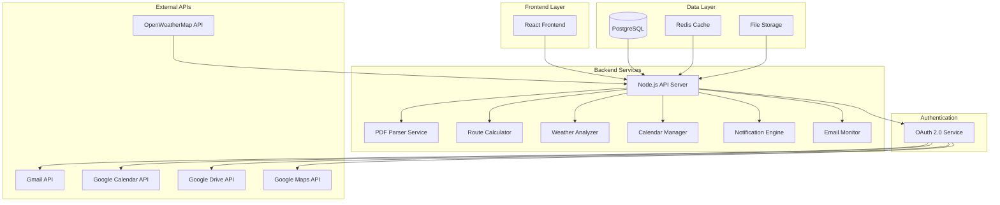

# Design Document - StillOnTime Film Schedule Automation System

## Overview

StillOnTime Film Schedule Automation System to kompleksowe rozwiązanie składające się z Node.js backend API z OAuth 2.0 oraz React frontend, które automatyzuje proces planowania dnia zdjęciowego. System integruje się z ekosystemem Google (Gmail, Calendar, Drive, Maps) poprzez OAuth 2.0 oraz zewnętrznymi API (OpenWeatherMap) aby zapewnić pełną automatyzację od wykrywania emaili po tworzenie kompletnego planu dnia.

## Architecture

### High-Level Architecture



### Technology Stack

**Backend:**

- **Node.js 20+** - Runtime environment
- **Express.js** - Web framework
- **TypeScript** - Type-safe development
- **PostgreSQL** - Primary database
- **Redis** - Caching and session storage
- **Prisma** - Database ORM
- **Bull Queue** - Background job processing
- **Winston** - Logging framework
- **Jest** - Testing framework

**Frontend:**

- **React 19** - UI framework with concurrent features
- **TypeScript** - Type-safe development
- **Vite** - Build tool and development server
- **Tailwind CSS** - Utility-first CSS framework
- **Zustand** - State management
- **React Hook Form + Zod** - Form handling with validation
- **React Router** - Client-side routing
- **Recharts** - Data visualization
- **Lucide React** - Icon library

**Authentication & APIs:**

- **OAuth 2.0** - Google services authentication
- **Google APIs Client Library** - Gmail, Calendar, Drive, Maps integration
- **OpenWeatherMap API** - Weather data
- **PDF-lib** - PDF parsing and manipulation
- **Nodemailer** - Email notifications

### System Components

1. **OAuth 2.0 Service** - zarządzanie autentykacją Google z automatycznym odświeżaniem tokenów
2. **Email Monitor** - monitorowanie i filtrowanie emaili Gmail co 5 minut z retry logic
3. **PDF Parser** - ekstrakcja danych z załączników PDF z OCR i interfejsem korekty
4. **Route Planner** - obliczanie optymalnych tras z walidacją czasów i alternatywami
5. **Weather Service** - integracja z API pogodowymi z różnicowaniem INT/EXT
6. **Calendar Manager** - zarządzanie wydarzeniami z alarmami i integracją SMS
7. **Notification Service** - system powiadomień wielokanałowych (email/SMS/push)
8. **Summary Generator** - generowanie podsumowań w języku polskim
9. **Analytics Service** - analiza danych historycznych i optymalizacja
10. **Background Job Processor** - przetwarzanie zadań w tle z monitorowaniem
11. **Error Handler** - obsługa błędów z graceful degradation
12. **Configuration Manager** - bezpieczne zarządzanie konfiguracją systemu
13. **React Dashboard** - interfejs użytkownika z analityką i kontrolą

## Components and Interfaces

### 1. OAuth 2.0 Service

**Purpose:** Zarządzanie autentykacją i autoryzacją Google OAuth 2.0

**Interface:**

```typescript
class OAuth2Service {
  async getAuthUrl(scopes: string[]): Promise<string>;
  async exchangeCodeForTokens(code: string): Promise<TokenSet>;
  async refreshAccessToken(refreshToken: string): Promise<TokenSet>;
  async getGoogleClient(userId: string): Promise<OAuth2Client>;
  async revokeTokens(userId: string): Promise<void>;
}
```

**Required Scopes:**

- `https://www.googleapis.com/auth/gmail.readonly` - Gmail access
- `https://www.googleapis.com/auth/calendar` - Calendar management
- `https://www.googleapis.com/auth/drive.file` - Drive file access

### 2. Email Monitor Service

**Purpose:** Wykrywanie i filtrowanie emaili z harmonogramami z załącznikami PDF z automatycznym monitorowaniem co 5 minut

**Interface:**

```typescript
class EmailMonitorService {
  async monitorEmails(userId: string): Promise<void>;
  async getScheduleEmails(userId: string): Promise<GmailMessage[]>;
  async isEmailProcessed(messageId: string): Promise<boolean>;
  async markAsProcessed(emailData: ProcessedEmail): Promise<void>;
  validateScheduleEmail(email: GmailMessage): boolean;
  async retryFailedProcessing(
    messageId: string,
    retryCount: number
  ): Promise<void>;
  async schedulePeriodicMonitoring(userId: string): Promise<void>;
}
```

**Filtering Criteria:**

- Subject keywords: "plan zdjęciowy", "drabinka", "call time", "shooting schedule"
- Sender domain validation and whitelist checking
- PDF attachment presence validation
- Duplicate detection via Message-ID hash and PDF content hash
- Processing within 5 minutes of email arrival

**Retry Logic:**

- Maximum 3 retry attempts with exponential backoff (2^n seconds)
- Failure tracking and error reporting
- Automatic recovery after system restoration

### 3. PDF Parser Service

**Purpose:** Ekstrakcja strukturalnych danych z plików PDF harmonogramów z OCR i interfejsem korekty manualnej

**Interface:**

```typescript
class PDFParserService {
  async parsePDFAttachment(
    attachmentId: string,
    userId: string
  ): Promise<ScheduleData>;
  async extractTextFromPDF(pdfBuffer: Buffer): Promise<string>;
  parseScheduleData(pdfText: string): Partial<ScheduleData>;
  validateExtractedData(data: Partial<ScheduleData>): ValidationResult;
  async performOCR(pdfBuffer: Buffer): Promise<OCRResult>;
  generateConfidenceScore(extractedData: Partial<ScheduleData>): number;
  createManualCorrectionInterface(
    failedData: Partial<ScheduleData>
  ): CorrectionInterface;
}
```

**Extraction Targets:**

- Shooting date (YYYY-MM-DD format) with validation
- Call time (HH:MM 24-hour format) with validation
- Location addresses with Google Maps geocoding validation
- Scene numbers and INT/EXT designation
- Contact information (names and phone numbers)
- Safety notes and special requirements
- Equipment lists and crew information

**OCR and Validation:**

- OCR fallback for scanned PDFs using Tesseract.js
- Confidence scoring (0-100%) for extracted data reliability
- Manual correction interface for failed or low-confidence extractions
- Data validation against expected formats and ranges

### 4. Route Planner Service

**Purpose:** Obliczanie optymalnych tras Dom→Panavision→Lokacja z uwzględnieniem ruchu i walidacją czasów

**Interface:**

```typescript
class RoutePlannerService {
  async calculateOptimalRoute(
    origin: string,
    destination: string,
    departureTime: Date,
    userId: string
  ): Promise<RouteResult>;
  async calculateRoutes(
    scheduleData: ScheduleData,
    userId: string
  ): Promise<RoutePlan>;
  applyTimeBuffers(baseTime: number, buffers: TimeBuffers): number;
  validateRouteResults(routeData: RouteResult): boolean;
  async getAlternativeRoutes(routePlan: RoutePlan): Promise<RouteAlternative[]>;
  calculateWakeUpTime(
    callTime: string,
    totalTravelTime: number,
    buffers: TimeBuffers
  ): Date;
  validateReasonableWakeUpTime(wakeUpTime: Date): ValidationResult;
  async getFallbackRouteEstimate(
    origin: string,
    destination: string
  ): Promise<RouteEstimate>;
}
```

**Buffer Configuration:**

- Car change: 15 minutes
- Parking: 10 minutes
- Entry/check-in: 10 minutes
- Traffic buffer: 20 minutes
- Morning routine: 45 minutes

**Route Validation:**

- Wake-up time validation (never before 4:00 AM)
- Unreasonable time flagging with adjustment suggestions
- Alternative route options with time comparisons
- Fallback distance-based estimates when API fails
- Real-time traffic integration with Google Maps API

### 5. Weather Service

**Purpose:** Pobieranie prognoz pogody z różnicowaniem dla INT/EXT i generowanie ostrzeżeń

**Interface:**

```typescript
class WeatherService {
  async getWeatherForecast(
    location: string,
    date: string,
    sceneType: "INT" | "EXT"
  ): Promise<WeatherData>;
  generateWeatherWarnings(forecast: WeatherForecast): string[];
  async updateWeatherData(scheduleId: string): Promise<void>;
  handleWeatherAPIFailure(location: string, date: string): WeatherData;
  async getDetailedForecast(
    location: string,
    date: string
  ): Promise<DetailedWeatherData>;
  async getBasicForecast(
    location: string,
    date: string
  ): Promise<BasicWeatherData>;
  getCachedWeatherData(location: string, date: string): WeatherData | null;
}
```

**Weather Data Differentiation:**

- **EXT Shoots**: Detailed weather (temperature, precipitation, wind, humidity, visibility, UV index)
- **INT Shoots**: Basic weather overview (temperature, general conditions)

**Warning Conditions:**

- Temperature < 0°C or > 30°C (extreme temperature warning)
- Precipitation > 0mm (rain/snow warning)
- Wind speed > 10 m/s (high wind warning)
- Thunderstorms, fog, severe weather conditions
- UV index warnings for outdoor shoots

**Caching and Fallback:**

- 24-hour cache TTL for weather data
- Cached data usage when API unavailable
- User notification of data limitations

### 6. Calendar Manager Service

**Purpose:** Tworzenie wydarzeń kalendarzowych z alarmami, przypomnieniami i integracją SMS

**Interface:**

```typescript
class CalendarManagerService {
  async createCalendarEvent(
    scheduleData: ScheduleData,
    routePlan: RoutePlan,
    weather: WeatherData,
    userId: string
  ): Promise<CalendarEvent>;
  async setMultipleAlarms(
    wakeUpTime: Date,
    userId: string
  ): Promise<CalendarEvent[]>;
  async updateExistingEvent(
    eventId: string,
    newData: Partial<ScheduleData>,
    userId: string
  ): Promise<void>;
  createEventDescription(
    scheduleData: ScheduleData,
    routePlan: RoutePlan,
    weather: WeatherData
  ): string;
  async retryCalendarOperation(
    operation: CalendarOperation,
    retryCount: number
  ): Promise<void>;
  async sendSMSReminders(
    userId: string,
    eventData: CalendarEvent
  ): Promise<void>;
  async storeEventLocally(eventData: CalendarEvent): Promise<void>;
}
```

**Event Structure:**

- Title: "StillOnTime — Dzień zdjęciowy (location)"
- Duration: departure time to call_time + 10 hours
- Comprehensive description with route plan, weather forecast, and warnings
- Location: shooting location address

**Alarms and Reminders:**

- **Wake-up Alarms**: wake_up_time-10min, wake_up_time, wake_up_time+5min
- **Popup Reminders**: -12h, -3h, -1h, departure_time
- **SMS Reminders**: Configurable SMS notifications for users with SMS enabled

**Error Handling:**

- Exponential backoff retry for Calendar API failures
- Local storage of event data for later retry
- Automatic retry when system recovers

### 7. Notification Service

**Purpose:** System powiadomień wielokanałowych (email, SMS, push) z preferencjami użytkownika

**Interface:**

```typescript
class NotificationService {
  async sendEmailNotification(
    userId: string,
    content: NotificationContent
  ): Promise<void>;
  async sendSMSNotification(
    userId: string,
    content: NotificationContent
  ): Promise<void>;
  async sendPushNotification(
    userId: string,
    content: NotificationContent
  ): Promise<void>;
  async sendMultiChannelNotification(
    userId: string,
    content: NotificationContent
  ): Promise<void>;
  async getUserNotificationPreferences(
    userId: string
  ): Promise<NotificationPreferences>;
  trackNotificationDelivery(
    notificationId: string,
    status: DeliveryStatus
  ): Promise<void>;
  createNotificationTemplate(type: NotificationType): NotificationTemplate;
}
```

**Notification Channels:**

- **Email**: Comprehensive summaries with full details
- **SMS**: Critical alerts and reminders (configurable)
- **Push**: Real-time status updates and immediate alerts

**Notification Types:**

- Schedule processing completion
- Critical error alerts
- Weather warnings for outdoor shoots
- Calendar event reminders
- System recovery notifications

### 8. Background Job Processor

**Purpose:** Przetwarzanie zadań w tle z wykorzystaniem Bull Queue

**Interface:**

```typescript
class JobProcessor {
  async addEmailProcessingJob(userId: string, messageId?: string): Promise<Job>;
  async addWeatherUpdateJob(scheduleId: string): Promise<Job>;
  async addRouteRecalculationJob(scheduleId: string): Promise<Job>;
  async processEmailJob(job: Job<EmailProcessingData>): Promise<void>;
  async processWeatherJob(job: Job<WeatherUpdateData>): Promise<void>;
  async schedulePeriodicJobs(): Promise<void>;
  handleJobFailure(job: Job, error: Error): Promise<void>;
}
```

**Job Types:**

- **Email Processing**: Periodic Gmail monitoring (every 5 minutes)
- **Weather Updates**: Daily weather forecast updates
- **Route Recalculation**: Dynamic route updates based on traffic
- **Notification Delivery**: Scheduled reminders and alerts

### 8. Summary Generation Service

**Purpose:** Generowanie kompletnych podsumowań dnia zdjęciowego w języku polskim

**Interface:**

```typescript
class SummaryService {
  async generateDaySummary(
    scheduleData: ScheduleData,
    routePlan: RoutePlan,
    weather: WeatherData
  ): Promise<DaySummary>;
  createTimeline(routePlan: RoutePlan, scheduleData: ScheduleData): Timeline;
  formatSummaryInPolish(summaryData: DaySummary): string;
  async storeSummaryHistory(summary: DaySummary, userId: string): Promise<void>;
  async sendSummaryNotifications(
    summary: DaySummary,
    userId: string
  ): Promise<void>;
}
```

**Summary Components:**

- **Timeline**: Wake-up, departure, and arrival times with buffer explanations
- **Location Details**: Shooting location with route information and alternatives
- **Weather Forecast**: Detailed weather with warnings for EXT shoots
- **Contact Information**: Crew contacts and safety notes from PDF
- **Equipment and Notes**: Special requirements and safety considerations

### 9. Analytics and Historical Data Service

**Purpose:** Analiza danych historycznych i optymalizacja planowania

**Interface:**

```typescript
class AnalyticsService {
  async getProcessingSuccessRates(
    dateRange: DateRange
  ): Promise<SuccessRateData>;
  async getHistoricalTravelTimes(
    route: RouteQuery
  ): Promise<TravelTimeAnalytics>;
  async analyzeWeatherImpact(
    schedules: ScheduleData[]
  ): Promise<WeatherImpactAnalysis>;
  async generateOptimizationRecommendations(
    userId: string
  ): Promise<OptimizationRecommendations>;
  async exportAnalyticsReport(
    format: "PDF" | "CSV",
    data: AnalyticsData
  ): Promise<Buffer>;
  detectPatterns(historicalData: HistoricalData[]): PatternAnalysis;
  suggestBufferAdjustments(
    travelHistory: TravelTimeData[]
  ): BufferRecommendations;
}
```

**Analytics Features:**

- Processing success rates over time with trend analysis
- Historical travel times and traffic pattern analysis
- Weather impact correlation with schedule changes
- Route optimization recommendations based on historical data
- Buffer adjustment suggestions based on actual travel times
- Export capabilities (PDF and CSV formats)

### 10. React Frontend Dashboard

**Purpose:** Interfejs użytkownika do monitorowania, konfiguracji i analizy systemu

**Components:**

```typescript
interface DashboardProps {
  systemStatus: SystemStatus;
  recentActivity: ProcessedEmail[];
  upcomingSchedules: ScheduleData[];
  healthChecks: ServiceHealthStatus[];
}

interface ConfigurationProps {
  addresses: AddressConfig;
  buffers: TimeBuffers;
  notifications: NotificationPrefs;
  oauthStatus: OAuthStatus;
  apiConnections: APIConnectionStatus[];
}

interface AnalyticsProps {
  successRates: SuccessRateData;
  travelTimeAnalytics: TravelTimeAnalytics;
  weatherImpact: WeatherImpactAnalysis;
  optimizationRecommendations: OptimizationRecommendations;
}

interface AuthenticationProps {
  onLogin: () => void;
  onLogout: () => void;
  isAuthenticated: boolean;
  user: User | null;
}
```

**Key Features:**

- **Real-time Monitoring**: System status, last 10 processed emails, upcoming schedules
- **Manual Controls**: Email processing triggers, error retry options
- **Configuration Management**: Address validation, time buffer presets, notification preferences
- **Analytics Dashboard**: Success rates, travel time patterns, weather impact analysis
- **Error Management**: Error logs display, retry mechanisms, service health indicators
- **OAuth 2.0 Integration**: Secure authentication flow with Google services

## Data Models

### Database Schema (PostgreSQL with Prisma)

```prisma
model User {
  id            String   @id @default(cuid())
  email         String   @unique
  name          String?
  googleId      String   @unique
  accessToken   String?
  refreshToken  String?
  tokenExpiry   DateTime?
  createdAt     DateTime @default(now())
  updatedAt     DateTime @updatedAt

  processedEmails     ProcessedEmail[]
  schedules           ScheduleData[]
  routePlans          RoutePlan[]
  weatherData         WeatherData[]
  calendarEvents      CalendarEvent[]
  notifications       Notification[]
  processingAnalytics ProcessingAnalytics[]
  userConfig          UserConfig?
}

model ProcessedEmail {
  id               String   @id @default(cuid())
  messageId        String   @unique
  subject          String
  sender           String
  receivedAt       DateTime
  threadId         String?
  processed        Boolean  @default(false)
  processingStatus String   @default("pending")
  pdfHash          String?
  error            String?
  createdAt        DateTime @default(now())
  updatedAt        DateTime @updatedAt

  userId           String
  user             User     @relation(fields: [userId], references: [id])
  schedule         ScheduleData?
}

model ScheduleData {
  id            String   @id @default(cuid())
  shootingDate  DateTime
  callTime      String
  location      String
  baseLocation  String?
  sceneType     String
  scenes        Json?
  safetyNotes   String?
  equipment     Json?
  contacts      Json?
  notes         String?
  createdAt     DateTime @default(now())
  updatedAt     DateTime @updatedAt

  userId        String
  user          User     @relation(fields: [userId], references: [id])
  emailId       String   @unique
  email         ProcessedEmail @relation(fields: [emailId], references: [id])

  routePlan     RoutePlan?
  weatherData   WeatherData?
  calendarEvent CalendarEvent?
  notifications Notification[]
}

model RoutePlan {
  id                  String   @id @default(cuid())
  wakeUpTime          DateTime
  departureTime       DateTime
  arrivalTime         DateTime
  totalTravelMinutes  Int
  routeSegments       Json
  buffers             Json
  calculatedAt        DateTime @default(now())

  userId              String
  user                User         @relation(fields: [userId], references: [id])
  scheduleId          String       @unique
  schedule            ScheduleData @relation(fields: [scheduleId], references: [id])
}

model WeatherData {
  id            String   @id @default(cuid())
  forecastDate  DateTime
  temperature   Float?
  description   String?
  windSpeed     Float?
  precipitation Float?
  humidity      Int?
  warnings      Json?
  fetchedAt     DateTime @default(now())

  userId        String
  user          User         @relation(fields: [userId], references: [id])
  scheduleId    String       @unique
  schedule      ScheduleData @relation(fields: [scheduleId], references: [id])
}

model CalendarEvent {
  id                String   @id @default(cuid())
  calendarEventId   String
  title             String
  startTime         DateTime
  endTime           DateTime
  description       String?
  location          String?
  createdAt         DateTime @default(now())

  userId            String
  user              User         @relation(fields: [userId], references: [id])
  scheduleId        String       @unique
  schedule          ScheduleData @relation(fields: [scheduleId], references: [id])
}

model UserConfig {
  id                    String @id @default(cuid())
  homeAddress           String
  panavisionAddress     String
  bufferCarChange       Int    @default(15)
  bufferParking         Int    @default(10)
  bufferEntry           Int    @default(10)
  bufferTraffic         Int    @default(20)
  bufferMorningRoutine  Int    @default(45)
  notificationEmail     Boolean @default(true)
  notificationSMS       Boolean @default(false)
  notificationPush      Boolean @default(true)
  smsPhoneNumber        String?
  pushDeviceTokens      Json?
  createdAt             DateTime @default(now())
  updatedAt             DateTime @updatedAt

  userId                String @unique
  user                  User   @relation(fields: [userId], references: [id])
}

model Notification {
  id            String   @id @default(cuid())
  type          String   // "email", "sms", "push"
  channel       String   // "summary", "alert", "reminder"
  content       Json
  status        String   @default("pending") // "pending", "sent", "failed"
  sentAt        DateTime?
  error         String?
  createdAt     DateTime @default(now())

  userId        String
  user          User     @relation(fields: [userId], references: [id])
  scheduleId    String?
  schedule      ScheduleData? @relation(fields: [scheduleId], references: [id])
}

model ProcessingAnalytics {
  id                String   @id @default(cuid())
  date              DateTime
  emailsProcessed   Int      @default(0)
  emailsSuccessful  Int      @default(0)
  emailsFailed      Int      @default(0)
  avgProcessingTime Float?
  routesCalculated  Int      @default(0)
  weatherFetched    Int      @default(0)
  calendarEvents    Int      @default(0)
  createdAt         DateTime @default(now())

  userId            String
  user              User     @relation(fields: [userId], references: [id])
}
```

### TypeScript Interfaces

```typescript
interface ScheduleData {
  id: string;
  shootingDate: Date;
  callTime: string;
  location: string;
  baseLocation?: string;
  sceneType: "INT" | "EXT";
  scenes?: string[];
  safetyNotes?: string;
  equipment?: string[];
  contacts?: ContactInfo[];
  notes?: string;
  createdAt: Date;
  updatedAt: Date;
}

interface RoutePlan {
  id: string;
  wakeUpTime: Date;
  departureTime: Date;
  arrivalTime: Date;
  totalTravelMinutes: number;
  routeSegments: RouteSegment[];
  buffers: TimeBuffers;
  calculatedAt: Date;
}

interface WeatherData {
  id: string;
  forecastDate: Date;
  temperature?: number;
  description?: string;
  windSpeed?: number;
  precipitation?: number;
  humidity?: number;
  warnings?: string[];
  fetchedAt: Date;
}

interface TokenSet {
  access_token: string;
  refresh_token?: string;
  expires_in: number;
  token_type: string;
}

interface OAuthStatus {
  isAuthenticated: boolean;
  scopes: string[];
  expiresAt?: Date;
  needsReauth: boolean;
}

interface NotificationContent {
  title: string;
  message: string;
  data?: any;
  priority: "low" | "normal" | "high" | "critical";
}

interface NotificationPreferences {
  email: boolean;
  sms: boolean;
  push: boolean;
  smsPhoneNumber?: string;
  pushDeviceTokens?: string[];
}

interface DaySummary {
  id: string;
  scheduleId: string;
  timeline: Timeline;
  locationDetails: LocationDetails;
  weatherForecast: WeatherData;
  contactInformation: ContactInfo[];
  safetyNotes: string[];
  equipmentList: string[];
  generatedAt: Date;
  language: "pl" | "en";
}

interface Timeline {
  wakeUpTime: Date;
  departureTime: Date;
  arrivalTime: Date;
  callTime: string;
  bufferBreakdown: TimeBuffers;
}

interface AnalyticsData {
  successRates: SuccessRateData;
  travelTimeAnalytics: TravelTimeAnalytics;
  weatherImpact: WeatherImpactAnalysis;
  processingMetrics: ProcessingMetrics;
}

interface SuccessRateData {
  emailProcessing: number;
  pdfParsing: number;
  routeCalculation: number;
  calendarCreation: number;
  overallSuccess: number;
  timeRange: DateRange;
}

interface TravelTimeAnalytics {
  averageTravelTime: number;
  trafficPatterns: TrafficPattern[];
  routeOptimizations: RouteOptimization[];
  historicalComparison: HistoricalComparison;
}

interface OCRResult {
  extractedText: string;
  confidence: number;
  boundingBoxes: BoundingBox[];
  processingTime: number;
}

interface ValidationResult {
  isValid: boolean;
  errors: ValidationError[];
  warnings: ValidationWarning[];
  confidence: number;
}

interface CorrectionInterface {
  originalData: Partial<ScheduleData>;
  suggestedCorrections: Partial<ScheduleData>;
  manualFields: ManualCorrectionField[];
  validationResults: ValidationResult;
}
```

## Error Handling

### Error Categories and Strategies

1. **OAuth 2.0 Failures**

   - Token expiration handling with automatic refresh
   - Scope permission errors with re-authorization flow
   - Rate limiting with exponential backoff
   - Invalid grant errors with user notification

2. **API Failures**

   - Gmail API rate limits and quota management
   - Calendar API conflicts and retry mechanisms
   - Maps API failures with fallback calculations
   - Weather API unavailability with cached data

3. **PDF Parsing Errors**

   - Corrupted PDF handling with error reporting
   - OCR fallback for scanned documents
   - Manual correction interface for failed parsing
   - Confidence scoring for extracted data

4. **Database Errors**
   - Connection pool management
   - Transaction rollback on failures
   - Data consistency validation
   - Backup and recovery procedures

### Error Recovery Mechanisms

```typescript
class ErrorHandler {
  async handleOAuthError(error: OAuthError, userId: string): Promise<void>;
  async handleAPIFailure(
    apiName: string,
    error: Error,
    retryCount: number
  ): Promise<void>;
  async handleParsingError(pdfData: Buffer, error: Error): Promise<void>;
  async handleDatabaseError(operation: string, error: Error): Promise<void>;
  async handleRouteCalculationFailure(
    routeData: RouteRequest
  ): Promise<RouteEstimate>;
  async handleWeatherAPIFailure(
    location: string,
    date: string
  ): Promise<WeatherData>;
  async handleCalendarFailure(eventData: CalendarEvent): Promise<void>;
  async sendCriticalErrorNotification(
    userId: string,
    error: CriticalError
  ): Promise<void>;
  async resumeProcessingAfterRecovery(userId: string): Promise<void>;
  logError(
    level: LogLevel,
    message: string,
    data: any,
    functionName: string
  ): void;
}
```

**Recovery Strategies:**

1. **Exponential Backoff**: All external API calls use exponential backoff (2^n seconds, max 5 attempts)
2. **Graceful Degradation**:
   - PDF parsing failure → Manual correction interface
   - Route calculation failure → Distance-based estimates
   - Weather API failure → Cached data with user notification
   - Calendar failure → Local storage with retry queue
3. **Critical Error Handling**: Immediate user notification for system failures
4. **Automatic Recovery**: Resume processing when services are restored

## Testing Strategy

### Unit Testing

- Service layer testing with Jest and mocks
- OAuth 2.0 flow testing with test tokens
- PDF parsing accuracy testing
- Route calculation validation
- Weather data processing verification

### Integration Testing

- End-to-end OAuth 2.0 authentication flow
- Gmail API integration with test accounts
- Calendar event creation and verification
- Database operations and migrations
- Background job processing

### Performance Testing

- Concurrent user authentication
- Email processing throughput
- API response time monitoring
- Database query optimization
- Memory usage profiling

### Security Testing

- OAuth 2.0 token security validation
- API key protection verification
- SQL injection prevention
- XSS protection testing
- CSRF token validation

## Configuration Management

### Secure Configuration Storage

**API Key Management:**

- Encrypted storage of all API keys in database
- Environment-specific configuration files
- API key rotation and validation
- Connection status monitoring for all external services

**Address Configuration:**

- Google Maps geocoding validation for all addresses
- Home and Panavision address management
- Address history and favorites
- Geocoding confidence scoring

**Time Buffer Management:**

- Configurable time buffers with presets:
  - Conservative: +25% to all buffers
  - Standard: Default values (15/10/10/20/45 minutes)
  - Aggressive: -15% to all buffers
- Custom buffer configuration per user
- Historical optimization recommendations

**Notification Preferences:**

- Multi-channel notification configuration (email/SMS/push)
- SMS phone number validation and formatting
- Push notification device token management
- Notification frequency and timing preferences

**System Configuration:**

- Rate limiting configuration per API endpoint
- Retry policy configuration (attempts, backoff multiplier)
- Cache TTL settings for different data types
- Audit logging for all configuration changes

### Configuration Interface

```typescript
interface SystemConfiguration {
  apiKeys: APIKeyConfiguration;
  addresses: AddressConfiguration;
  timeBuffers: TimeBufferConfiguration;
  notifications: NotificationConfiguration;
  rateLimiting: RateLimitConfiguration;
  caching: CacheConfiguration;
}

interface APIKeyConfiguration {
  googleMaps: string;
  openWeatherMap: string;
  twilioSMS?: string;
  firebasePush?: string;
  connectionStatus: Record<string, ConnectionStatus>;
}

interface AddressConfiguration {
  homeAddress: ValidatedAddress;
  panavisionAddress: ValidatedAddress;
  addressHistory: ValidatedAddress[];
}

interface TimeBufferConfiguration {
  preset: "conservative" | "standard" | "aggressive" | "custom";
  carChange: number;
  parking: number;
  entry: number;
  traffic: number;
  morningRoutine: number;
}
```

## Security Considerations

### Authentication & Authorization

- OAuth 2.0 with PKCE for secure authentication
- JWT tokens for session management
- Refresh token rotation for enhanced security
- Scope-based permission management
- Rate limiting per user and endpoint

### Data Protection

- Encrypted storage of sensitive tokens
- Temporary PDF file automatic deletion
- Email content processed in memory only
- Audit logging for all operations
- GDPR compliance with data retention policies

### API Security

- HTTPS enforcement for all communications
- API key rotation and management
- Request signing for critical operations
- Input validation and sanitization
- Output encoding to prevent XSS

## Performance Optimization

### Caching Strategy

- Redis caching for frequently accessed data
- Weather data caching (24-hour TTL)
- Route calculation caching for common paths
- OAuth token caching with expiration
- Database query result caching

### Background Processing

- Bull Queue for asynchronous job processing
- Email monitoring as scheduled jobs
- Weather updates as cron jobs
- Route recalculation on demand
- Batch processing for multiple operations

### Database Optimization

- Proper indexing for query performance
- Connection pooling for concurrent requests
- Query optimization with Prisma
- Database migrations for schema changes
- Backup and replication strategies

## Deployment Architecture

### Development Environment

- Docker containers for local development
- Environment-specific configuration
- Hot reloading for rapid development
- Test database with sample data
- Mock external API responses

### Production Deployment

- Containerized deployment with Docker
- Load balancing for high availability
- Auto-scaling based on demand
- Health checks and monitoring
- Blue-green deployment strategy

### Monitoring and Logging

- Structured logging with Winston
- Application performance monitoring
- Error tracking and alerting
- OAuth flow monitoring
- API usage analytics

This design provides a modern, secure, and scalable foundation for the StillOnTime automation system using OAuth 2.0 authentication and industry-standard technologies.
