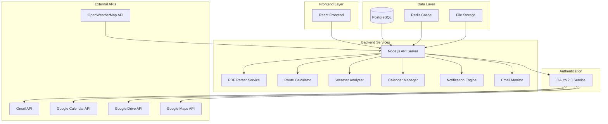

# Design Document - StillOnTime Film Schedule Automation System

## Overview

StillOnTime Film Schedule Automation System to kompleksowe rozwiązanie składające się z Node.js backend API z OAuth 2.0 oraz React frontend, które automatyzuje proces planowania dnia zdjęciowego. System integruje się z ekosystemem Google (Gmail, Calendar, Drive, Maps) poprzez OAuth 2.0 oraz zewnętrznymi API (OpenWeatherMap) aby zapewnić pełną automatyzację od wykrywania emaili po tworzenie kompletnego planu dnia.

## Architecture

### High-Level Architecture



### Technology Stack

**Backend:**

- **Node.js 20+** - Runtime environment
- **Express.js** - Web framework
- **TypeScript** - Type-safe development
- **PostgreSQL** - Primary database
- **Redis** - Caching and session storage
- **Prisma** - Database ORM
- **Bull Queue** - Background job processing
- **Winston** - Logging framework
- **Jest** - Testing framework

**Frontend:**

- **React 19** - UI framework with concurrent features
- **TypeScript** - Type-safe development
- **Vite** - Build tool and development server
- **Tailwind CSS** - Utility-first CSS framework
- **Zustand** - State management
- **React Hook Form + Zod** - Form handling with validation
- **React Router** - Client-side routing
- **Recharts** - Data visualization
- **Lucide React** - Icon library

**Authentication & APIs:**

- **OAuth 2.0** - Google services authentication
- **Google APIs Client Library** - Gmail, Calendar, Drive, Maps integration
- **OpenWeatherMap API** - Weather data
- **PDF-lib** - PDF parsing and manipulation
- **Nodemailer** - Email notifications

### System Components

1. **OAuth 2.0 Service** - zarządzanie autentykacją Google
2. **Email Monitor** - monitorowanie i filtrowanie emaili Gmail
3. **PDF Parser** - ekstrakcja danych z załączników PDF
4. **Route Planner** - obliczanie optymalnych tras z uwzględnieniem ruchu
5. **Weather Service** - integracja z API pogodowymi
6. **Calendar Manager** - zarządzanie wydarzeniami i alarmami Google Calendar
7. **Notification Manager** - system powiadomień wielokanałowych
8. **Background Job Processor** - przetwarzanie zadań w tle
9. **React Dashboard** - interfejs użytkownika

## Components and Interfaces

### 1. OAuth 2.0 Service

**Purpose:** Zarządzanie autentykacją i autoryzacją Google OAuth 2.0

**Interface:**

```typescript
class OAuth2Service {
  async getAuthUrl(scopes: string[]): Promise<string>;
  async exchangeCodeForTokens(code: string): Promise<TokenSet>;
  async refreshAccessToken(refreshToken: string): Promise<TokenSet>;
  async getGoogleClient(userId: string): Promise<OAuth2Client>;
  async revokeTokens(userId: string): Promise<void>;
}
```

**Required Scopes:**

- `https://www.googleapis.com/auth/gmail.readonly` - Gmail access
- `https://www.googleapis.com/auth/calendar` - Calendar management
- `https://www.googleapis.com/auth/drive.file` - Drive file access

### 2. Email Monitor Service

**Purpose:** Wykrywanie i filtrowanie emaili z harmonogramami z załącznikami PDF

**Interface:**

```typescript
class EmailMonitorService {
  async monitorEmails(userId: string): Promise<void>;
  async getScheduleEmails(userId: string): Promise<GmailMessage[]>;
  async isEmailProcessed(messageId: string): Promise<boolean>;
  async markAsProcessed(emailData: ProcessedEmail): Promise<void>;
  validateScheduleEmail(email: GmailMessage): boolean;
}
```

**Filtering Criteria:**

- Subject keywords: "plan zdjęciowy", "drabinka", "call time", "shooting schedule"
- Sender domain validation
- PDF attachment presence
- Duplicate detection via Message-ID hash

### 3. PDF Parser Service

**Purpose:** Ekstrakcja strukturalnych danych z plików PDF harmonogramów

**Interface:**

```typescript
class PDFParserService {
  async parsePDFAttachment(
    attachmentId: string,
    userId: string
  ): Promise<ScheduleData>;
  async extractTextFromPDF(pdfBuffer: Buffer): Promise<string>;
  parseScheduleData(pdfText: string): Partial<ScheduleData>;
  validateExtractedData(data: Partial<ScheduleData>): ValidationResult;
}
```

**Extraction Targets:**

- Shooting date (YYYY-MM-DD format)
- Call time (HH:MM 24-hour format)
- Location addresses with geocoding validation
- Scene numbers and INT/EXT designation
- Safety notes and contact information
- Equipment lists and special requirements

### 4. Route Planner Service

**Purpose:** Obliczanie optymalnych tras Dom→Panavision→Lokacja z uwzględnieniem ruchu

**Interface:**

```typescript
class RoutePlannerService {
  async calculateOptimalRoute(
    origin: string,
    destination: string,
    departureTime: Date,
    userId: string
  ): Promise<RouteResult>;
  async calculateRoutes(
    scheduleData: ScheduleData,
    userId: string
  ): Promise<RoutePlan>;
  applyTimeBuffers(baseTime: number, buffers: TimeBuffers): number;
  validateRouteResults(routeData: RouteResult): boolean;
}
```

**Buffer Configuration:**

- Car change: 15 minutes
- Parking: 10 minutes
- Entry/check-in: 10 minutes
- Traffic buffer: 20 minutes
- Morning routine: 45 minutes

### 5. Weather Service

**Purpose:** Pobieranie prognoz pogody i generowanie ostrzeżeń

**Interface:**

```typescript
class WeatherService {
  async getWeatherForecast(
    location: string,
    date: string
  ): Promise<WeatherData>;
  generateWeatherWarnings(forecast: WeatherForecast): string[];
  async updateWeatherData(scheduleId: string): Promise<void>;
  handleWeatherAPIFailure(location: string, date: string): WeatherData;
}
```

**Warning Conditions:**

- Temperature < 0°C or > 30°C
- Precipitation > 0mm
- Wind speed > 10 m/s
- Thunderstorms, fog conditions

### 6. Calendar Manager Service

**Purpose:** Tworzenie wydarzeń kalendarzowych z alarmami i przypomnieniami

**Interface:**

```typescript
class CalendarManagerService {
  async createCalendarEvent(
    scheduleData: ScheduleData,
    routePlan: RoutePlan,
    weather: WeatherData,
    userId: string
  ): Promise<CalendarEvent>;
  async setMultipleAlarms(
    wakeUpTime: Date,
    userId: string
  ): Promise<CalendarEvent[]>;
  async updateExistingEvent(
    eventId: string,
    newData: Partial<ScheduleData>,
    userId: string
  ): Promise<void>;
  createEventDescription(
    scheduleData: ScheduleData,
    routePlan: RoutePlan,
    weather: WeatherData
  ): string;
}
```

**Event Structure:**

- Title: "StillOnTime — Dzień zdjęciowy (location)"
- Duration: departure time to call_time + 10 hours
- Alarms: wake_up-10min, wake_up, wake_up+5min
- Reminders: -12h, -3h, -1h, departure time

### 7. Background Job Processor

**Purpose:** Przetwarzanie zadań w tle z wykorzystaniem Bull Queue

**Interface:**

```typescript
class JobProcessor {
  async addEmailProcessingJob(userId: string, messageId?: string): Promise<Job>;
  async addWeatherUpdateJob(scheduleId: string): Promise<Job>;
  async addRouteRecalculationJob(scheduleId: string): Promise<Job>;
  async processEmailJob(job: Job<EmailProcessingData>): Promise<void>;
  async processWeatherJob(job: Job<WeatherUpdateData>): Promise<void>;
}
```

### 8. React Frontend Dashboard

**Purpose:** Interfejs użytkownika do monitorowania i konfiguracji systemu

**Components:**

```typescript
interface DashboardProps {
  systemStatus: SystemStatus;
  recentActivity: ProcessedEmail[];
  upcomingSchedules: ScheduleData[];
}

interface ConfigurationProps {
  addresses: AddressConfig;
  buffers: TimeBuffers;
  notifications: NotificationPrefs;
  oauthStatus: OAuthStatus;
}

interface AuthenticationProps {
  onLogin: () => void;
  onLogout: () => void;
  isAuthenticated: boolean;
  user: User | null;
}
```

**Key Features:**

- OAuth 2.0 authentication flow
- Real-time status monitoring
- Manual email processing triggers
- Configuration management
- Processing history and analytics
- Error handling and retry options

## Data Models

### Database Schema (PostgreSQL with Prisma)

```prisma
model User {
  id            String   @id @default(cuid())
  email         String   @unique
  name          String?
  googleId      String   @unique
  accessToken   String?
  refreshToken  String?
  tokenExpiry   DateTime?
  createdAt     DateTime @default(now())
  updatedAt     DateTime @updatedAt

  processedEmails ProcessedEmail[]
  schedules       ScheduleData[]
  routePlans      RoutePlan[]
  weatherData     WeatherData[]
  calendarEvents  CalendarEvent[]
  userConfig      UserConfig?
}

model ProcessedEmail {
  id               String   @id @default(cuid())
  messageId        String   @unique
  subject          String
  sender           String
  receivedAt       DateTime
  threadId         String?
  processed        Boolean  @default(false)
  processingStatus String   @default("pending")
  pdfHash          String?
  error            String?
  createdAt        DateTime @default(now())
  updatedAt        DateTime @updatedAt

  userId           String
  user             User     @relation(fields: [userId], references: [id])
  schedule         ScheduleData?
}

model ScheduleData {
  id            String   @id @default(cuid())
  shootingDate  DateTime
  callTime      String
  location      String
  baseLocation  String?
  sceneType     String
  scenes        Json?
  safetyNotes   String?
  equipment     Json?
  contacts      Json?
  notes         String?
  createdAt     DateTime @default(now())
  updatedAt     DateTime @updatedAt

  userId        String
  user          User     @relation(fields: [userId], references: [id])
  emailId       String   @unique
  email         ProcessedEmail @relation(fields: [emailId], references: [id])

  routePlan     RoutePlan?
  weatherData   WeatherData?
  calendarEvent CalendarEvent?
}

model RoutePlan {
  id                  String   @id @default(cuid())
  wakeUpTime          DateTime
  departureTime       DateTime
  arrivalTime         DateTime
  totalTravelMinutes  Int
  routeSegments       Json
  buffers             Json
  calculatedAt        DateTime @default(now())

  userId              String
  user                User         @relation(fields: [userId], references: [id])
  scheduleId          String       @unique
  schedule            ScheduleData @relation(fields: [scheduleId], references: [id])
}

model WeatherData {
  id            String   @id @default(cuid())
  forecastDate  DateTime
  temperature   Float?
  description   String?
  windSpeed     Float?
  precipitation Float?
  humidity      Int?
  warnings      Json?
  fetchedAt     DateTime @default(now())

  userId        String
  user          User         @relation(fields: [userId], references: [id])
  scheduleId    String       @unique
  schedule      ScheduleData @relation(fields: [scheduleId], references: [id])
}

model CalendarEvent {
  id                String   @id @default(cuid())
  calendarEventId   String
  title             String
  startTime         DateTime
  endTime           DateTime
  description       String?
  location          String?
  createdAt         DateTime @default(now())

  userId            String
  user              User         @relation(fields: [userId], references: [id])
  scheduleId        String       @unique
  schedule          ScheduleData @relation(fields: [scheduleId], references: [id])
}

model UserConfig {
  id                    String @id @default(cuid())
  homeAddress           String
  panavisionAddress     String
  bufferCarChange       Int    @default(15)
  bufferParking         Int    @default(10)
  bufferEntry           Int    @default(10)
  bufferTraffic         Int    @default(20)
  bufferMorningRoutine  Int    @default(45)
  notificationEmail     Boolean @default(true)
  notificationSMS       Boolean @default(false)
  notificationPush      Boolean @default(true)

  userId                String @unique
  user                  User   @relation(fields: [userId], references: [id])
}
```

### TypeScript Interfaces

```typescript
interface ScheduleData {
  id: string;
  shootingDate: Date;
  callTime: string;
  location: string;
  baseLocation?: string;
  sceneType: "INT" | "EXT";
  scenes?: string[];
  safetyNotes?: string;
  equipment?: string[];
  contacts?: ContactInfo[];
  notes?: string;
  createdAt: Date;
  updatedAt: Date;
}

interface RoutePlan {
  id: string;
  wakeUpTime: Date;
  departureTime: Date;
  arrivalTime: Date;
  totalTravelMinutes: number;
  routeSegments: RouteSegment[];
  buffers: TimeBuffers;
  calculatedAt: Date;
}

interface WeatherData {
  id: string;
  forecastDate: Date;
  temperature?: number;
  description?: string;
  windSpeed?: number;
  precipitation?: number;
  humidity?: number;
  warnings?: string[];
  fetchedAt: Date;
}

interface TokenSet {
  access_token: string;
  refresh_token?: string;
  expires_in: number;
  token_type: string;
}

interface OAuthStatus {
  isAuthenticated: boolean;
  scopes: string[];
  expiresAt?: Date;
  needsReauth: boolean;
}
```

## Error Handling

### Error Categories and Strategies

1. **OAuth 2.0 Failures**

   - Token expiration handling with automatic refresh
   - Scope permission errors with re-authorization flow
   - Rate limiting with exponential backoff
   - Invalid grant errors with user notification

2. **API Failures**

   - Gmail API rate limits and quota management
   - Calendar API conflicts and retry mechanisms
   - Maps API failures with fallback calculations
   - Weather API unavailability with cached data

3. **PDF Parsing Errors**

   - Corrupted PDF handling with error reporting
   - OCR fallback for scanned documents
   - Manual correction interface for failed parsing
   - Confidence scoring for extracted data

4. **Database Errors**
   - Connection pool management
   - Transaction rollback on failures
   - Data consistency validation
   - Backup and recovery procedures

### Error Recovery Mechanisms

```typescript
class ErrorHandler {
  async handleOAuthError(error: OAuthError, userId: string): Promise<void>;
  async handleAPIFailure(
    apiName: string,
    error: Error,
    retryCount: number
  ): Promise<void>;
  async handleParsingError(pdfData: Buffer, error: Error): Promise<void>;
  async handleDatabaseError(operation: string, error: Error): Promise<void>;
  logError(
    level: LogLevel,
    message: string,
    data: any,
    functionName: string
  ): void;
}
```

## Testing Strategy

### Unit Testing

- Service layer testing with Jest and mocks
- OAuth 2.0 flow testing with test tokens
- PDF parsing accuracy testing
- Route calculation validation
- Weather data processing verification

### Integration Testing

- End-to-end OAuth 2.0 authentication flow
- Gmail API integration with test accounts
- Calendar event creation and verification
- Database operations and migrations
- Background job processing

### Performance Testing

- Concurrent user authentication
- Email processing throughput
- API response time monitoring
- Database query optimization
- Memory usage profiling

### Security Testing

- OAuth 2.0 token security validation
- API key protection verification
- SQL injection prevention
- XSS protection testing
- CSRF token validation

## Security Considerations

### Authentication & Authorization

- OAuth 2.0 with PKCE for secure authentication
- JWT tokens for session management
- Refresh token rotation for enhanced security
- Scope-based permission management
- Rate limiting per user and endpoint

### Data Protection

- Encrypted storage of sensitive tokens
- Temporary PDF file automatic deletion
- Email content processed in memory only
- Audit logging for all operations
- GDPR compliance with data retention policies

### API Security

- HTTPS enforcement for all communications
- API key rotation and management
- Request signing for critical operations
- Input validation and sanitization
- Output encoding to prevent XSS

## Performance Optimization

### Caching Strategy

- Redis caching for frequently accessed data
- Weather data caching (24-hour TTL)
- Route calculation caching for common paths
- OAuth token caching with expiration
- Database query result caching

### Background Processing

- Bull Queue for asynchronous job processing
- Email monitoring as scheduled jobs
- Weather updates as cron jobs
- Route recalculation on demand
- Batch processing for multiple operations

### Database Optimization

- Proper indexing for query performance
- Connection pooling for concurrent requests
- Query optimization with Prisma
- Database migrations for schema changes
- Backup and replication strategies

## Deployment Architecture

### Development Environment

- Docker containers for local development
- Environment-specific configuration
- Hot reloading for rapid development
- Test database with sample data
- Mock external API responses

### Production Deployment

- Containerized deployment with Docker
- Load balancing for high availability
- Auto-scaling based on demand
- Health checks and monitoring
- Blue-green deployment strategy

### Monitoring and Logging

- Structured logging with Winston
- Application performance monitoring
- Error tracking and alerting
- OAuth flow monitoring
- API usage analytics

This design provides a modern, secure, and scalable foundation for the StillOnTime automation system using OAuth 2.0 authentication and industry-standard technologies.
