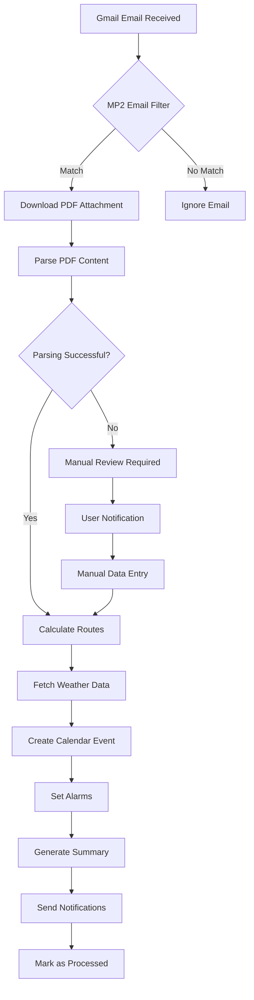

# MP2 Film Schedule Automation - Product Requirements Document

## 1. Product Overview

System automatyzacji planów zdjęciowych MP2 to inteligentne narzędzie, które automatycznie przetwarza maile z harmonogramami filmu "Matki Pingwinów 2", tworzy optymalne plany dnia i integruje się z kalendarzem Google.

Produkt rozwiązuje problem czasochłonnego manualnego planowania dnia zdjęciowego poprzez automatyczne obliczanie tras, ustawianie alarmów i monitorowanie pogody. Głównym użytkownikiem jest członek ekipy filmowej wymagający precyzyjnego zarządzania czasem.

Celem produktu jest zwiększenie efektywności planowania o 80% i eliminacja błędów ludzkich w obliczeniach czasowych, co przekłada się na oszczędności czasu i kosztów produkcji.

## 2. Core Features

### 2.1 User Roles

| Role                 | Registration Method    | Core Permissions                                                                |
| -------------------- | ---------------------- | ------------------------------------------------------------------------------- |
| Film Crew Member     | Google Account OAuth   | Full access to automation features, calendar integration, notification settings |
| System Administrator | Google Workspace Admin | System configuration, API key management, user access control                   |

### 2.2 Feature Module

Nasz system automatyzacji MP2 składa się z następujących głównych stron:

1. **Dashboard**: monitoring statusu automatyzacji, ostatnie przetwarzane maile, nadchodzące plany zdjęciowe
2. **Configuration Page**: ustawienia adresów, buforów czasowych, preferencji powiadomień, kluczy API
3. **Processing History**: historia przetwarzanych maili, szczegóły planów dnia, logi błędów
4. **Calendar Integration**: podgląd wydarzeń kalendarzowych, zarządzanie alarmami, synchronizacja
5. **Analytics Dashboard**: statystyki przetwarzania, analiza czasów podróży, optymalizacja tras

### 2.3 Page Details

| Page Name            | Module Name              | Feature Description                                                                     |
| -------------------- | ------------------------ | --------------------------------------------------------------------------------------- |
| Dashboard            | Status Monitor           | Display real-time automation status, last processed emails, upcoming shooting schedules |
| Dashboard            | Quick Actions            | Manual email processing trigger, system health check, emergency notifications           |
| Dashboard            | Recent Activity          | Show last 10 processed emails with status, processing time, and results summary         |
| Configuration        | Address Settings         | Configure home address, Panavision office, custom locations with validation             |
| Configuration        | Time Buffers             | Set car change, parking, entry, traffic, morning routine buffers with presets           |
| Configuration        | API Management           | Secure API key configuration for Maps, Weather, with connection testing                 |
| Configuration        | Notification Preferences | Email, SMS, push notification settings with delivery time preferences                   |
| Processing History   | Email Log                | Searchable list of processed emails with filters by date, status, location              |
| Processing History   | Schedule Details         | Detailed view of parsed PDF data, route calculations, weather forecasts                 |
| Processing History   | Error Management         | Error logs with retry options, manual correction interface, troubleshooting guides      |
| Calendar Integration | Event Overview           | Calendar widget showing MP2 events, alarm status, reminder configuration                |
| Calendar Integration | Alarm Management         | Create, modify, delete wake-up alarms with multiple time options                        |
| Calendar Integration | Sync Status              | Google Calendar synchronization status, conflict resolution, backup options             |
| Analytics Dashboard  | Processing Stats         | Charts showing processing success rates, average times, error trends                    |
| Analytics Dashboard  | Route Optimization       | Historical route data analysis, traffic pattern insights, time savings metrics          |
| Analytics Dashboard  | Weather Impact           | Weather condition correlation with schedule changes, seasonal patterns                  |

## 3. Core Process

### Main User Flow - Automated Processing

1. **Email Reception**: System automatically detects MP2 emails with PDF attachments in Gmail
2. **Content Extraction**: PDF is downloaded, parsed for schedule data (date, call time, location, scenes)
3. **Route Planning**: Calculate optimal routes Dom→Panavision→Location with real-time traffic data
4. **Time Calculation**: Determine wake-up time based on call time minus travel time and buffers
5. **Weather Integration**: Fetch weather forecast for shooting date and location
6. **Calendar Creation**: Create Google Calendar event with all details, reminders, and alarms
7. **Notification Generation**: Send comprehensive day summary to user via preferred channels
8. **Monitoring**: Continuous monitoring for schedule changes or weather alerts

### Manual Override Flow

1. **Dashboard Access**: User accesses system dashboard for manual control
2. **Email Selection**: Choose specific email for processing or reprocessing
3. **Data Review**: Review extracted PDF data with manual correction options
4. **Route Adjustment**: Modify routes, add stops, adjust time buffers as needed
5. **Calendar Update**: Apply changes to calendar events and alarms
6. **Confirmation**: Receive updated summary with all modifications

### Error Handling Flow

1. **Error Detection**: System identifies processing errors (API failures, parsing issues)
2. **Automatic Retry**: Attempt automatic retry with exponential backoff
3. **Fallback Options**: Use cached data or default values when external services fail
4. **User Notification**: Alert user of errors with suggested manual actions
5. **Manual Resolution**: Provide interface for manual data correction and reprocessing

## 4. User Interface Design

### 4.1 Design Style

- **Primary Colors**: Blue (#3B82F6), MP2 Brand Orange (#F97316)
- **Secondary Colors**: Success Green (#10B981), Warning Yellow (#F59E0B), Error Red (#EF4444)
- **Typography**: Inter font family with system font fallbacks, 16px base size
- **Button Style**: Modern rounded buttons with Tailwind CSS styling and hover effects
- **Layout Style**: Clean card-based design with Tailwind's spacing system, responsive grid
- **Icons**: Lucide React icons for consistency and modern appearance
- **Animation**: Smooth transitions using Tailwind CSS and React 19 concurrent features
- **Framework**: Tailwind CSS utility-first approach for rapid development

### 4.2 Page Design Overview

| Page Name            | Module Name        | UI Elements                                                                                                                  |
| -------------------- | ------------------ | ---------------------------------------------------------------------------------------------------------------------------- |
| Dashboard            | Status Monitor     | Large status cards with color-coded indicators (green/yellow/red), real-time updating counters, progress bars for processing |
| Dashboard            | Quick Actions      | Prominent action buttons with icons, floating action button for emergency processing, tooltip guidance                       |
| Dashboard            | Recent Activity    | Timeline-style activity feed with expandable details, status badges, timestamp formatting                                    |
| Configuration        | Address Settings   | Google Maps integration for address validation, autocomplete dropdowns, saved location presets                               |
| Configuration        | Time Buffers       | Slider controls with live preview of total time, preset buttons for common scenarios, visual time breakdown                  |
| Configuration        | API Management     | Secure input fields with show/hide toggle, connection status indicators, test buttons with loading states                    |
| Processing History   | Email Log          | Data table with sorting, filtering, pagination, expandable rows for details, export functionality                            |
| Processing History   | Schedule Details   | Split-pane layout with PDF preview on left, parsed data on right, edit-in-place functionality                                |
| Calendar Integration | Event Overview     | Mini calendar widget with event markers, popup details on hover, drag-and-drop rescheduling                                  |
| Calendar Integration | Alarm Management   | Time picker controls, multiple alarm toggle switches, sound/vibration preference selectors                                   |
| Analytics Dashboard  | Processing Stats   | Interactive charts (line, bar, pie) with date range selectors, drill-down capabilities, export options                       |
| Analytics Dashboard  | Route Optimization | Map visualization with route overlays, traffic heat maps, comparative time analysis charts                                   |

### 4.3 Responsiveness

Built with Tailwind CSS responsive design system:

- **Mobile First**: Base styles for mobile (320px+)
- **Tablet**: md: breakpoint (768px+)
- **Desktop**: lg: breakpoint (1024px+) and xl: (1280px+)
- **Touch Optimized**: React 19 touch events and gesture handling
- **Progressive Enhancement**: Core functionality works on all devices

### 4.4 Accessibility Features

- **WCAG 2.1 AA Compliance**: High contrast ratios, keyboard navigation, screen reader compatibility
- **Internationalization**: Polish and English language support with RTL text support preparation
- **Voice Commands**: Integration with browser speech recognition for hands-free operation
- **Visual Indicators**: Color-blind friendly design with icons and patterns alongside color coding
- **Font Scaling**: Support for browser zoom up to 200% without horizontal scrolling

## 5. Functional Requirements

### 5.1 Email Processing Requirements

**FR-001: Email Detection**

- System MUST monitor Gmail inbox every 5 minutes for new emails
- System MUST identify MP2 emails using sender domain, subject keywords (MP2, plan zdjęciowy, drabinka, call time)
- System MUST verify presence of PDF attachment before processing
- System MUST handle multiple emails in single processing cycle

**FR-002: Duplicate Prevention**

- System MUST maintain hash of processed Message-IDs to prevent duplicate processing
- System MUST calculate and store PDF content hash for duplicate detection
- System MUST provide manual override option for reprocessing duplicates
- System MUST log all duplicate detection events for audit purposes

**FR-003: PDF Parsing**

- System MUST extract shooting date in YYYY-MM-DD format with validation
- System MUST extract call time in HH:MM 24-hour format
- System MUST identify location addresses with geocoding validation
- System MUST parse scene numbers, INT/EXT designation, safety notes, contact information
- System MUST handle OCR for scanned PDFs with confidence scoring
- System MUST provide manual correction interface for parsing errors

### 5.2 Route Planning Requirements

**FR-004: Route Calculation**

- System MUST calculate Dom→Panavision→Location route with real-time traffic data
- System MUST apply configurable time buffers: 15min car change, 10min parking, 10min entry, 20min traffic, 45min morning routine
- System MUST use Google Maps Directions API with traffic_model=best_guess
- System MUST provide alternative route options with time comparisons
- System MUST handle route calculation failures with fallback estimates

**FR-005: Time Management**

- System MUST calculate wake-up time as: call_time - (total_travel_time + buffers)
- System MUST account for weekend/holiday traffic variations
- System MUST provide buffer adjustment recommendations based on weather conditions
- System MUST validate calculated times are reasonable (wake-up not before 4:00 AM)

### 5.3 Calendar Integration Requirements

**FR-006: Event Creation**

- System MUST create Google Calendar event with title "MP2 — Dzień zdjęciowy (location)"
- System MUST set event duration from departure time to call_time + 10 hours
- System MUST include comprehensive description with all parsed data, route plan, weather forecast
- System MUST set event location to shooting location with GPS coordinates
- System MUST handle calendar API failures with retry mechanism

**FR-007: Alarm Management**

- System MUST create 3 separate alarm events at wake_up_time-10min, wake_up_time, wake_up_time+5min
- System MUST set popup reminders at -12h, -3h, -1h, and departure time
- System MUST support SMS reminders if user phone number is configured
- System MUST allow manual alarm time adjustment through interface

### 5.4 Weather Integration Requirements

**FR-008: Weather Monitoring**

- System MUST fetch weather forecast for shooting date and location using OpenWeatherMap API
- System MUST generate warnings for: temperature <0°C or >30°C, precipitation >0mm, wind speed >10m/s, storms, fog
- System MUST provide detailed weather information for EXT shoots, basic info for INT shoots
- System MUST update weather data 24 hours before shooting date
- System MUST handle weather API failures gracefully with cached data

### 5.5 Notification Requirements

**FR-009: Summary Generation**

- System MUST generate comprehensive day summary in Polish language
- System MUST include timeline (wake-up, departure, arrivals), locations, weather, warnings
- System MUST format times in 24-hour format, dates in YYYY-MM-DD format
- System MUST provide summary via email, in-app notification, or dashboard display
- System MUST store summary history for future reference

### 5.6 Error Handling Requirements

**FR-010: Resilience**

- System MUST implement exponential backoff retry for API failures
- System MUST provide fallback options when external services are unavailable
- System MUST log all errors with sufficient detail for troubleshooting
- System MUST notify user of critical errors requiring manual intervention
- System MUST maintain system availability >99% during normal operation

## 6. Non-Functional Requirements

### 6.1 Performance Requirements

**NFR-001: Processing Speed**

- Email processing MUST complete within 2 minutes of email receipt
- PDF parsing MUST complete within 30 seconds for standard documents
- Route calculation MUST complete within 15 seconds including API calls
- Calendar event creation MUST complete within 10 seconds

**NFR-002: Scalability**

- System MUST handle up to 50 emails per day without performance degradation
- System MUST support concurrent processing of multiple emails
- System MUST maintain response times under increased load

### 6.2 Security Requirements

**NFR-003: Data Protection**

- All API keys MUST be stored in encrypted Google Apps Script Properties
- Email content MUST be processed in memory without persistent storage
- PDF files MUST be deleted from temporary storage within 1 hour
- User authentication MUST use Google OAuth 2.0 with appropriate scopes

**NFR-004: Privacy**

- System MUST NOT store personal information beyond operational requirements
- System MUST provide data deletion capabilities for GDPR compliance
- System MUST log access attempts and data modifications for audit

### 6.3 Reliability Requirements

**NFR-005: Availability**

- System MUST maintain 99% uptime during business hours (6:00-22:00 CET)
- System MUST recover automatically from transient failures
- System MUST provide health check endpoints for monitoring

**NFR-006: Data Integrity**

- System MUST validate all parsed data before processing
- System MUST maintain backup of configuration settings
- System MUST provide data recovery mechanisms for critical failures

## 7. Integration Requirements

### 7.1 Google Services Integration

**INT-001: Gmail API**

- Read access to inbox for MP2 email detection
- Attachment download capabilities
- Thread and message metadata access

**INT-002: Google Calendar API**

- Event creation, modification, deletion permissions
- Reminder and notification management
- Calendar sharing and access control

**INT-003: Google Drive API**

- Temporary file storage for PDF processing
- File sharing and permission management
- Automatic cleanup of temporary files

**INT-004: Google Maps API**

- Directions API with traffic data access
- Geocoding API for address validation
- Places API for location suggestions

### 7.2 External Service Integration

**INT-005: OpenWeatherMap API**

- Current weather and forecast data access
- Severe weather alert subscriptions
- Historical weather data for analysis

**INT-006: PDF Processing Services**

- Text extraction from PDF documents
- OCR capabilities for scanned documents
- Document structure analysis

## 8. User Stories

### 8.1 Primary User Stories

**US-001: Automatic Schedule Processing**
_As a film crew member, I want the system to automatically process MP2 schedule emails so that I don't have to manually plan my shooting days._

**Acceptance Criteria:**

- Email is detected within 5 minutes of receipt
- PDF is parsed correctly with >95% accuracy
- Calendar event is created with all relevant information
- I receive a summary notification within 2 minutes

**US-002: Route Optimization**
_As a film crew member, I want the system to calculate optimal routes with traffic data so that I arrive on time for call time._

**Acceptance Criteria:**

- Route includes Dom→Panavision→Location segments
- Real-time traffic data is incorporated
- Alternative routes are provided when available
- Travel time includes all necessary buffers

**US-003: Weather-Aware Planning**
_As a film crew member, I want to receive weather warnings for shooting days so that I can prepare appropriate equipment and clothing._

**Acceptance Criteria:**

- Weather forecast is fetched for shooting location and date
- Warnings are generated for adverse conditions
- Equipment recommendations are provided based on weather
- Weather updates are provided 24 hours before shoot

**US-004: Multiple Alarm Setup**
_As a film crew member, I want multiple wake-up alarms set automatically so that I don't oversleep on shooting days._

**Acceptance Criteria:**

- Three alarms are set at different times around calculated wake-up time
- Alarms are created as separate calendar events
- Popup and SMS reminders are configured if available
- Alarms can be manually adjusted if needed

### 8.2 Secondary User Stories

**US-005: Manual Override**
_As a film crew member, I want to manually correct parsed data when the system makes errors so that my schedule remains accurate._

**Acceptance Criteria:**

- Interface allows editing of all parsed fields
- Changes trigger recalculation of routes and times
- Updated calendar events reflect manual corrections
- Original and corrected data are logged for improvement

**US-006: Historical Analysis**
_As a film crew member, I want to view historical shooting schedules and route performance so that I can optimize my planning._

**Acceptance Criteria:**

- Dashboard shows processing statistics and trends
- Route performance data is visualized with charts
- Historical weather impact on schedules is analyzed
- Export functionality for detailed analysis

**US-007: System Configuration**
_As a system administrator, I want to configure system settings and API keys so that the automation works correctly for different users._

**Acceptance Criteria:**

- Secure interface for API key management
- Address and buffer configuration options
- User permission and access control settings
- System health monitoring and alerting

## 9. Success Metrics

### 9.1 Primary Metrics

**Processing Accuracy**: >95% of emails processed without manual intervention
**Time Savings**: 80% reduction in manual planning time (from 30 minutes to 6 minutes per schedule)
**Schedule Adherence**: >90% on-time arrival rate for call times
**User Satisfaction**: >4.5/5 rating in user feedback surveys

### 9.2 Secondary Metrics

**System Reliability**: >99% uptime during business hours
**API Performance**: <30 seconds average processing time per email
**Error Rate**: <5% of processed emails require manual correction
**Weather Accuracy**: >85% accuracy in weather-based equipment recommendations

### 9.3 Business Impact Metrics

**Cost Savings**: Estimated 2 hours saved per shooting day × 100 shooting days = 200 hours annually
**Production Efficiency**: Reduced late arrivals and schedule disruptions
**Crew Satisfaction**: Improved work-life balance through better time management
**Risk Mitigation**: Reduced weather-related equipment damage and schedule delays

This comprehensive product requirements document provides the foundation for developing a robust, user-friendly MP2 automation system that meets the specific needs of film production scheduling while maintaining high standards of reliability and usability.
