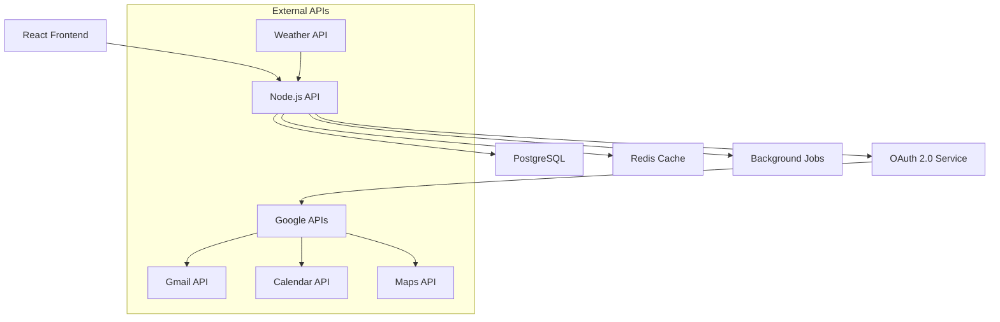

# StillOnTime Automation System - Plan Działania

## 📋 Przegląd Projektu

**Nazwa:** StillOnTime Film Schedule Automation System  
**Cel:** Automatyzacja planowania dnia zdjęciowego dla produkcji filmowych  
**Technologie:** Node.js + TypeScript, React 19, PostgreSQL, Redis, OAuth 2.0  
**Czas realizacji:** 8-12 tygodni

## 🎯 Główne Cele

1. **Automatyzacja Email Processing** - 100% automatyczne wykrywanie i przetwarzanie emaili z harmonogramami
2. **Inteligentne Route Planning** - Optymalne trasy Dom→Panavision→Lokacja z real-time traffic
3. **Calendar Integration** - Automatyczne tworzenie wydarzeń z alarmami i przypomnieniami
4. **Weather Monitoring** - Prognozy pogody z ostrzeżeniami dla planów zdjęciowych
5. **User Dashboard** - Intuicyjny interfejs do monitorowania i konfiguracji

## 📊 Architektura Systemu

## 🚀 Fazy Implementacji

### Faza 1: Fundament (Tygodnie 1-2)

- [ ] Setup projektu i środowiska development
- [ ] Konfiguracja bazy danych PostgreSQL + Prisma
- [ ] Implementacja OAuth 2.0 authentication
- [ ] Podstawowa struktura API i frontend

### Faza 2: Core Services (Tygodnie 3-5)

- [ ] Gmail API integration z email monitoring
- [ ] PDF parsing service z OCR support
- [ ] Google Maps integration dla route planning
- [ ] Weather API integration z caching
- [ ] Background job processing system

### Faza 3: Business Logic (Tygodnie 6-8)

- [ ] StillOnTime-specific email filtering i validation
- [ ] Schedule data extraction i parsing
- [ ] Route calculation z time buffers
- [ ] Calendar event creation z alarmami
- [ ] Weather warnings i notifications

### Faza 4: User Interface (Tygodnie 9-10)

- [ ] React dashboard z real-time updates
- [ ] Authentication flow i user management
- [ ] Configuration interface
- [ ] Processing history i analytics
- [ ] Error handling i manual overrides

### Faza 5: Testing & Deployment (Tygodnie 11-12)

- [ ] Comprehensive testing suite
- [ ] Performance optimization
- [ ] Security audit i hardening
- [ ] Production deployment
- [ ] Documentation i user training

## 🔧 Kluczowe Komponenty

### Backend Services

1. **OAuth2Service** - Google authentication i token management
2. **EmailMonitorService** - Gmail monitoring z StillOnTime filtering
3. **PDFParserService** - Extraction danych z PDF attachments
4. **RoutePlannerService** - Google Maps integration z traffic data
5. **WeatherService** - OpenWeatherMap integration z warnings
6. **CalendarManagerService** - Google Calendar events i alarms
7. **NotificationService** - Multi-channel notifications
8. **JobProcessor** - Background task processing

### Frontend Components

1. **AuthenticationFlow** - OAuth 2.0 login/logout
2. **Dashboard** - System status i recent activity
3. **ConfigurationPanel** - User settings i preferences
4. **ProcessingHistory** - Email logs i schedule details
5. **AnalyticsDashboard** - Statistics i performance metrics

## 📋 Wymagania Funkcjonalne

### Email Processing (FR-001 do FR-003)

- Automatyczne wykrywanie emaili z harmonogramami co 5 minut
- Filtrowanie po keywords: "plan zdjęciowy", "drabinka", "shooting schedule"
- PDF parsing z extraction: date, call time, location, scenes
- Duplicate prevention z message ID i PDF hash
- Manual correction interface dla parsing errors

### Route Planning (FR-004 do FR-005)

- Dom→Panavision→Location route calculation
- Real-time traffic data z Google Maps
- Time buffers: 15min car change, 10min parking, 10min entry, 20min traffic, 45min morning routine
- Wake-up time calculation: call_time - (travel_time + buffers)
- Validation: wake-up nie wcześniej niż 4:00 AM

### Calendar Integration (FR-006 do FR-007)

- Event title: "StillOnTime — Dzień zdjęciowy (location)"
- Duration: departure time do call_time + 10 hours
- 3 alarms: wake_up-10min, wake_up, wake_up+5min
- Reminders: -12h, -3h, -1h, departure time
- Comprehensive description z wszystkimi details

### Weather Monitoring (FR-008)

- Weather forecast dla shooting date i location
- Warnings dla: temp <0°C lub >30°C, precipitation >0mm, wind >10m/s
- Detailed info dla EXT shoots, basic dla INT shoots
- 24h cache z automatic updates
- Fallback gdy weather API unavailable

## 🔒 Security & Performance

### Security Measures

- OAuth 2.0 z PKCE dla Google services
- JWT session management z automatic refresh
- Encrypted token storage
- Rate limiting per user i endpoint
- Input validation i sanitization
- HTTPS enforcement w production

### Performance Optimization

- Redis caching dla frequently accessed data
- Background job processing dla heavy operations
- Database indexing i query optimization
- Connection pooling dla external APIs
- CDN dla static assets

## 🧪 Testing Strategy

### Unit Testing (80%+ coverage)

- Service layer testing z Jest i mocks
- OAuth 2.0 flow testing z test tokens
- PDF parsing accuracy testing
- Route calculation validation
- Weather data processing verification

### Integration Testing

- End-to-end email processing flow
- Google APIs integration z test accounts
- Calendar event creation i verification
- Database operations i migrations
- Background job processing

### Performance Testing

- Concurrent user authentication
- Email processing throughput
- API response time monitoring
- Database query performance
- Memory usage profiling

## 📈 Success Metrics

### Primary KPIs

- **Email Processing Success Rate**: >95%
- **Route Calculation Accuracy**: >90%
- **Calendar Event Creation Success**: >98%
- **System Uptime**: >99.5%
- **User Satisfaction**: >4.5/5

### Performance Targets

- **Email Processing Time**: <30 seconds per email
- **Route Calculation Time**: <5 seconds
- **Dashboard Load Time**: <2 seconds
- **API Response Time**: <500ms (95th percentile)

## 🚢 Deployment Plan

### Development Environment

- Docker Compose z hot reloading
- Test databases z sample data
- Mock external APIs
- Comprehensive logging

### Staging Environment

- Production-like configuration
- Real API integrations z test accounts
- Performance testing
- Security scanning

### Production Environment

- Containerized deployment
- Load balancing i auto-scaling
- Health checks i monitoring
- Backup i recovery procedures
- Blue-green deployment strategy

## 📚 Documentation Plan

### Technical Documentation

- API documentation z OpenAPI/Swagger
- Database schema documentation
- Deployment i configuration guides
- OAuth 2.0 setup instructions
- Troubleshooting guides

### User Documentation

- User manual dla dashboard functionality
- Configuration best practices
- Common issues i solutions
- Video tutorials dla key features

## 🤝 Team & Resources

### Required Skills

- **Backend Developer**: Node.js, TypeScript, OAuth 2.0, Google APIs
- **Frontend Developer**: React, TypeScript, Tailwind CSS
- **DevOps Engineer**: Docker, PostgreSQL, Redis, monitoring
- **QA Engineer**: Testing automation, security testing

### External Dependencies

- Google Cloud Platform account
- OpenWeatherMap API account
- Production hosting (AWS/GCP/Azure)
- Domain i SSL certificates

## 📅 Timeline & Milestones

### Week 1-2: Foundation

- ✅ Project setup i environment configuration
- ✅ Database schema i Prisma setup
- ✅ OAuth 2.0 authentication implementation
- ✅ Basic API structure

### Week 3-5: Core Services

- 🔄 Gmail API integration
- 🔄 PDF parsing service
- 🔄 Google Maps integration
- 🔄 Weather API integration
- 🔄 Background job system

### Week 6-8: Business Logic

- ⏳ StillOnTime email filtering
- ⏳ Schedule data processing
- ⏳ Route calculation logic
- ⏳ Calendar integration
- ⏳ Notification system

### Week 9-10: User Interface

- ⏳ React dashboard
- ⏳ Authentication UI
- ⏳ Configuration interface
- ⏳ Analytics dashboard

### Week 11-12: Launch

- ⏳ Testing i QA
- ⏳ Performance optimization
- ⏳ Production deployment
- ⏳ Documentation i training

## 🎯 Next Steps

1. **Immediate Actions**

   - Setup development environment
   - Configure Google Cloud Platform
   - Initialize project repositories
   - Setup CI/CD pipeline

2. **Week 1 Priorities**

   - Database schema implementation
   - OAuth 2.0 service development
   - Basic API structure
   - Frontend project initialization

3. **Risk Mitigation**
   - API quota monitoring i management
   - Backup authentication methods
   - Fallback dla external service failures
   - Regular security audits

---

**Status**: 🚀 Ready to Start Implementation  
**Last Updated**: December 2024  
**Next Review**: Weekly standup meetings
