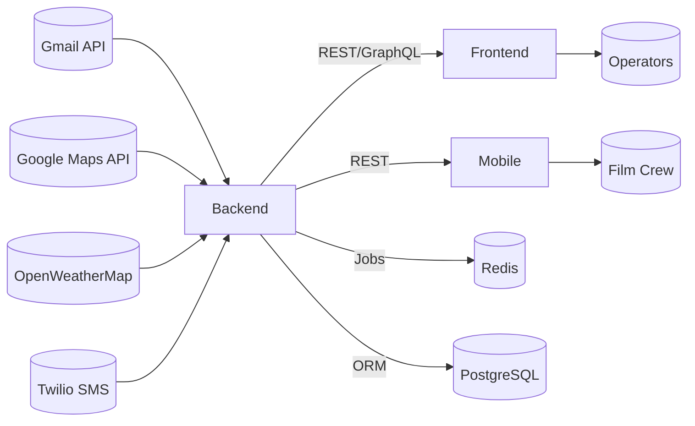

# Architecture Overview

## Context Diagram

## Component Summary
| Warstwa | Opis | Technologie | Artefakty |
| --- | --- | --- | --- |
| Backend API | Obsługa maili, PDF, harmonogramów, integracje zewnętrzne | Node.js 20, Express, Prisma, Bull, Redis | `backend/` |
| Frontend Dashboard | Panel zarządzania i konfiguracji | React 18, Vite, Tailwind, Zustand | `frontend/` |
| Mobile Client | Dostęp mobilny do harmonogramu | React Native (Expo) | `mobile/` |
| Background Jobs | Kolejki powiadomień SMS, synchronizacja kalendarzy | Bull, Redis | `backend/src/jobs/` |
| Observability | Monitorowanie i alerty | Prometheus, Grafana (szablony) | `monitoring/` |

## Integrations
- **Google APIs** – Gmail/Calendar/Drive/Maps (klucze wymagane w `.env`).
- **Twilio** – wysyłka SMS.
- **OpenWeatherMap** – prognozy pogody.
- **Redis** – cache i kolejki.
- **PostgreSQL** – główna baza danych.

## Deployment Targets
| Środowisko | Narzędzia | Konfiguracje |
| --- | --- | --- |
| Local Dev | Docker Compose, `scripts/start.sh` | `.env`, `docker-compose.yml` |
| CI | GitHub Actions | `.github/workflows/ci.yaml` |
| Production | Docker Compose (prod profile) / Kubernetes (folder `kubernetes/`) | `docker-compose.production.yml`, `kubernetes/` |

## Known Gaps
- Brak definicji `<SERVICE_PORTS>` (TODO).
- `<DB_CONNECTION_STRING?>` musi zostać potwierdzone dla produkcji (placeholdery w `.env`).
- Niezweryfikowana integracja mobilna (brak CI, brak smoke testu).
