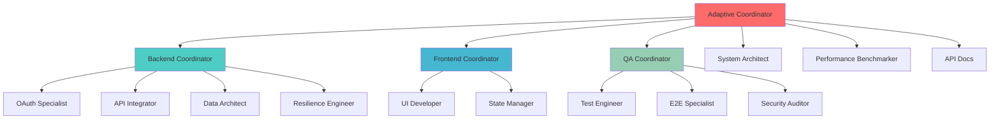

# StillOnTime Swarm Orchestration

## Overview

This directory contains the complete swarm coordination system for the StillOnTime Film Schedule Automation project.

## Contents

### Core Documentation

1. **[swarm-init.md](./swarm-init.md)** - Swarm initialization configuration
   - Topology definition (Adaptive Mesh)
   - Agent hierarchy and roles
   - Communication patterns
   - Memory organization
   - Initialization sequence
   - Coordination hooks protocol

2. **[swarm-strategies.md](./swarm-strategies.md)** - Execution strategies for different scenarios
   - Feature Development strategy
   - Bug Fixing strategy
   - Performance Optimization strategy
   - Security Hardening strategy
   - E2E Testing strategy
   - Production Deployment strategy

3. **[agent-profiles.md](./agent-profiles.md)** - Detailed agent specifications
   - Capabilities and responsibilities
   - Code ownership areas
   - Communication patterns
   - Success metrics
   - Memory namespaces

## Quick Start

### Initialize Swarm

```bash
# 1. Ensure claude-flow is installed
npx claude-flow@alpha --version

# 2. Initialize swarm session
npx claude-flow@alpha swarm init \
  --topology adaptive-mesh \
  --max-agents 12 \
  --session-id swarm-stillontime

# 3. Spawn primary coordinator
npx claude-flow@alpha agent spawn \
  --type adaptive-coordinator \
  --session-id swarm-stillontime
```

### Execute a Strategy

```bash
# Example: Run Feature Development strategy for new API integration
npx claude-flow@alpha strategy execute \
  --strategy feature-development \
  --feature "Google Drive Integration" \
  --session-id swarm-stillontime
```

### Monitor Swarm Status

```bash
# Check swarm health
npx claude-flow@alpha swarm status --session-id swarm-stillontime

# List active agents
npx claude-flow@alpha agent list --session-id swarm-stillontime

# View current tasks
npx claude-flow@alpha task list --session-id swarm-stillontime
```

## Architecture Overview



## Strategy Selection Matrix

| Scenario | Strategy | Priority | Duration | Agents |
|----------|----------|----------|----------|--------|
| **New Feature** | Feature Development | High | 3-5 days | 8-12 |
| **Critical Bug** | Bug Fix | Critical | 2-6 hours | 4-6 |
| **Performance Issue** | Performance Optimization | High | 2-3 days | 6-8 |
| **Security Concern** | Security Hardening | Critical | 1-2 days | 5-7 |
| **Pre-Release** | E2E Testing | High | 1 day | 6-8 |
| **Production Release** | Deployment | Critical | 4-8 hours | 7-10 |

## Agent Coordination Protocol

All agents MUST follow this protocol:

### 1. Pre-Task (Before Starting Work)
```bash
npx claude-flow@alpha hooks pre-task \
  --description "Task description" \
  --agent-id "agent-name" \
  --session-id "swarm-stillontime"

npx claude-flow@alpha hooks session-restore \
  --session-id "swarm-stillontime"
```

### 2. During Task (While Working)
```bash
# After editing a file
npx claude-flow@alpha hooks post-edit \
  --file "path/to/file" \
  --memory-key "swarm/agent-name/file-changes"

# Send status update
npx claude-flow@alpha hooks notify \
  --message "Completed OAuth implementation" \
  --level "info"
```

### 3. Post-Task (After Completion)
```bash
npx claude-flow@alpha hooks post-task \
  --task-id "task-123" \
  --status "completed" \
  --metrics-export true

npx claude-flow@alpha hooks session-end \
  --session-id "swarm-stillontime" \
  --export-metrics true \
  --save-patterns true
```

## Memory Organization

```
coordination/
├── memory_bank/
│   ├── swarm-session-template.json    # Session state template
│   └── sessions/
│       └── swarm-stillontime-YYYYMMDD-HHMMSS.json
├── orchestration/
│   ├── swarm-init.md                  # Initialization config
│   ├── swarm-strategies.md            # Execution strategies
│   ├── agent-profiles.md              # Agent specifications
│   └── README.md                      # This file
└── subtasks/
    └── [agent-generated-subtasks]/    # Agent work breakdown
```

## Performance Targets

### Coordination Overhead
- Agent spawn time: <500ms per agent
- Message passing latency: <50ms
- Memory read/write: <100ms
- Hook execution: <200ms per hook

### Development Velocity
- Task distribution: <1s for 10 concurrent tasks
- Progress tracking: Real-time updates every 30s
- Bottleneck detection: <5s from occurrence
- Session restore: <2s for full state

## Constitution Compliance

All strategies and agents enforce StillOnTime constitution:

### ✅ Security & Compliance (MUST)
- OAuth 2.0 with PKCE for all external integrations
- Secrets encrypted and stored securely
- GDPR: deletion capabilities and temp file cleanup (<1 hour)
- Circuit breakers + exponential backoff + fallbacks

### ✅ Real-Time Performance (MUST)
- Email processing ≤ 2 min
- PDF parsing ≤ 30 s
- Route calculation ≤ 15 s
- Calendar event ≤ 10 s
- 99% uptime target 06:00-22:00 CET

### ✅ TDD & Code Quality (MUST)
- Tests first, then implementation
- Coverage >80% for critical paths
- TypeScript strict mode
- No console.log in production

### ✅ Film Industry Domain (MUST)
- Production terminology (call sheets, schedules)
- Industry time buffers (car change, parking, entry, traffic, morning routine)
- Weather-based equipment recommendations
- Multi-location shoot handling
- Manual override capabilities

## Troubleshooting

### Swarm Not Starting
```bash
# Check if claude-flow is installed
npx claude-flow@alpha --version

# Reinstall if needed
npm install -g claude-flow@alpha

# Clear session cache
rm -rf .claude-flow/sessions/swarm-stillontime-*
```

### Agent Not Responding
```bash
# Check agent status
npx claude-flow@alpha agent status \
  --agent-id "agent-name" \
  --session-id "swarm-stillontime"

# Restart agent
npx claude-flow@alpha agent restart \
  --agent-id "agent-name" \
  --session-id "swarm-stillontime"
```

### Memory Corruption
```bash
# Validate memory integrity
npx claude-flow@alpha memory validate \
  --session-id "swarm-stillontime"

# Restore from backup
npx claude-flow@alpha memory restore \
  --session-id "swarm-stillontime" \
  --backup-timestamp "2025-10-12T10:00:00Z"
```

## Best Practices

1. **Always Use Hooks**: Every agent must execute coordination hooks
2. **Test First**: TDD is mandatory for all code changes
3. **Memory Coordination**: Use shared memory for agent communication
4. **Monitor Performance**: Track metrics continuously
5. **Constitution Compliance**: Every change must respect all gates
6. **Fail Fast**: Detect failures early and abort/rollback quickly
7. **Document Decisions**: Update memory with architectural choices

## Integration with Development Workflow

### Daily Development Flow
```bash
# Morning: Start swarm session
npm run swarm:start

# Throughout day: Execute strategies as needed
npm run swarm:feature "Feature Name"
npm run swarm:bugfix "Bug Description"

# End of day: Save session state
npm run swarm:save

# Shutdown
npm run swarm:stop
```

### CI/CD Integration
```yaml
# .github/workflows/swarm-validation.yml
name: Swarm Strategy Validation

on: [pull_request]

jobs:
  validate:
    runs-on: ubuntu-latest
    steps:
      - uses: actions/checkout@v2
      - name: Install claude-flow
        run: npm install -g claude-flow@alpha
      - name: Run E2E Testing Strategy
        run: npx claude-flow@alpha strategy execute --strategy e2e-testing
```

## Version History

- **v1.0.0** (2025-10-12): Initial swarm orchestration system
  - Adaptive mesh topology
  - 6 core strategies
  - 15 specialized agents + 1 coordinator
  - Full constitution compliance

## Next Steps

1. **Activate Swarm**: Initialize first session
2. **Test Strategy**: Run Feature Development strategy on sample feature
3. **Measure Performance**: Collect baseline metrics
4. **Train Neural Patterns**: Build pattern library from successful executions
5. **Iterate**: Refine strategies based on real-world results

## Support

- **Documentation**: See individual strategy and agent profile docs
- **Issues**: Report to project maintainers
- **Metrics**: Check `.claude-flow/metrics/` for performance data
- **Sessions**: Stored in `coordination/memory_bank/sessions/`

---

**Status**: ✅ Ready for Activation  
**Last Updated**: 2025-10-12  
**Maintained By**: System Architect + Adaptive Coordinator

