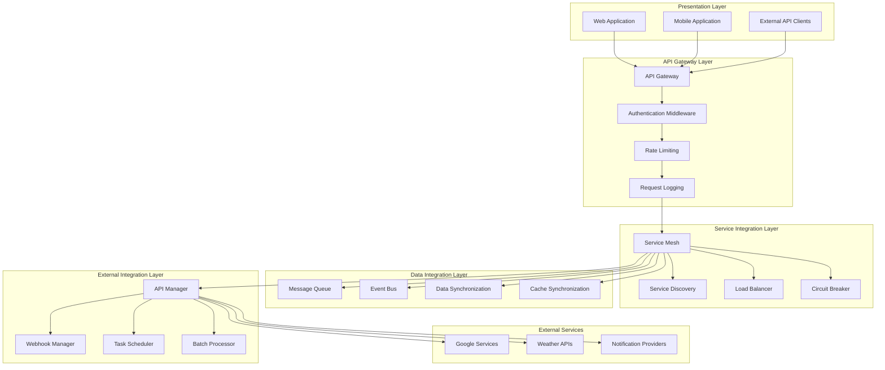

# MP2 Film Schedule Automation - System Integration Patterns

## Integration Overview

This document outlines the comprehensive integration patterns and strategies for the MP2 Film Schedule Automation System. The integration architecture enables seamless communication between microservices, external APIs, and system components while maintaining reliability, scalability, and maintainability.

## 1. Integration Architecture

### 1.1 Integration Layers



## 2. Service-to-Service Integration Patterns

### 2.1 Synchronous Communication

**REST API Integration**:
```javascript
class ServiceClient {
    constructor(serviceName, baseURL) {
        this.serviceName = serviceName;
        this.baseURL = baseURL;
        this.circuitBreaker = new CircuitBreaker({
            failureThreshold: 5,
            resetTimeout: 30000
        });
        this.retry = new RetryMechanism({
            maxAttempts: 3,
            baseDelay: 1000
        });
    }

    async makeRequest(method, endpoint, data = null, options = {}) {
        const url = `${this.baseURL}${endpoint}`;

        return this.circuitBreaker.execute(async () => {
            return this.retry.execute(async () => {
                const response = await fetch(url, {
                    method,
                    headers: {
                        'Content-Type': 'application/json',
                        'Authorization': `Bearer ${this.getAuthToken()}`,
                        'X-Request-ID': this.generateRequestId(),
                        ...options.headers
                    },
                    body: data ? JSON.stringify(data) : null,
                    timeout: options.timeout || 10000
                });

                if (!response.ok) {
                    throw new ServiceError(
                        `HTTP ${response.status}: ${response.statusText}`,
                        response.status,
                        await response.json().catch(() => null)
                    );
                }

                return response.json();
            });
        });
    }

    // Service-specific methods
    async getSchedule(scheduleId) {
        return this.makeRequest('GET', `/schedule/${scheduleId}`);
    }

    async createRoutePlan(routeData) {
        return this.makeRequest('POST', '/routes/calculate', routeData);
    }

    async updateCalendarEvent(eventId, eventData) {
        return this.makeRequest('PUT', `/calendar/events/${eventId}`, eventData);
    }
}
```

**GraphQL Integration**:
```javascript
class GraphQLClient {
    constructor(endpoint) {
        this.endpoint = endpoint;
        this.client = new ApolloClient({
            uri: endpoint,
            cache: new InMemoryCache(),
            defaultOptions: {
                watchQuery: {
                    errorPolicy: 'all'
                },
                query: {
                    errorPolicy: 'all'
                }
            }
        });
    }

    async query(query, variables = {}, options = {}) {
        try {
            const result = await this.client.query({
                query,
                variables,
                ...options
            });

            return result.data;
        } catch (error) {
            throw new GraphQLQueryError(error.message, error.graphQLErrors);
        }
    }

    async mutate(mutation, variables = {}, options = {}) {
        try {
            const result = await this.client.mutate({
                mutation,
                variables,
                ...options
            });

            return result.data;
        } catch (error) {
            throw new GraphQLMutationError(error.message, error.graphQLErrors);
        }
    }
}

// Example GraphQL query
const GET_SCHEDULE_WITH_RELATIONS = gql`
    query GetScheduleWithRelations($id: UUID!) {
        schedule(id: $id) {
            id
            shootingDate
            callTime
            location
            routePlan {
                wakeUpTime
                departureTime
                arrivalTime
            }
            weatherInfo {
                temperature
                description
                warnings
            }
            calendarEvent {
                id
                title
                startTime
                endTime
            }
        }
    }
`;
```

### 2.2 Asynchronous Communication

**Message Queue Integration**:
```javascript
class MessageQueueProducer {
    constructor(queueName, connectionConfig) {
        this.queueName = queueName;
        this.connection = new RabbitMQConnection(connectionConfig);
        this.channel = null;
    }

    async initialize() {
        this.channel = await this.connection.createChannel();
        await this.channel.assertQueue(this.queueName, {
            durable: true,
            arguments: {
                'x-message-ttl': 3600000, // 1 hour
                'x-dead-letter-exchange': `${this.queueName}.dlx`
            }
        });
    }

    async publishMessage(message, options = {}) {
        if (!this.channel) {
            await this.initialize();
        }

        const messageData = {
            id: generateUUID(),
            timestamp: new Date().toISOString(),
            payload: message,
            metadata: {
                source: process.env.SERVICE_NAME,
                version: '1.0.0',
                ...options.metadata
            }
        };

        const published = this.channel.sendToQueue(
            this.queueName,
            Buffer.from(JSON.stringify(messageData)),
            {
                persistent: true,
                messageId: messageData.id,
                timestamp: Date.now(),
                headers: {
                    'content-type': 'application/json',
                    ...options.headers
                },
                ...options.options
            }
        );

        if (!published) {
            throw new Error('Failed to publish message to queue');
        }

        return messageData.id;
    }

    async publishEvent(eventType, eventData, options = {}) {
        return this.publishMessage({
            type: eventType,
            data: eventData
        }, {
            metadata: {
                eventType,
                ...options.metadata
            },
            ...options
        });
    }
}

class MessageQueueConsumer {
    constructor(queueName, handler, connectionConfig) {
        this.queueName = queueName;
        this.handler = handler;
        this.connection = new RabbitMQConnection(connectionConfig);
        this.channel = null;
        this.consumerTag = null;
    }

    async start(options = {}) {
        this.channel = await this.connection.createChannel();

        await this.channel.prefetch(options.prefetchCount || 1);
        await this.channel.assertQueue(this.queueName, { durable: true });

        this.consumerTag = await this.channel.consume(
            this.queueName,
            async (msg) => {
                if (msg === null) return;

                try {
                    const messageData = JSON.parse(msg.content.toString());
                    await this.handleMessage(messageData, msg);
                    this.channel.ack(msg);
                } catch (error) {
                    console.error('Message processing failed:', error);

                    if (options.retryOnFailure !== false) {
                        // Retry with exponential backoff
                        this.channel.nack(msg, false, false);
                    } else {
                        this.channel.ack(msg);
                    }
                }
            },
            {
                noAck: false,
                consumerTag: options.consumerTag
            }
        );
    }

    async handleMessage(messageData, rawMessage) {
        const context = {
            messageId: messageData.id,
            timestamp: messageData.timestamp,
            source: messageData.metadata?.source,
            attemptCount: rawMessage.properties.headers?.['x-death']?.[0]?.count || 0
        };

        await this.handler(messageData.payload, context);
    }

    async stop() {
        if (this.consumerTag && this.channel) {
            await this.channel.cancel(this.consumerTag);
        }
    }
}
```

**Event-Driven Architecture**:
```javascript
class EventPublisher {
    constructor(eventBus) {
        this.eventBus = eventBus;
    }

    async publishEvent(eventType, eventData, options = {}) {
        const event = {
            id: generateUUID(),
            type: eventType,
            data: eventData,
            metadata: {
                source: process.env.SERVICE_NAME,
                timestamp: new Date().toISOString(),
                version: '1.0.0',
                correlationId: options.correlationId || generateUUID(),
                causationId: options.causationId,
                ...options.metadata
            }
        };

        await this.eventBus.publish(event);
        return event.id;
    }
}

class EventSubscriber {
    constructor(eventBus) {
        this.eventBus = eventBus;
        this.handlers = new Map();
    }

    subscribe(eventType, handler, options = {}) {
        if (!this.handlers.has(eventType)) {
            this.handlers.set(eventType, []);
        }

        this.handlers.get(eventType).push({
            handler,
            options
        });

        // Set up actual subscription with event bus
        this.eventBus.subscribe(eventType, async (event) => {
            const handlers = this.handlers.get(eventType) || [];

            for (const { handler, options } of handlers) {
                try {
                    await this.handleEvent(event, handler, options);
                } catch (error) {
                    console.error(`Event handler failed for ${eventType}:`, error);

                    if (options.errorHandler) {
                        await options.errorHandler(error, event);
                    }
                }
            }
        });
    }

    async handleEvent(event, handler, options) {
        const context = {
            eventId: event.id,
            eventType: event.type,
            timestamp: event.metadata.timestamp,
            source: event.metadata.source,
            correlationId: event.metadata.correlationId,
            causationId: event.metadata.causationId
        };

        if (options.filter && !options.filter(event.data, context)) {
            return; // Skip processing if filter returns false
        }

        if (options.transform) {
            event.data = await options.transform(event.data, context);
        }

        await handler(event.data, context);
    }
}

// Event definitions
const EVENTS = {
    EMAIL_RECEIVED: 'email.received',
    EMAIL_PROCESSED: 'email.processed',
    PDF_PARSED: 'pdf.parsed',
    SCHEDULE_CREATED: 'schedule.created',
    SCHEDULE_UPDATED: 'schedule.updated',
    ROUTE_CALCULATED: 'route.calculated',
    CALENDAR_EVENT_CREATED: 'calendar.event.created',
    NOTIFICATION_SENT: 'notification.sent',
    WEATHER_FETCHED: 'weather.fetched',
    ERROR_OCCURRED: 'error.occurred'
};

// Example usage
const eventPublisher = new EventPublisher(eventBus);

// Publish events
await eventPublisher.publishEvent(EVENTS.EMAIL_RECEIVED, {
    messageId: 'gmail_123',
    subject: 'MP2 Schedule',
    sender: 'production@mp2.com'
});

// Subscribe to events
const eventSubscriber = new EventSubscriber(eventBus);

eventSubscriber.subscribe(EVENTS.SCHEDULE_CREATED, async (scheduleData, context) => {
    console.log(`New schedule created: ${scheduleData.id}`);

    // Trigger route calculation
    await routeService.calculateRoute(scheduleData);
}, {
    filter: (data) => data.status === 'confirmed',
    transform: async (data) => {
        // Enrich schedule data
        data.enrichedAt = new Date().toISOString();
        return data;
    }
});
```

## 3. External Service Integration

### 3.1 Google Services Integration

**Gmail API Integration**:
```javascript
class GmailIntegrationService {
    constructor(oauth2Client) {
        this.gmail = google.gmail({ version: 'v1', auth: oauth2Client });
        this.rateLimiter = new RateLimiter({
            windowMs: 1000, // 1 second
            maxRequests: 10 // 10 requests per second
        });
        this.circuitBreaker = new CircuitBreaker({
            failureThreshold: 3,
            resetTimeout: 60000
        });
    }

    async getUnreadEmails(options = {}) {
        await this.rateLimiter.wait();

        return this.circuitBreaker.execute(async () => {
            const response = await this.gmail.users.messages.list({
                userId: 'me',
                q: this.buildQuery(options),
                maxResults: options.maxResults || 50,
                includeSpamTrash: false
            });

            return {
                messages: response.data.messages || [],
                nextPageToken: response.data.nextPageToken,
                resultSizeEstimate: response.data.resultSizeEstimate
            };
        });
    }

    async getEmailDetails(messageId) {
        await this.rateLimiter.wait();

        return this.circuitBreaker.execute(async () => {
            const response = await this.gmail.users.messages.get({
                userId: 'me',
                id: messageId,
                format: 'full',
                metadataHeaders: ['Subject', 'From', 'Date', 'Message-ID']
            });

            return this.parseEmailResponse(response.data);
        });
    }

    async getAttachment(messageId, attachmentId) {
        await this.rateLimiter.wait();

        return this.circuitBreaker.execute(async () => {
            const response = await this.gmail.users.messages.attachments.get({
                userId: 'me',
                messageId: messageId,
                id: attachmentId
            });

            return Buffer.from(response.data.data, 'base64');
        });
    }

    buildQuery(options) {
        const queryParts = ['is:unread'];

        if (options.sender) {
            queryParts.push(`from:${options.sender}`);
        }

        if (options.subject) {
            queryParts.push(`subject:${options.subject}`);
        }

        if (options.hasAttachment) {
            queryParts.push('has:attachment');
        }

        if (options.dateFrom) {
            queryParts.push(`after:${options.dateFrom}`);
        }

        if (options.dateTo) {
            queryParts.push(`before:${options.dateTo}`);
        }

        return queryParts.join(' ');
    }

    parseEmailResponse(message) {
        const headers = message.payload.headers.reduce((acc, header) => {
            acc[header.name.toLowerCase()] = header.value;
            return acc;
        }, {});

        const attachments = [];
        const parts = this.extractParts(message.payload);

        return {
            id: message.id,
            threadId: message.threadId,
            subject: headers.subject,
            from: headers.from,
            date: headers.date,
            messageId: headers['message-id'],
            snippet: message.snippet,
            body: this.extractBody(parts),
            attachments: attachments,
            internalDate: parseInt(message.internalDate)
        };
    }
}
```

**Google Calendar API Integration**:
```javascript
class CalendarIntegrationService {
    constructor(oauth2Client) {
        this.calendar = google.calendar({ version: 'v3', auth: oauth2Client });
        this.rateLimiter = new RateLimiter({
            windowMs: 1000,
            maxRequests: 5 // 5 requests per second
        });
    }

    async createEvent(eventData, calendarId = 'primary') {
        await this.rateLimiter.wait();

        const googleEvent = {
            summary: eventData.title,
            description: eventData.description,
            location: eventData.location,
            start: {
                dateTime: eventData.startTime,
                timeZone: eventData.timeZone || 'Europe/Warsaw'
            },
            end: {
                dateTime: eventData.endTime,
                timeZone: eventData.timeZone || 'Europe/Warsaw'
            },
            reminders: {
                useDefault: false,
                overrides: eventData.reminders || []
            },
            attendees: eventData.attendees || [],
            visibility: eventData.visibility || 'private'
        };

        const response = await this.calendar.events.insert({
            calendarId,
            resource: googleEvent,
            sendUpdates: eventData.sendUpdates || 'none'
        });

        return {
            id: response.data.id,
            htmlLink: response.data.htmlLink,
            created: response.data.created,
            updated: response.data.updated
        };
    }

    async updateEvent(eventId, eventData, calendarId = 'primary') {
        await this.rateLimiter.wait();

        const googleEvent = this.mapToGoogleEvent(eventData);

        const response = await this.calendar.events.patch({
            calendarId,
            eventId,
            resource: googleEvent,
            sendUpdates: eventData.sendUpdates || 'none'
        });

        return {
            id: response.data.id,
            updated: response.data.updated
        };
    }

    async deleteEvent(eventId, calendarId = 'primary') {
        await this.rateLimiter.wait();

        await this.calendar.events.delete({
            calendarId,
            eventId,
            sendUpdates: 'none'
        });
    }

    async getEvents(dateFrom, dateTo, calendarId = 'primary') {
        await this.rateLimiter.wait();

        const response = await this.calendar.events.list({
            calendarId,
            timeMin: dateFrom,
            timeMax: dateTo,
            singleEvents: true,
            orderBy: 'startTime'
        });

        return response.data.items.map(event => this.mapFromGoogleEvent(event));
    }

    mapToGoogleEvent(eventData) {
        return {
            summary: eventData.title,
            description: eventData.description,
            location: eventData.location,
            start: {
                dateTime: eventData.startTime,
                timeZone: eventData.timeZone
            },
            end: {
                dateTime: eventData.endTime,
                timeZone: eventData.timeZone
            },
            reminders: eventData.reminders ? {
                useDefault: false,
                overrides: eventData.reminders
            } : undefined,
            attendees: eventData.attendees
        };
    }

    mapFromGoogleEvent(googleEvent) {
        return {
            id: googleEvent.id,
            title: googleEvent.summary,
            description: googleEvent.description,
            location: googleEvent.location,
            startTime: googleEvent.start.dateTime,
            endTime: googleEvent.end.dateTime,
            attendees: googleEvent.attendees || [],
            created: googleEvent.created,
            updated: googleEvent.updated
        };
    }
}
```

### 3.2 Weather API Integration

**OpenWeatherMap API Integration**:
```javascript
class WeatherIntegrationService {
    constructor(apiKey, baseUrl = 'https://api.openweathermap.org/data/2.5') {
        this.apiKey = apiKey;
        this.baseUrl = baseUrl;
        this.rateLimiter = new RateLimiter({
            windowMs: 60000, // 1 minute
            maxRequests: 60 // 60 requests per minute
        });
        this.cache = new RedisCache('weather', { ttl: 3600 }); // 1 hour cache
    }

    async getCurrentWeather(location) {
        const cacheKey = `current:${location}`;

        // Check cache first
        const cached = await this.cache.get(cacheKey);
        if (cached) {
            return cached;
        }

        await this.rateLimiter.wait();

        const response = await fetch(
            `${this.baseUrl}/weather?q=${encodeURIComponent(location)}&appid=${this.apiKey}&units=metric`
        );

        if (!response.ok) {
            throw new WeatherAPIError(`Weather API error: ${response.status}`);
        }

        const data = await response.json();
        const weatherData = this.parseCurrentWeatherResponse(data);

        // Cache the result
        await this.cache.set(cacheKey, weatherData, 1800); // 30 minutes cache

        return weatherData;
    }

    async getForecast(location, days = 5) {
        const cacheKey = `forecast:${location}:${days}`;

        const cached = await this.cache.get(cacheKey);
        if (cached) {
            return cached;
        }

        await this.rateLimiter.wait();

        const response = await fetch(
            `${this.baseUrl}/forecast?q=${encodeURIComponent(location)}&appid=${this.apiKey}&units=metric&cnt=${days * 8}`
        );

        if (!response.ok) {
            throw new WeatherAPIError(`Weather API error: ${response.status}`);
        }

        const data = await response.json();
        const forecastData = this.parseForecastResponse(data);

        // Cache the result
        await this.cache.set(cacheKey, forecastData, 3600); // 1 hour cache

        return forecastData;
    }

    async getHistoricalWeather(location, date) {
        // OpenWeatherMap requires a different endpoint for historical data
        // This would need the One Call API 3.0 with history add-on
        const cacheKey = `historical:${location}:${date}`;

        const cached = await this.cache.get(cacheKey);
        if (cached) {
            return cached;
        }

        await this.rateLimiter.wait();

        const timestamp = Math.floor(new Date(date).getTime() / 1000);
        const coordinates = await this.getCoordinates(location);

        const response = await fetch(
            `${this.baseUrl}/onecall/timemachine?lat=${coordinates.lat}&lon=${coordinates.lon}&dt=${timestamp}&appid=${this.apiKey}&units=metric`
        );

        if (!response.ok) {
            throw new WeatherAPIError(`Weather API error: ${response.status}`);
        }

        const data = await response.json();
        const historicalData = this.parseHistoricalResponse(data);

        // Cache historical data for longer period
        await this.cache.set(cacheKey, historicalData, 86400); // 24 hours cache

        return historicalData;
    }

    parseCurrentWeatherResponse(data) {
        return {
            location: {
                name: data.name,
                country: data.sys.country,
                coordinates: {
                    latitude: data.coord.lat,
                    longitude: data.coord.lon
                }
            },
            current: {
                temperature: data.main.temp,
                feelsLike: data.main.feels_like,
                humidity: data.main.humidity,
                pressure: data.main.pressure,
                visibility: data.visibility,
                uvIndex: data.uvi,
                windSpeed: data.wind.speed,
                windDirection: data.wind.deg,
                cloudCover: data.clouds.all,
                description: data.weather[0].description,
                icon: data.weather[0].icon
            },
            timestamp: new Date(data.dt * 1000).toISOString()
        };
    }

    parseForecastResponse(data) {
        const dailyForecasts = this.groupForecastByDay(data.list);

        return {
            location: {
                name: data.city.name,
                country: data.city.country,
                coordinates: {
                    latitude: data.city.coord.lat,
                    longitude: data.city.coord.lon
                }
            },
            forecasts: dailyForecasts.map(day => ({
                date: day.date,
                temperature: {
                    min: day.minTemp,
                    max: day.maxTemp,
                    morning: day.morningTemp,
                    day: day.dayTemp,
                    evening: day.eveningTemp,
                    night: day.nightTemp
                },
                humidity: day.humidity,
                pressure: day.pressure,
                windSpeed: day.windSpeed,
                windDirection: day.windDirection,
                precipitation: {
                    probability: day.precipitationProbability,
                    amount: day.precipitationAmount
                },
                description: day.description,
                icon: day.icon,
                sunrise: new Date(day.sunrise * 1000).toISOString(),
                sunset: new Date(day.sunset * 1000).toISOString()
            })),
            timestamp: new Date().toISOString()
        };
    }

    groupForecastByDay(forecastList) {
        const dailyMap = new Map();

        forecastList.forEach(item => {
            const date = new Date(item.dt * 1000).toDateString();

            if (!dailyMap.has(date)) {
                dailyMap.set(date, {
                    date,
                    temps: [],
                    humidity: [],
                    pressure: [],
                    windSpeed: [],
                    windDirection: [],
                    precipitationProbability: [],
                    precipitationAmount: [],
                    descriptions: [],
                    icons: [],
                    sunrise: item.sys.sunrise,
                    sunset: item.sys.sunset
                });
            }

            const day = dailyMap.get(date);
            day.temps.push(item.main.temp);
            day.humidity.push(item.main.humidity);
            day.pressure.push(item.main.pressure);
            day.windSpeed.push(item.wind.speed);
            day.windDirection.push(item.wind.deg);
            day.precipitationProbability.push(item.pop * 100);
            day.precipitationAmount.push(item.rain ? item.rain['3h'] || 0 : 0);
            day.descriptions.push(item.weather[0].description);
            day.icons.push(item.weather[0].icon);
        });

        return Array.from(dailyMap.values()).map(day => ({
            date: day.date,
            minTemp: Math.min(...day.temps),
            maxTemp: Math.max(...day.temps),
            morningTemp: day.temps[0],
            dayTemp: Math.max(...day.temps),
            eveningTemp: day.temps[day.temps.length - 1],
            nightTemp: Math.min(...day.temps),
            humidity: day.humidity[Math.floor(day.humidity.length / 2)],
            pressure: day.pressure[Math.floor(day.pressure.length / 2)],
            windSpeed: day.windSpeed[Math.floor(day.windSpeed.length / 2)],
            windDirection: day.windDirection[Math.floor(day.windDirection.length / 2)],
            precipitationProbability: Math.max(...day.precipitationProbability),
            precipitationAmount: day.precipitationAmount.reduce((sum, amount) => sum + amount, 0),
            description: day.descriptions[Math.floor(day.descriptions.length / 2)],
            icon: day.icons[Math.floor(day.icons.length / 2)],
            sunrise: day.sunrise,
            sunset: day.sunset
        }));
    }
}
```

## 4. Data Integration Patterns

### 4.1 Database Integration

**Multi-Database Transaction Management**:
```javascript
class TransactionManager {
    constructor() {
        this.postgresPool = new PostgresPool();
        this.mongoClient = new MongoClient();
        this.redisClient = new RedisClient();
    }

    async executeTransaction(operations) {
        const postgresClient = await this.postgresPool.connect();
        const mongoSession = await this.mongoClient.startSession();

        try {
            // Start PostgreSQL transaction
            await postgresClient.query('BEGIN');

            // Start MongoDB transaction
            mongoSession.startTransaction();

            // Execute operations
            const results = [];
            for (const operation of operations) {
                const result = await this.executeOperation(
                    operation,
                    postgresClient,
                    mongoSession,
                    this.redisClient
                );
                results.push(result);
            }

            // Commit PostgreSQL transaction
            await postgresClient.query('COMMIT');

            // Commit MongoDB transaction
            await mongoSession.commitTransaction();

            return results;
        } catch (error) {
            // Rollback PostgreSQL transaction
            await postgresClient.query('ROLLBACK');

            // Rollback MongoDB transaction
            await mongoSession.abortTransaction();

            throw error;
        } finally {
            postgresClient.release();
            mongoSession.endSession();
        }
    }

    async executeOperation(operation, postgresClient, mongoSession, redisClient) {
        switch (operation.type) {
            case 'postgres':
                return await postgresClient.query(operation.sql, operation.params);

            case 'mongodb':
                return await operation.collection.updateOne(
                    operation.filter,
                    operation.update,
                    { session: mongoSession, ...operation.options }
                );

            case 'redis':
                if (operation.command === 'set') {
                    return await redisClient.set(operation.key, operation.value, operation.options);
                } else if (operation.command === 'del') {
                    return await redisClient.del(operation.key);
                }
                break;

            default:
                throw new Error(`Unknown operation type: ${operation.type}`);
        }
    }
}
```

**Data Synchronization**:
```javascript
class DataSynchronizer {
    constructor(sourceDB, targetDB) {
        this.sourceDB = sourceDB;
        this.targetDB = targetDB;
        this.lastSyncTime = null;
    }

    async synchronizeData(syncConfig) {
        const { table, query, transform, conflictResolution } = syncConfig;

        // Get last sync time
        const lastSync = await this.getLastSyncTime(table);

        // Fetch changes from source
        const changes = await this.sourceDB.query(
            `${query} WHERE updated_at > $1`,
            [lastSync]
        );

        // Apply transformations
        const transformedData = await Promise.all(
            changes.rows.map(row => transform(row))
        );

        // Apply to target with conflict resolution
        for (const data of transformedData) {
            await this.applyChange(table, data, conflictResolution);
        }

        // Update last sync time
        await this.updateLastSyncTime(table);
    }

    async applyChange(table, data, conflictResolution) {
        const existing = await this.targetDB.query(
            `SELECT id FROM ${table} WHERE id = $1`,
            [data.id]
        );

        if (existing.rows.length > 0) {
            // Handle conflicts
            if (conflictResolution === 'source_wins') {
                await this.targetDB.query(
                    `UPDATE ${table} SET $2 WHERE id = $1`,
                    [data.id, this.buildUpdateSet(data)]
                );
            } else if (conflictResolution === 'merge') {
                const merged = await this.mergeData(
                    existing.rows[0],
                    data
                );
                await this.targetDB.query(
                    `UPDATE ${table} SET $2 WHERE id = $1`,
                    [data.id, this.buildUpdateSet(merged)]
                );
            }
        } else {
            // Insert new record
            await this.targetDB.query(
                `INSERT INTO ${table} ($1) VALUES ($2)`,
                [Object.keys(data), Object.values(data)]
            );
        }
    }

    async mergeData(existing, incoming) {
        // Implement custom merge logic
        return {
            ...existing,
            ...incoming,
            updated_at: new Date(),
            conflict_resolved: true
        };
    }
}
```

### 4.2 Cache Integration

**Multi-Level Caching**:
```javascript
class CacheManager {
    constructor() {
        this.l1Cache = new Map(); // Memory cache
        this.l2Cache = new RedisClient(); // Redis cache
        this.l3Cache = new DatabaseClient(); // Database

        this.l1MaxSize = 1000;
        this.l1TTL = 300000; // 5 minutes
        this.l2TTL = 3600000; // 1 hour
    }

    async get(key, options = {}) {
        // Check L1 cache first
        if (this.l1Cache.has(key)) {
            const entry = this.l1Cache.get(key);
            if (Date.now() - entry.timestamp < entry.ttl) {
                return entry.value;
            }
            this.l1Cache.delete(key);
        }

        // Check L2 cache
        if (!options.skipL2) {
            try {
                const l2Value = await this.l2Cache.get(key);
                if (l2Value) {
                    const parsed = JSON.parse(l2Value);

                    // Promote to L1
                    this.setL1(key, parsed.value, parsed.ttl || this.l1TTL);

                    return parsed.value;
                }
            } catch (error) {
                console.error('L2 cache error:', error);
            }
        }

        // Fallback to database
        if (!options.skipL3) {
            try {
                const dbValue = await this.l3Cache.get(key);

                if (dbValue) {
                    // Promote to L2 and L1
                    await this.setL2(key, dbValue, options.l2TTL || this.l2TTL);
                    this.setL1(key, dbValue, options.l1TTL || this.l1TTL);

                    return dbValue;
                }
            } catch (error) {
                console.error('Database cache error:', error);
            }
        }

        return null;
    }

    async set(key, value, options = {}) {
        const ttl = options.ttl || this.l1TTL;

        // Set in L1
        this.setL1(key, value, ttl);

        // Set in L2
        if (!options.skipL2) {
            try {
                await this.setL2(key, value, options.l2TTL || this.l2TTL);
            } catch (error) {
                console.error('L2 cache set error:', error);
            }
        }

        // Set in L3 (if needed)
        if (options.persistToL3) {
            try {
                await this.l3Cache.set(key, value);
            } catch (error) {
                console.error('L3 cache set error:', error);
            }
        }
    }

    setL1(key, value, ttl) {
        // Implement LRU eviction for L1 cache
        if (this.l1Cache.size >= this.l1MaxSize) {
            const firstKey = this.l1Cache.keys().next().value;
            this.l1Cache.delete(firstKey);
        }

        this.l1Cache.set(key, {
            value,
            timestamp: Date.now(),
            ttl
        });
    }

    async setL2(key, value, ttl) {
        const data = {
            value,
            ttl,
            cached_at: Date.now()
        };

        await this.l2Cache.setex(key, Math.ceil(ttl / 1000), JSON.stringify(data));
    }

    async invalidate(key) {
        // Remove from all cache levels
        this.l1Cache.delete(key);

        try {
            await this.l2Cache.del(key);
        } catch (error) {
            console.error('L2 cache invalidation error:', error);
        }

        // Optionally remove from L3 if needed
    }

    async invalidatePattern(pattern) {
        // For Redis pattern-based invalidation
        try {
            const keys = await this.l2Cache.keys(pattern);
            if (keys.length > 0) {
                await this.l2Cache.del(...keys);
            }
        } catch (error) {
            console.error('Pattern invalidation error:', error);
        }

        // For L1, filter and remove matching keys
        for (const key of this.l1Cache.keys()) {
            if (this.matchesPattern(key, pattern)) {
                this.l1Cache.delete(key);
            }
        }
    }

    matchesPattern(key, pattern) {
        // Simple pattern matching (can be enhanced)
        const regex = new RegExp(pattern.replace(/\*/g, '.*'));
        return regex.test(key);
    }
}
```

## 5. Error Handling and Resilience

### 5.1 Circuit Breaker Pattern

```javascript
class CircuitBreaker {
    constructor(options = {}) {
        this.failureThreshold = options.failureThreshold || 5;
        this.resetTimeout = options.resetTimeout || 60000;
        this.monitoringPeriod = options.monitoringPeriod || 10000;

        this.state = 'CLOSED'; // CLOSED, OPEN, HALF_OPEN
        this.failureCount = 0;
        this.lastFailureTime = null;
        this.successCount = 0;
        this.requestCount = 0;

        this.options = options;
        this.eventEmitter = new EventEmitter();
    }

    async execute(operation, context = {}) {
        this.requestCount++;

        if (this.state === 'OPEN') {
            if (this.shouldAttemptReset()) {
                this.state = 'HALF_OPEN';
                this.eventEmitter.emit('half_open', { context });
            } else {
                throw new CircuitBreakerOpenError('Circuit breaker is OPEN');
            }
        }

        const startTime = Date.now();

        try {
            const result = await this.executeWithTimeout(operation, this.options.timeout);

            this.onSuccess(Date.now() - startTime);
            this.eventEmitter.emit('success', {
                duration: Date.now() - startTime,
                context
            });

            return result;
        } catch (error) {
            this.onFailure(error, Date.now() - startTime);
            this.eventEmitter.emit('failure', {
                error,
                duration: Date.now() - startTime,
                context
            });

            throw error;
        }
    }

    onSuccess(duration) {
        this.failureCount = 0;

        if (this.state === 'HALF_OPEN') {
            this.successCount++;
            if (this.successCount >= this.options.successThreshold || 3) {
                this.state = 'CLOSED';
                this.successCount = 0;
                this.eventEmitter.emit('closed');
            }
        }

        this.updateMetrics(duration, true);
    }

    onFailure(error, duration) {
        this.failureCount++;
        this.lastFailureTime = Date.now();

        if (this.failureCount >= this.failureThreshold) {
            this.state = 'OPEN';
            this.eventEmitter.emit('open', { error });
        }

        this.updateMetrics(duration, false);
    }

    shouldAttemptReset() {
        return Date.now() - this.lastFailureTime > this.resetTimeout;
    }

    async executeWithTimeout(operation, timeout) {
        if (!timeout) {
            return await operation();
        }

        return Promise.race([
            operation(),
            new Promise((_, reject) =>
                setTimeout(() => reject(new Error('Operation timeout')), timeout)
            )
        ]);
    }

    updateMetrics(duration, success) {
        // Update rolling metrics
        if (!this.metrics) {
            this.metrics = {
                totalRequests: 0,
                successRequests: 0,
                failureRequests: 0,
                totalDuration: 0,
                averageDuration: 0
            };
        }

        this.metrics.totalRequests++;
        this.metrics.totalDuration += duration;
        this.metrics.averageDuration = this.metrics.totalDuration / this.metrics.totalRequests;

        if (success) {
            this.metrics.successRequests++;
        } else {
            this.metrics.failureRequests++;
        }
    }

    getState() {
        return {
            state: this.state,
            failureCount: this.failureCount,
            successCount: this.successCount,
            requestCount: this.requestCount,
            lastFailureTime: this.lastFailureTime,
            metrics: this.metrics
        };
    }

    reset() {
        this.state = 'CLOSED';
        this.failureCount = 0;
        this.successCount = 0;
        this.lastFailureTime = null;
        this.metrics = null;
        this.eventEmitter.emit('reset');
    }
}
```

### 5.2 Retry Pattern

```javascript
class RetryMechanism {
    constructor(options = {}) {
        this.maxAttempts = options.maxAttempts || 3;
        this.baseDelay = options.baseDelay || 1000;
        this.maxDelay = options.maxDelay || 30000;
        this.backoffFactor = options.backoffFactor || 2;
        this.jitter = options.jitter || true;
        this.retryableErrors = options.retryableErrors || [
            'ECONNRESET',
            'ETIMEDOUT',
            'ENOTFOUND',
            'EAI_AGAIN'
        ];
    }

    async execute(operation, context = {}) {
        let lastError;

        for (let attempt = 1; attempt <= this.maxAttempts; attempt++) {
            try {
                const result = await operation();
                return result;
            } catch (error) {
                lastError = error;

                if (attempt === this.maxAttempts) {
                    throw new MaxRetriesExceededError(
                        `Max retries (${this.maxAttempts}) exceeded`,
                        lastError,
                        attempt
                    );
                }

                if (!this.isRetryableError(error)) {
                    throw error;
                }

                const delay = this.calculateDelay(attempt);
                await this.sleep(delay);
            }
        }

        throw lastError;
    }

    calculateDelay(attempt) {
        let delay = this.baseDelay * Math.pow(this.backoffFactor, attempt - 1);

        // Apply jitter to prevent thundering herd
        if (this.jitter) {
            delay = delay * (0.5 + Math.random() * 0.5);
        }

        return Math.min(delay, this.maxDelay);
    }

    isRetryableError(error) {
        // Check for network errors
        if (this.retryableErrors.includes(error.code)) {
            return true;
        }

        // Check for HTTP status codes
        if (error.response) {
            const status = error.response.status;
            return status >= 500 || status === 429; // Retry server errors and rate limits
        }

        // Check for timeout errors
        if (error.message && error.message.includes('timeout')) {
            return true;
        }

        return false;
    }

    async sleep(ms) {
        return new Promise(resolve => setTimeout(resolve, ms));
    }
}
```

## 6. Monitoring and Observability Integration

### 6.1 Distributed Tracing

```javascript
class TracingManager {
    constructor(serviceName) {
        this.serviceName = serviceName;
        this.tracer = initTracer({
            serviceName,
            sampler: new JaegerSampler(1), // Sample all traces
            reporter: new JaegerReporter({
                agentHost: process.env.JAEGER_AGENT_HOST || 'localhost',
                agentPort: process.env.JAEGER_AGENT_PORT || 6831
            })
        });
    }

    startSpan(operationName, options = {}) {
        const spanOptions = {
            tags: {
                [Tags.COMPONENT]: this.serviceName,
                [Tags.SPAN_KIND]: Tags.SPAN_KIND_RPC_SERVER,
                ...options.tags
            },
            ...options
        };

        return this.tracer.startSpan(operationName, spanOptions);
    }

    async traceAsync(operationName, asyncFn, options = {}) {
        const span = this.startSpan(operationName, options);

        try {
            span.log({ event: 'operation_started' });

            const result = await asyncFn(span);

            span.setTag(Tags.HTTP_STATUS_CODE, 200);
            span.log({ event: 'operation_completed' });

            return result;
        } catch (error) {
            span.setTag(Tags.ERROR, true);
            span.setTag(Tags.HTTP_STATUS_CODE, 500);
            span.log({
                event: 'error',
                'error.object': error,
                'error.message': error.message,
                'error.stack': error.stack
            });

            throw error;
        } finally {
            span.finish();
        }
    }

    inject(span, headers) {
        this.tracer.inject(span, FORMAT_HTTP_HEADERS, headers);
    }

    extract(headers) {
        return this.tracer.extract(FORMAT_HTTP_HEADERS, headers);
    }
}

// Example usage in service
class EmailService {
    constructor() {
        this.tracer = new TracingManager('email-service');
    }

    async processEmail(messageId) {
        return this.tracer.traceAsync('process_email', async (span) => {
            span.setTag('message_id', messageId);

            // Extract PDF
            const pdfData = await this.tracer.traceAsync(
                'extract_pdf',
                () => this.extractPDF(messageId),
                { childOf: span }
            );

            // Parse PDF
            const scheduleData = await this.tracer.traceAsync(
                'parse_pdf',
                () => this.parsePDF(pdfData),
                { childOf: span }
            );

            // Create schedule
            const schedule = await this.tracer.traceAsync(
                'create_schedule',
                () => this.createSchedule(scheduleData),
                { childOf: span }
            );

            span.setTag('schedule_id', schedule.id);

            return schedule;
        });
    }
}
```

### 6.2 Metrics Collection

```javascript
class MetricsCollector {
    constructor(serviceName) {
        this.serviceName = serviceName;
        this.register = new prometheus.Registry();

        this.register.setDefaultLabels({
            service: serviceName
        });

        this.defineMetrics();
    }

    defineMetrics() {
        this.requestCounter = new prometheus.Counter({
            name: 'http_requests_total',
            help: 'Total number of HTTP requests',
            labelNames: ['method', 'route', 'status_code'],
            registers: [this.register]
        });

        this.requestDuration = new prometheus.Histogram({
            name: 'http_request_duration_seconds',
            help: 'HTTP request duration in seconds',
            labelNames: ['method', 'route', 'status_code'],
            buckets: [0.005, 0.01, 0.025, 0.05, 0.1, 0.25, 0.5, 1, 2.5, 5, 10],
            registers: [this.register]
        });

        this.operationCounter = new prometheus.Counter({
            name: 'operations_total',
            help: 'Total number of operations',
            labelNames: ['operation', 'status'],
            registers: [this.register]
        });

        this.operationDuration = new prometheus.Histogram({
            name: 'operation_duration_seconds',
            help: 'Operation duration in seconds',
            labelNames: ['operation'],
            buckets: [0.1, 0.5, 1, 2, 5, 10, 30, 60, 120, 300],
            registers: [this.register]
        });

        this.errorCounter = new prometheus.Counter({
            name: 'errors_total',
            help: 'Total number of errors',
            labelNames: ['error_type', 'operation'],
            registers: [this.register]
        });

        this.activeConnections = new prometheus.Gauge({
            name: 'active_connections',
            help: 'Number of active connections',
            registers: [this.register]
        });
    }

    recordHttpRequest(method, route, statusCode, duration) {
        this.requestCounter
            .labels(method, route, statusCode.toString())
            .inc();

        this.requestDuration
            .labels(method, route, statusCode.toString())
            .observe(duration / 1000); // Convert ms to seconds
    }

    recordOperation(operation, status, duration) {
        this.operationCounter
            .labels(operation, status)
            .inc();

        this.operationDuration
            .labels(operation)
            .observe(duration / 1000);
    }

    recordError(errorType, operation) {
        this.errorCounter
            .labels(errorType, operation)
            .inc();
    }

    setActiveConnections(count) {
        this.activeConnections.set(count);
    }

    getMetrics() {
        return this.register.metrics();
    }
}

// Middleware example
function metricsMiddleware(metricsCollector) {
    return (req, res, next) => {
        const start = Date.now();

        res.on('finish', () => {
            const duration = Date.now() - start;
            metricsCollector.recordHttpRequest(
                req.method,
                req.route ? req.route.path : req.path,
                res.statusCode,
                duration
            );
        });

        next();
    };
}
```

## 7. Integration Testing Framework

### 7.1 Contract Testing

```javascript
class ContractTester {
    constructor(providerService, consumerService) {
        this.providerService = providerService;
        this.consumerService = consumerService;
        this.pact = new Pact({
            consumer: consumerService.name,
            provider: providerService.name,
            port: 1234,
            log: path.resolve(process.cwd(), 'logs', 'pact.log'),
            dir: path.resolve(process.cwd(), 'pacts'),
            logLevel: 'INFO'
        });
    }

    async setup() {
        await this.pact.setup();
    }

    async addInteraction(interaction) {
        await this.pact.addInteraction({
            state: interaction.state,
            uponReceiving: interaction.uponReceiving,
            withRequest: {
                method: interaction.request.method,
                path: interaction.request.path,
                headers: interaction.request.headers,
                body: interaction.request.body
            },
            willRespondWith: {
                status: interaction.response.status,
                headers: interaction.response.headers,
                body: interaction.response.body
            }
        });
    }

    async verify() {
        await this.pact.verify();
        await this.pact.finalize();
    }

    async publishContract() {
        const pactFiles = glob.sync(path.join(__dirname, '../pacts/*.json'));

        for (const pactFile of pactFiles) {
            await publishPacts({
                pactFilesOrDirs: [pactFile],
                pactBroker: process.env.PACT_BROKER_URL,
                pactBrokerToken: process.env.PACT_BROKER_TOKEN,
                consumerVersion: process.env.APP_VERSION
            });
        }
    }
}

// Example contract test
describe('Email Service Contract', () => {
    const contractTester = new ContractTester(
        { name: 'email-service' },
        { name: 'schedule-service' }
    );

    beforeAll(async () => {
        await contractTester.setup();
    });

    it('processes email and returns schedule data', async () => {
        await contractTester.addInteraction({
            uponReceiving: 'a request to process email',
            withRequest: {
                method: 'POST',
                path: '/email/process',
                headers: { 'Content-Type': 'application/json' },
                body: { message_id: 'test-message-123' }
            },
            willRespondWith: {
                status: 200,
                headers: { 'Content-Type': 'application/json' },
                body: {
                    success: true,
                    schedule_id: 'test-schedule-456',
                    call_time: '07:00',
                    location: 'Test Location'
                }
            }
        });

        const response = await request(contractTester.pact.mockService)
            .post('/email/process')
            .send({ message_id: 'test-message-123' })
            .expect(200);

        expect(response.body).to.have.property('success', true);
        expect(response.body).to.have.property('schedule_id');
    });

    afterAll(async () => {
        await contractTester.verify();
    });
});
```

### 7.2 Integration Test Suite

```javascript
class IntegrationTestSuite {
    constructor() {
        this.testEnvironment = new TestEnvironment();
        this.services = new Map();
        this.databases = new Map();
    }

    async setup() {
        // Set up test environment
        await this.testEnvironment.initialize();

        // Start databases
        await this.setupDatabases();

        // Start services
        await this.setupServices();

        // Wait for services to be ready
        await this.waitForServices();
    }

    async setupDatabases() {
        // PostgreSQL
        this.databases.set('postgres', new TestPostgres({
            database: 'mp2_test',
            username: 'test_user',
            password: 'test_password'
        }));

        // Redis
        this.databases.set('redis', new TestRedis({
            port: 6380 // Different port to avoid conflicts
        }));

        // MongoDB
        this.databases.set('mongodb', new TestMongoDB({
            database: 'mp2_test',
            port: 27018
        }));

        // Initialize databases
        for (const [name, db] of this.databases) {
            await db.start();
            await db.initialize();
        }
    }

    async setupServices() {
        // Email Service
        this.services.set('email', new TestService({
            name: 'email-service',
            port: 3001,
            environment: {
                DATABASE_URL: this.databases.get('postgres').connectionString,
                REDIS_URL: this.databases.get('redis').connectionString,
                GMAIL_CLIENT_ID: process.env.TEST_GMAIL_CLIENT_ID,
                GMAIL_CLIENT_SECRET: process.env.TEST_GMAIL_CLIENT_SECRET
            }
        }));

        // Schedule Service
        this.services.set('schedule', new TestService({
            name: 'schedule-service',
            port: 3002,
            environment: {
                DATABASE_URL: this.databases.get('postgres').connectionString,
                REDIS_URL: this.databases.get('redis').connectionString
            }
        }));

        // Route Service
        this.services.set('route', new TestService({
            name: 'route-service',
            port: 3003,
            environment: {
                GOOGLE_MAPS_API_KEY: process.env.TEST_GOOGLE_MAPS_API_KEY,
                REDIS_URL: this.databases.get('redis').connectionString
            }
        }));

        // Start services
        for (const [name, service] of this.services) {
            await service.start();
        }
    }

    async waitForServices() {
        const healthChecks = Array.from(this.services.values()).map(service =>
            this.waitForService(service.url)
        );

        await Promise.all(healthChecks);
    }

    async waitForService(serviceUrl, timeout = 30000) {
        const startTime = Date.now();

        while (Date.now() - startTime < timeout) {
            try {
                const response = await fetch(`${serviceUrl}/health`);
                if (response.ok) {
                    return;
                }
            } catch (error) {
                // Service not ready yet
            }

            await new Promise(resolve => setTimeout(resolve, 1000));
        }

        throw new Error(`Service at ${serviceUrl} not ready within ${timeout}ms`);
    }

    async teardown() {
        // Stop services
        for (const [name, service] of this.services) {
            await service.stop();
        }

        // Stop databases
        for (const [name, db] of this.databases) {
            await db.stop();
        }

        // Cleanup test environment
        await this.testEnvironment.cleanup();
    }

    async runTests() {
        await this.setup();

        try {
            // Run integration tests
            await this.runEmailProcessingTests();
            await this.runRouteCalculationTests();
            await this.runCalendarIntegrationTests();
            await this.runNotificationTests();
        } finally {
            await this.teardown();
        }
    }

    async runEmailProcessingTests() {
        const emailService = this.services.get('email');
        const scheduleService = this.services.get('schedule');

        // Test email processing flow
        const testEmail = {
            message_id: 'test-message-123',
            subject: 'MP2 Plan Zdjęciowy - Test',
            sender: 'test@mp2.com',
            pdf_content: this.generateTestPDF()
        };

        // Process email
        const processResponse = await request(emailService.url)
            .post('/email/process')
            .send(testEmail)
            .expect(200);

        const { schedule_id } = processResponse.body;

        // Verify schedule was created
        const scheduleResponse = await request(scheduleService.url)
            .get(`/schedule/${schedule_id}`)
            .expect(200);

        expect(scheduleResponse.body).to.have.property('shooting_date');
        expect(scheduleResponse.body).to.have.property('call_time');
        expect(scheduleResponse.body).to.have.property('location');
    }

    async runRouteCalculationTests() {
        const routeService = this.services.get('route');

        const routeRequest = {
            origin: 'Test Address 1',
            destination: 'Test Address 2',
            departure_time: '2024-03-15T05:45:00Z'
        };

        const response = await request(routeService.url)
            .post('/routes/calculate')
            .send(routeRequest)
            .expect(200);

        expect(response.body).to.have.property('route_plan');
        expect(response.body.route_plan).to.have.property('total_travel_minutes');
        expect(response.body.route_plan).to.have.property('route_segments');
        expect(response.body.route_plan.route_segments).to.be.an('array');
    }

    // Add more test methods...

    generateTestPDF() {
        // Generate test PDF content
        return Buffer.from('test pdf content');
    }
}
```

This comprehensive integration patterns document provides a robust foundation for implementing reliable, scalable, and maintainable integrations between the MP2 Film Schedule Automation System components and external services.

---

**Document Version**: 1.0.0
**Last Updated**: 2025-10-19
**Integration Team**: MP2 System Architecture Group