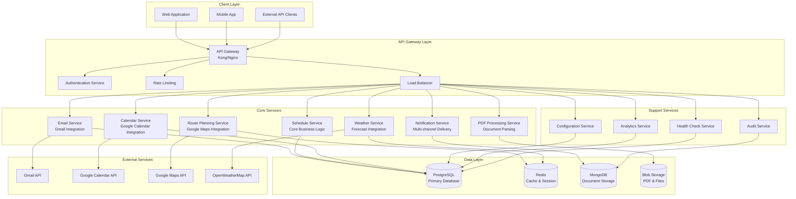
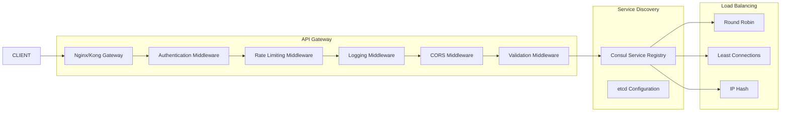
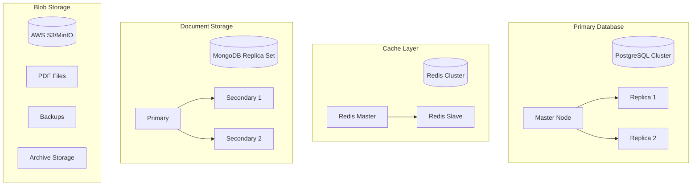
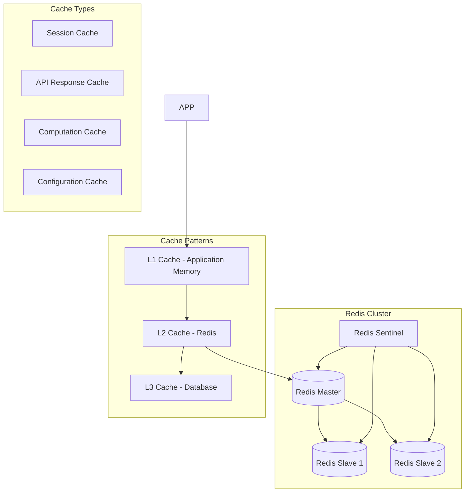
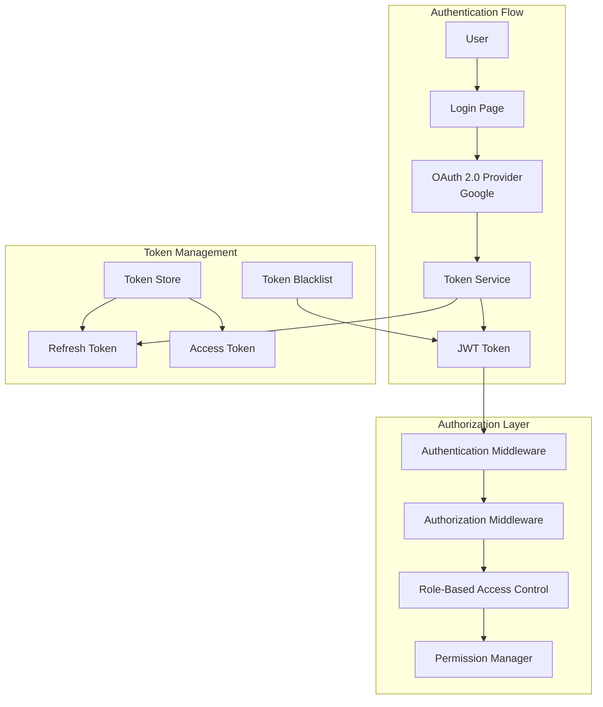
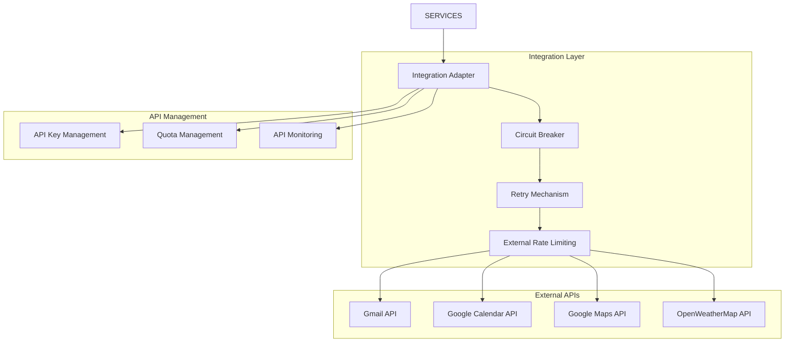
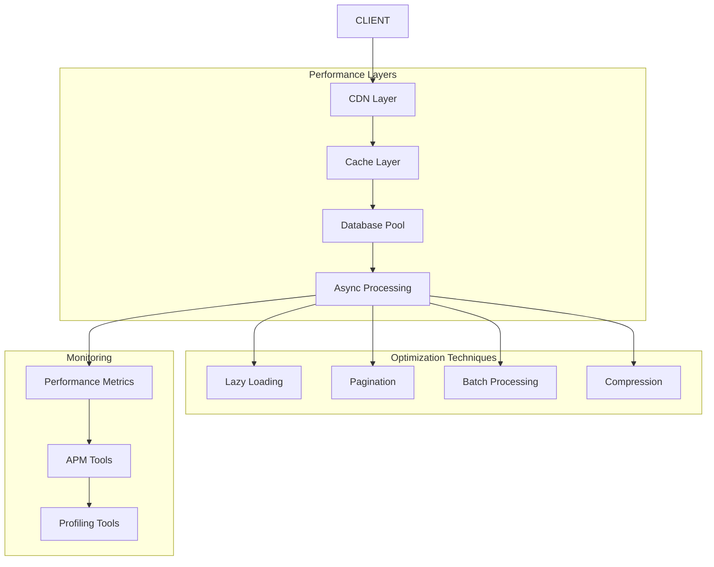
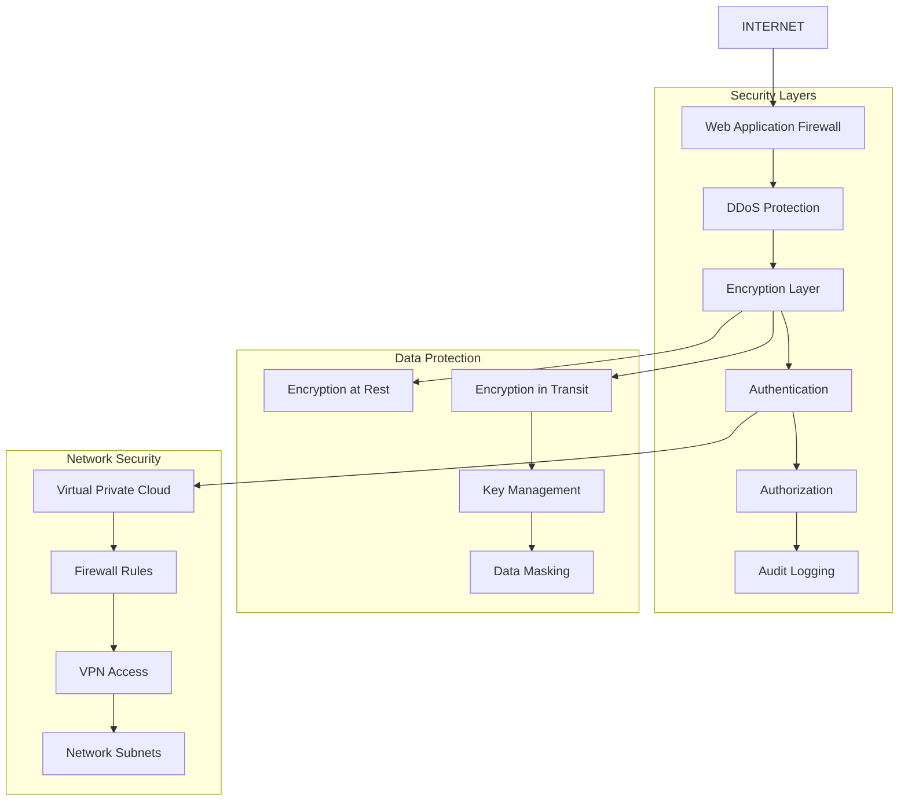
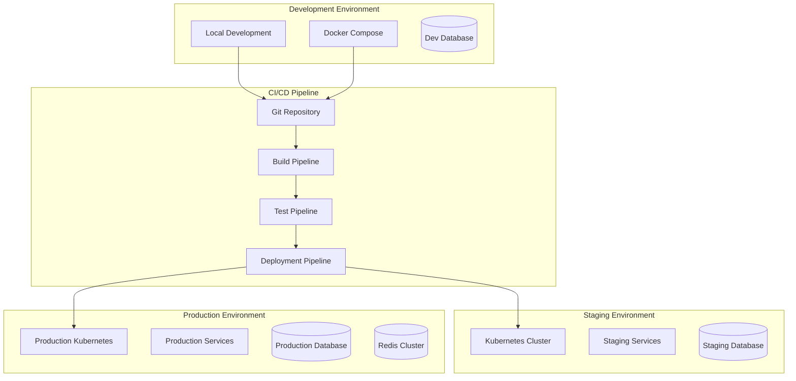
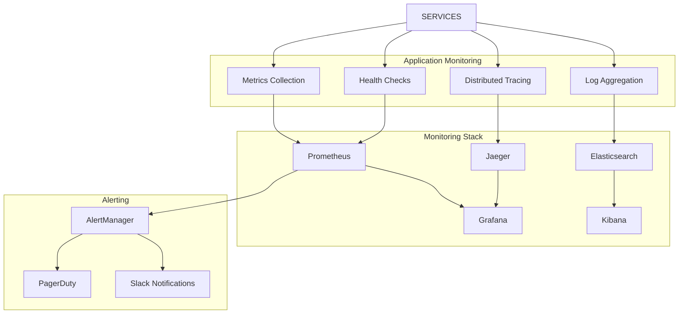

# MP2 Film Schedule Automation - Microservices Architecture Design

## Architecture Overview

This document outlines the comprehensive microservices architecture for the MP2 Film Schedule Automation System, designed to provide scalability, reliability, and maintainability for film production scheduling automation.

## 1. Microservices Design

### 1.1 Service Architecture Diagram



### 1.2 Service Definitions

#### Core Services

**Email Service**
- **Purpose**: Monitor Gmail inbox, detect MP2 emails, extract attachments
- **Technology**: Node.js with Gmail API integration
- **Responsibilities**:
  - Email polling and filtering
  - PDF attachment extraction
  - Duplicate detection and prevention
  - Email processing orchestration

**PDF Processing Service**
- **Purpose**: Parse and extract data from PDF schedule documents
- **Technology**: Python with PDF parsing libraries (pdfplumber, OCR)
- **Responsibilities**:
  - Text extraction from PDFs
  - OCR processing for scanned documents
  - Data structure parsing and validation
  - Error handling and manual correction interface

**Schedule Service**
- **Purpose**: Core business logic for schedule processing and management
- **Technology**: Java/Quarkus with reactive patterns
- **Responsibilities**:
  - Schedule data management
  - Business rule enforcement
  - Workflow orchestration
  - Data validation and transformation

**Route Planning Service**
- **Purpose**: Calculate optimal routes with traffic data
- **Technology**: Java with Google Maps API integration
- **Responsibilities**:
  - Route calculation and optimization
  - Traffic data integration
  - Time buffer management
  - Alternative route suggestions

**Calendar Service**
- **Purpose**: Google Calendar integration for event management
- **Technology**: Node.js with Google Calendar API
- **Responsibilities**:
  - Calendar event creation and management
  - Alarm and reminder setup
  - Calendar synchronization
  - Conflict resolution

**Weather Service**
- **Purpose**: Weather forecasting and alert integration
- **Technology**: Python with OpenWeatherMap API
- **Responsibilities**:
  - Weather data fetching and caching
  - Severe weather alerts
  - Equipment recommendations
  - Historical weather analysis

**Notification Service**
- **Purpose**: Multi-channel notification delivery
- **Technology**: Node.js with various notification providers
- **Responsibilities**:
  - Email notification delivery
  - SMS messaging integration
  - Push notifications
  - Notification preference management

#### Support Services

**Configuration Service**
- **Purpose**: Centralized configuration management
- **Technology**: Java/Spring Boot with configuration store
- **Responsibilities**:
  - API key management
  - User preferences
  - System settings
  - Environment-specific configurations

**Audit Service**
- **Purpose**: Comprehensive audit logging and compliance
- **Technology**: Node.js with MongoDB storage
- **Responsibilities**:
  - Action logging
  - Compliance reporting
  - Security event tracking
  - Data access monitoring

**Analytics Service**
- **Purpose**: System analytics and business intelligence
- **Technology**: Python with PostgreSQL data warehouse
- **Responsibilities**:
  - Usage statistics
  - Performance metrics
  - Business insights
  - Report generation

**Health Check Service**
- **Purpose**: System health monitoring and alerting
- **Technology**: Go for lightweight monitoring
- **Responsibilities**:
  - Service health monitoring
  - Dependency health checks
  - Alert generation
  - System status dashboard

## 2. API Gateway and Routing

### 2.1 Gateway Architecture



### 2.2 Routing Configuration

**Path-based Routing**:
```
/api/v1/email/*     → Email Service
/api/v1/pdf/*       → PDF Processing Service
/api/v1/schedule/*  → Schedule Service
/api/v1/routes/*    → Route Planning Service
/api/v1/calendar/*  → Calendar Service
/api/v1/weather/*   → Weather Service
/api/v1/notify/*    → Notification Service
/api/v1/config/*    → Configuration Service
/api/v1/audit/*     → Audit Service
/api/v1/analytics/* → Analytics Service
/api/v1/health/*    → Health Check Service
```

**Load Balancing Strategy**:
- **Round Robin**: Default for stateless services
- **Least Connections**: For CPU-intensive operations (PDF processing)
- **IP Hash**: For session-dependent services (configuration)

### 2.3 Gateway Middleware Stack

1. **Authentication & Authorization**
   - JWT token validation
   - OAuth 2.0 integration
   - Role-based access control

2. **Rate Limiting**
   - Per-client rate limits
   - Service-specific limits
   - Burst handling

3. **Request/Response Transformation**
   - Protocol translation
   - Data format conversion
   - Response aggregation

4. **Monitoring & Logging**
   - Request tracing
   - Response time tracking
   - Error logging

5. **Security**
   - CORS handling
   - Request validation
   - SQL injection prevention

## 3. Database Architecture

### 3.1 Data Storage Strategy



### 3.2 Database Schema Design

**PostgreSQL - Relational Data**

```sql
-- Users and Authentication
CREATE TABLE users (
    id UUID PRIMARY KEY DEFAULT gen_random_uuid(),
    email VARCHAR(255) UNIQUE NOT NULL,
    name VARCHAR(255) NOT NULL,
    role user_role NOT NULL DEFAULT 'crew_member',
    created_at TIMESTAMP DEFAULT CURRENT_TIMESTAMP,
    updated_at TIMESTAMP DEFAULT CURRENT_TIMESTAMP
);

-- Email Processing
CREATE TABLE processed_emails (
    id UUID PRIMARY KEY DEFAULT gen_random_uuid(),
    message_id VARCHAR(255) UNIQUE NOT NULL,
    subject TEXT NOT NULL,
    sender VARCHAR(255) NOT NULL,
    received_at TIMESTAMP NOT NULL,
    thread_id VARCHAR(255),
    processed BOOLEAN DEFAULT FALSE,
    processing_status VARCHAR(50) DEFAULT 'pending',
    pdf_hash VARCHAR(64),
    created_at TIMESTAMP DEFAULT CURRENT_TIMESTAMP,
    updated_at TIMESTAMP DEFAULT CURRENT_TIMESTAMP
);

-- Schedule Data
CREATE TABLE schedules (
    id UUID PRIMARY KEY DEFAULT gen_random_uuid(),
    email_id UUID REFERENCES processed_emails(id),
    shooting_date DATE NOT NULL,
    call_time TIME NOT NULL,
    location TEXT,
    base_location TEXT,
    scene_type VARCHAR(10) CHECK (scene_type IN ('INT', 'EXT')),
    scenes JSONB,
    safety_notes TEXT,
    equipment JSONB,
    contacts JSONB,
    notes TEXT,
    created_at TIMESTAMP DEFAULT CURRENT_TIMESTAMP,
    updated_at TIMESTAMP DEFAULT CURRENT_TIMESTAMP
);

-- Route Plans
CREATE TABLE route_plans (
    id UUID PRIMARY KEY DEFAULT gen_random_uuid(),
    schedule_id UUID REFERENCES schedules(id),
    wake_up_time TIMESTAMP NOT NULL,
    departure_time TIMESTAMP NOT NULL,
    arrival_time TIMESTAMP NOT NULL,
    total_travel_minutes INTEGER NOT NULL,
    route_segments JSONB,
    buffers JSONB,
    calculated_at TIMESTAMP DEFAULT CURRENT_TIMESTAMP
);

-- Calendar Events
CREATE TABLE calendar_events (
    id UUID PRIMARY KEY DEFAULT gen_random_uuid(),
    schedule_id UUID REFERENCES schedules(id),
    calendar_event_id VARCHAR(255) UNIQUE NOT NULL,
    title VARCHAR(255) NOT NULL,
    start_time TIMESTAMP NOT NULL,
    end_time TIMESTAMP NOT NULL,
    description TEXT,
    location TEXT,
    created_at TIMESTAMP DEFAULT CURRENT_TIMESTAMP
);

-- User Configuration
CREATE TABLE user_configurations (
    id UUID PRIMARY KEY DEFAULT gen_random_uuid(),
    user_id UUID REFERENCES users(id),
    home_address TEXT,
    panavision_address TEXT,
    buffers JSONB,
    notification_preferences JSONB,
    api_keys JSONB,
    created_at TIMESTAMP DEFAULT CURRENT_TIMESTAMP,
    updated_at TIMESTAMP DEFAULT CURRENT_TIMESTAMP
);

-- Indexes for Performance
CREATE INDEX idx_processed_emails_received_at ON processed_emails(received_at DESC);
CREATE INDEX idx_processed_emails_status ON processed_emails(processing_status);
CREATE INDEX idx_schedules_shooting_date ON schedules(shooting_date);
CREATE INDEX idx_schedules_call_time ON schedules(call_time);
CREATE INDEX idx_route_plans_wake_up_time ON route_plans(wake_up_time);
CREATE INDEX idx_calendar_events_start_time ON calendar_events(start_time);
```

**MongoDB - Document Storage**

```javascript
// Audit Logs Collection
{
  _id: ObjectId,
  timestamp: ISODate,
  level: String, // INFO, WARNING, ERROR, DEBUG
  service: String,
  action: String,
  user_id: String,
  details: Object,
  ip_address: String,
  user_agent: String
}

// Notification History Collection
{
  _id: ObjectId,
  schedule_id: String,
  type: String, // email, sms, push
  recipient: String,
  content: String,
  status: String, // sent, delivered, failed
  sent_at: ISODate,
  metadata: Object
}

// Analytics Data Collection
{
  _id: ObjectId,
  date: Date,
  metrics: {
    emails_processed: Number,
    pdfs_parsed: Number,
    routes_calculated: Number,
    calendar_events_created: Number,
    notifications_sent: Number,
    errors: Number
  },
  performance: {
    avg_processing_time: Number,
    success_rate: Number,
    api_response_times: Object
  }
}
```

### 3.3 Database Scaling Strategy

**Read Replicas**:
- Primary database for writes
- Multiple read replicas for scaling read operations
- Automatic failover to replicas

**Connection Pooling**:
- Application-level connection pools
- Database connection limits
- Connection timeout management

**Data Partitioning**:
- Time-based partitioning for historical data
- Geographic partitioning for multi-region deployment
- Service-specific data isolation

## 4. Caching Strategy (Redis)

### 4.1 Cache Architecture



### 4.2 Caching Patterns

**Cache-Aside Pattern**:
```javascript
// Application code example
async function getSchedule(scheduleId) {
    // Try cache first
    let schedule = await redis.get(`schedule:${scheduleId}`);

    if (schedule) {
        return JSON.parse(schedule);
    }

    // Cache miss - fetch from database
    schedule = await database.getSchedule(scheduleId);

    // Cache the result
    await redis.setex(`schedule:${scheduleId}`, 3600, JSON.stringify(schedule));

    return schedule;
}
```

**Write-Through Cache**:
```javascript
async function updateSchedule(scheduleId, data) {
    // Update database
    await database.updateSchedule(scheduleId, data);

    // Update cache
    await redis.setex(`schedule:${scheduleId}`, 3600, JSON.stringify(data));

    // Invalidate related caches
    await redis.del(`schedules:user:${data.userId}`);
    await redis.del(`schedules:date:${data.date}`);
}
```

**Cache Invalidation Strategy**:
- **TTL-based**: Automatic expiration
- **Event-based**: Invalidate on data changes
- **Manual**: Administrative cache clearing
- **Scheduled**: Periodic cache refresh

### 4.3 Redis Data Structures

**Session Storage**:
```
Key: session:{sessionId}
Type: Hash
TTL: 24 hours
Fields:
  - user_id
  - email
  - role
  - last_activity
  - preferences
```

**API Response Cache**:
```
Key: api_cache:{endpoint}:{params_hash}
Type: String (JSON)
TTL: 15 minutes
Value: Serialized API response
```

**Route Calculation Cache**:
```
Key: route_cache:{origin}:{destination}:{departure_time_hash}
Type: Hash
TTL: 1 hour
Fields:
  - duration
  - distance
  - route_segments
  - calculated_at
```

**Weather Data Cache**:
```
Key: weather:{location}:{date}
Type: String (JSON)
TTL: 6 hours
Value: Weather forecast data
```

**Rate Limiting**:
```
Key: rate_limit:{user_id}:{endpoint}
Type: String
TTL: 1 hour
Value: Request count
```

## 5. Authentication and Authorization

### 5.1 Security Architecture



### 5.2 Authentication Implementation

**OAuth 2.0 + Google Integration**:
```javascript
// Authentication Service
class AuthService {
    async authenticateWithGoogle(code) {
        // Exchange authorization code for tokens
        const tokens = await this.exchangeCodeForTokens(code);

        // Get user profile from Google
        const profile = await this.getGoogleProfile(tokens.access_token);

        // Create or update user in database
        const user = await this.findOrCreateUser(profile);

        // Generate JWT tokens
        const jwtTokens = await this.generateJWTTokens(user);

        // Store refresh token securely
        await this.storeRefreshToken(user.id, jwtTokens.refreshToken);

        return jwtTokens;
    }

    async generateJWTTokens(user) {
        const accessToken = jwt.sign(
            {
                sub: user.id,
                email: user.email,
                role: user.role,
                permissions: await this.getUserPermissions(user.id)
            },
            process.env.JWT_SECRET,
            { expiresIn: '1h' }
        );

        const refreshToken = crypto.randomBytes(32).toString('hex');

        return { accessToken, refreshToken };
    }
}
```

**JWT Token Structure**:
```json
{
  "sub": "user-uuid",
  "email": "user@example.com",
  "role": "crew_member",
  "permissions": [
    "schedule:read",
    "schedule:create",
    "calendar:read",
    "calendar:write"
  ],
  "iat": 1640995200,
  "exp": 1640998800,
  "iss": "mp2-automation"
}
```

### 5.3 Authorization Model

**Role-Based Access Control (RBAC)**:

```javascript
const roles = {
    'admin': {
        permissions: [
            'user:*',
            'schedule:*',
            'calendar:*',
            'config:*',
            'audit:read',
            'analytics:read'
        ]
    },
    'crew_member': {
        permissions: [
            'schedule:read',
            'schedule:create',
            'calendar:read',
            'calendar:write',
            'notification:read',
            'notification:write'
        ]
    },
    'viewer': {
        permissions: [
            'schedule:read',
            'calendar:read'
        ]
    }
};

const permissions = {
    'schedule:read': 'View schedule information',
    'schedule:create': 'Create new schedules',
    'schedule:update': 'Update existing schedules',
    'schedule:delete': 'Delete schedules',
    'calendar:read': 'Read calendar events',
    'calendar:write': 'Create/modify calendar events',
    'config:read': 'Read system configuration',
    'config:write': 'Modify system configuration',
    'user:*': 'Full user management',
    'audit:read': 'Read audit logs',
    'analytics:read': 'View analytics data'
};
```

**Authorization Middleware**:
```javascript
function authorize(requiredPermissions) {
    return async (req, res, next) => {
        try {
            const token = extractToken(req);
            const decoded = jwt.verify(token, process.env.JWT_SECRET);

            const userPermissions = decoded.permissions || [];
            const hasPermission = requiredPermissions.every(
                permission => userPermissions.includes(permission)
            );

            if (!hasPermission) {
                return res.status(403).json({ error: 'Insufficient permissions' });
            }

            req.user = decoded;
            next();
        } catch (error) {
            return res.status(401).json({ error: 'Invalid token' });
        }
    };
}
```

## 6. External Service Integrations

### 6.1 Integration Architecture



### 6.2 Integration Patterns

**Circuit Breaker Pattern**:
```javascript
class CircuitBreaker {
    constructor(options = {}) {
        this.failureThreshold = options.failureThreshold || 5;
        this.resetTimeout = options.resetTimeout || 60000;
        this.monitoringPeriod = options.monitoringPeriod || 10000;

        this.state = 'CLOSED'; // CLOSED, OPEN, HALF_OPEN
        this.failureCount = 0;
        this.lastFailureTime = null;
        this.successCount = 0;
    }

    async execute(operation) {
        if (this.state === 'OPEN') {
            if (Date.now() - this.lastFailureTime > this.resetTimeout) {
                this.state = 'HALF_OPEN';
                this.successCount = 0;
            } else {
                throw new Error('Circuit breaker is OPEN');
            }
        }

        try {
            const result = await operation();
            this.onSuccess();
            return result;
        } catch (error) {
            this.onFailure();
            throw error;
        }
    }

    onSuccess() {
        this.failureCount = 0;
        if (this.state === 'HALF_OPEN') {
            this.successCount++;
            if (this.successCount >= 3) {
                this.state = 'CLOSED';
            }
        }
    }

    onFailure() {
        this.failureCount++;
        this.lastFailureTime = Date.now();

        if (this.failureCount >= this.failureThreshold) {
            this.state = 'OPEN';
        }
    }
}
```

**Retry Mechanism**:
```javascript
class RetryMechanism {
    constructor(options = {}) {
        this.maxAttempts = options.maxAttempts || 3;
        this.baseDelay = options.baseDelay || 1000;
        this.maxDelay = options.maxDelay || 10000;
        this.backoffFactor = options.backoffFactor || 2;
    }

    async execute(operation, context = {}) {
        let lastError;

        for (let attempt = 1; attempt <= this.maxAttempts; attempt++) {
            try {
                return await operation();
            } catch (error) {
                lastError = error;

                if (attempt === this.maxAttempts) {
                    throw lastError;
                }

                if (!this.isRetryableError(error)) {
                    throw error;
                }

                const delay = this.calculateDelay(attempt);
                await this.sleep(delay);
            }
        }

        throw lastError;
    }

    calculateDelay(attempt) {
        const delay = this.baseDelay * Math.pow(this.backoffFactor, attempt - 1);
        return Math.min(delay, this.maxDelay);
    }

    isRetryableError(error) {
        // Define retryable error types
        const retryableErrors = [
            'ECONNRESET',
            'ETIMEDOUT',
            'ENOTFOUND',
            'EAI_AGAIN'
        ];

        return retryableErrors.includes(error.code) ||
               (error.response && error.response.status >= 500);
    }
}
```

### 6.3 Specific Integrations

**Gmail API Integration**:
```javascript
class GmailService {
    constructor() {
        this.gmail = google.gmail({ version: 'v1', auth: this.oauth2Client });
        this.circuitBreaker = new CircuitBreaker({
            failureThreshold: 3,
            resetTimeout: 30000
        });
        this.retry = new RetryMechanism({
            maxAttempts: 3,
            baseDelay: 1000
        });
    }

    async fetchUnreadEmails() {
        return this.circuitBreaker.execute(async () => {
            return this.retry.execute(async () => {
                const response = await this.gmail.users.messages.list({
                    userId: 'me',
                    q: 'is:unread from:mp2-productions.com',
                    maxResults: 50
                });

                return response.data.messages || [];
            });
        });
    }

    async getEmailContent(messageId) {
        return this.circuitBreaker.execute(async () => {
            return this.retry.execute(async () => {
                const response = await this.gmail.users.messages.get({
                    userId: 'me',
                    id: messageId,
                    format: 'full'
                });

                return this.parseEmailResponse(response.data);
            });
        });
    }
}
```

**Google Maps API Integration**:
```javascript
class MapsService {
    constructor() {
        this.client = new GoogleMapsClient({
            apiKey: process.env.GOOGLE_MAPS_API_KEY
        });
        this.rateLimiter = new RateLimiter({
            windowMs: 1000, // 1 second
            maxRequests: 10 // 10 requests per second
        });
    }

    async calculateRoute(origin, destination, departureTime) {
        await this.rateLimiter.wait();

        return this.client.directions({
            origin,
            destination,
            departure_time: departureTime,
            traffic_model: 'best_guess',
            alternatives: true
        });
    }

    async geocodeAddress(address) {
        await this.rateLimiter.wait();

        return this.client.geocode({
            address
        });
    }
}
```

## 7. Performance Optimization Patterns

### 7.1 Performance Architecture



### 7.2 Performance Patterns

**Connection Pooling**:
```javascript
class DatabasePool {
    constructor(config) {
        this.pool = new Pool({
            host: config.host,
            port: config.port,
            database: config.database,
            user: config.user,
            password: config.password,
            max: 20, // Maximum number of connections
            min: 5,  // Minimum number of connections
            idleTimeoutMillis: 30000,
            connectionTimeoutMillis: 2000
        });
    }

    async query(sql, params) {
        const client = await this.pool.connect();
        try {
            const result = await client.query(sql, params);
            return result;
        } finally {
            client.release();
        }
    }
}
```

**Batch Processing**:
```javascript
class BatchProcessor {
    constructor(options = {}) {
        this.batchSize = options.batchSize || 100;
        this.flushInterval = options.flushInterval || 5000;
        this.queue = [];
        this.timer = null;
    }

    add(item) {
        this.queue.push(item);

        if (this.queue.length >= this.batchSize) {
            this.flush();
        } else if (!this.timer) {
            this.timer = setTimeout(() => this.flush(), this.flushInterval);
        }
    }

    async flush() {
        if (this.queue.length === 0) return;

        const batch = this.queue.splice(0);
        clearTimeout(this.timer);
        this.timer = null;

        try {
            await this.processBatch(batch);
        } catch (error) {
            console.error('Batch processing failed:', error);
            // Re-add items to queue for retry
            this.queue.unshift(...batch);
        }
    }

    async processBatch(batch) {
        // Process batch items
        await Promise.all(batch.map(item => this.processItem(item)));
    }
}
```

**Async Processing with Message Queues**:
```javascript
class MessageQueueProcessor {
    constructor() {
        this.queue = new Queue('email-processing', {
            redis: {
                host: process.env.REDIS_HOST,
                port: process.env.REDIS_PORT
            },
            defaultJobOptions: {
                removeOnComplete: 100,
                removeOnFail: 50,
                attempts: 3,
                backoff: {
                    type: 'exponential',
                    delay: 2000
                }
            }
        });

        this.setupProcessors();
    }

    setupProcessors() {
        this.queue.process('parse-pdf', 5, async (job) => {
            const { pdfUrl, emailId } = job.data;
            return await this.parsePDF(pdfUrl, emailId);
        });

        this.queue.process('calculate-route', 10, async (job) => {
            const { origin, destination, departureTime } = job.data;
            return await this.calculateRoute(origin, destination, departureTime);
        });

        this.queue.process('send-notification', 20, async (job) => {
            const { userId, message, type } = job.data;
            return await this.sendNotification(userId, message, type);
        });
    }
}
```

## 8. Security Architecture

### 8.1 Security Layers



### 8.2 Security Implementation

**Encryption Strategy**:
```javascript
class EncryptionService {
    constructor() {
        this.algorithm = 'aes-256-gcm';
        this.keyLength = 32;
        this.ivLength = 16;
        this.tagLength = 16;
    }

    async encrypt(data, key) {
        const iv = crypto.randomBytes(this.ivLength);
        const cipher = crypto.createCipher(this.algorithm, key);
        cipher.setAAD(Buffer.from('mp2-automation'));

        let encrypted = cipher.update(data, 'utf8', 'hex');
        encrypted += cipher.final('hex');

        const tag = cipher.getAuthTag();

        return {
            encrypted,
            iv: iv.toString('hex'),
            tag: tag.toString('hex')
        };
    }

    async decrypt(encryptedData, key) {
        const { encrypted, iv, tag } = encryptedData;
        const decipher = crypto.createDecipher(this.algorithm, key);
        decipher.setAAD(Buffer.from('mp2-automation'));
        decipher.setAuthTag(Buffer.from(tag, 'hex'));

        let decrypted = decipher.update(encrypted, 'hex', 'utf8');
        decrypted += decipher.final('utf8');

        return decrypted;
    }
}
```

**API Security**:
```javascript
class APISecurityMiddleware {
    static rateLimit(options = {}) {
        return rateLimit({
            windowMs: options.windowMs || 15 * 60 * 1000, // 15 minutes
            max: options.max || 100, // Limit each IP to 100 requests per windowMs
            message: 'Too many requests from this IP',
            standardHeaders: true,
            legacyHeaders: false
        });
    }

    static validateInput(schema) {
        return (req, res, next) => {
            const { error } = schema.validate(req.body);
            if (error) {
                return res.status(400).json({
                    error: 'Validation failed',
                    details: error.details
                });
            }
            next();
        };
    }

    static sanitizeInput(req, res, next) {
        // Sanitize input parameters
        if (req.body) {
            req.body = this.sanitizeObject(req.body);
        }
        if (req.query) {
            req.query = this.sanitizeObject(req.query);
        }
        next();
    }

    static sanitizeObject(obj) {
        const sanitized = {};
        for (const [key, value] of Object.entries(obj)) {
            if (typeof value === 'string') {
                sanitized[key] = DOMPurify.sanitize(value);
            } else if (typeof value === 'object' && value !== null) {
                sanitized[key] = this.sanitizeObject(value);
            } else {
                sanitized[key] = value;
            }
        }
        return sanitized;
    }
}
```

**Security Headers**:
```javascript
const securityHeaders = {
    'Content-Security-Policy': "default-src 'self'",
    'X-Content-Type-Options': 'nosniff',
    'X-Frame-Options': 'DENY',
    'X-XSS-Protection': '1; mode=block',
    'Strict-Transport-Security': 'max-age=31536000; includeSubDomains',
    'Referrer-Policy': 'strict-origin-when-cross-origin'
};

app.use((req, res, next) => {
    Object.entries(securityHeaders).forEach(([header, value]) => {
        res.setHeader(header, value);
    });
    next();
});
```

## 9. Deployment Architecture

### 9.1 Deployment Strategy



### 9.2 Kubernetes Configuration

**Deployment Manifest**:
```yaml
apiVersion: apps/v1
kind: Deployment
metadata:
  name: mp2-email-service
  labels:
    app: mp2-email-service
spec:
  replicas: 3
  selector:
    matchLabels:
      app: mp2-email-service
  template:
    metadata:
      labels:
        app: mp2-email-service
    spec:
      containers:
      - name: email-service
        image: mp2/email-service:latest
        ports:
        - containerPort: 3000
        env:
        - name: DATABASE_URL
          valueFrom:
            secretKeyRef:
              name: mp2-secrets
              key: database-url
        - name: REDIS_URL
          valueFrom:
            secretKeyRef:
              name: mp2-secrets
              key: redis-url
        - name: GMAIL_CLIENT_ID
          valueFrom:
            secretKeyRef:
              name: mp2-secrets
              key: gmail-client-id
        resources:
          requests:
            memory: "256Mi"
            cpu: "250m"
          limits:
            memory: "512Mi"
            cpu: "500m"
        livenessProbe:
          httpGet:
            path: /health
            port: 3000
          initialDelaySeconds: 30
          periodSeconds: 10
        readinessProbe:
          httpGet:
            path: /ready
            port: 3000
          initialDelaySeconds: 5
          periodSeconds: 5
---
apiVersion: v1
kind: Service
metadata:
  name: mp2-email-service
spec:
  selector:
    app: mp2-email-service
  ports:
  - protocol: TCP
    port: 80
    targetPort: 3000
  type: ClusterIP
```

**Horizontal Pod Autoscaler**:
```yaml
apiVersion: autoscaling/v2
kind: HorizontalPodAutoscaler
metadata:
  name: mp2-email-service-hpa
spec:
  scaleTargetRef:
    apiVersion: apps/v1
    kind: Deployment
    name: mp2-email-service
  minReplicas: 3
  maxReplicas: 10
  metrics:
  - type: Resource
    resource:
      name: cpu
      target:
        type: Utilization
        averageUtilization: 70
  - type: Resource
    resource:
      name: memory
      target:
        type: Utilization
        averageUtilization: 80
```

### 9.3 Deployment Strategy

**Blue-Green Deployment**:
```bash
#!/bin/bash
# deploy-blue-green.sh

# Deploy to green environment
kubectl apply -f k8s/green/ -n mp2-green

# Wait for green deployment to be ready
kubectl rollout status deployment/mp2-email-service -n mp2-green

# Run smoke tests on green
npm run smoke-test:green

# Switch traffic to green
kubectl patch service mp2-email-service -p '{"spec":{"selector":{"version":"green"}}}'

# Wait for traffic switch
sleep 30

# Health check
curl -f http://mp2-email-service/health || {
    echo "Health check failed, rolling back..."
    kubectl patch service mp2-email-service -p '{"spec":{"selector":{"version":"blue"}}}'
    exit 1
}

echo "Deployment successful, cleaning up blue environment"
kubectl delete -f k8s/blue/ -n mp2-blue
```

## 10. Monitoring and Observability

### 10.1 Monitoring Architecture



### 10.2 Metrics Implementation

**Custom Metrics**:
```javascript
class MetricsCollector {
    constructor() {
        this.client = require('prom-client');
        this.register = new this.client.Registry();

        // Define custom metrics
        this.emailProcessingDuration = new this.client.Histogram({
            name: 'email_processing_duration_seconds',
            help: 'Duration of email processing',
            labelNames: ['status', 'service'],
            buckets: [0.1, 0.5, 1, 2, 5, 10]
        });

        this.pdfParsingErrors = new this.client.Counter({
            name: 'pdf_parsing_errors_total',
            help: 'Total number of PDF parsing errors',
            labelNames: ['error_type']
        });

        this.routeCalculations = new this.client.Counter({
            name: 'route_calculations_total',
            help: 'Total number of route calculations',
            labelNames: ['status']
        });

        this.register.registerMetric(this.emailProcessingDuration);
        this.register.registerMetric(this.pdfParsingErrors);
        this.register.registerMetric(this.routeCalculations);
    }

    recordEmailProcessing(duration, status, service) {
        this.emailProcessingDuration
            .labels(status, service)
            .observe(duration);
    }

    recordPDFParsingError(errorType) {
        this.pdfParsingErrors.labels(errorType).inc();
    }

    recordRouteCalculation(status) {
        this.routeCalculations.labels(status).inc();
    }

    getMetrics() {
        return this.register.metrics();
    }
}
```

**Health Check Implementation**:
```javascript
class HealthChecker {
    constructor(dependencies) {
        this.dependencies = dependencies;
        this.status = {
            overall: 'healthy',
            services: {},
            timestamp: new Date()
        };
    }

    async checkHealth() {
        const checks = await Promise.allSettled(
            Object.entries(this.dependencies).map(([name, checker]) =>
                this.checkService(name, checker)
            )
        );

        const services = {};
        let overallStatus = 'healthy';

        checks.forEach((result, index) => {
            const serviceName = Object.keys(this.dependencies)[index];

            if (result.status === 'fulfilled') {
                services[serviceName] = result.value;
                if (result.value.status !== 'healthy') {
                    overallStatus = 'degraded';
                }
            } else {
                services[serviceName] = {
                    status: 'unhealthy',
                    error: result.reason.message
                };
                overallStatus = 'unhealthy';
            }
        });

        this.status = {
            overall: overallStatus,
            services,
            timestamp: new Date()
        };

        return this.status;
    }

    async checkService(name, checker) {
        const startTime = Date.now();

        try {
            const result = await Promise.race([
                checker(),
                new Promise((_, reject) =>
                    setTimeout(() => reject(new Error('Timeout')), 5000)
                )
            ]);

            return {
                status: 'healthy',
                responseTime: Date.now() - startTime,
                details: result
            };
        } catch (error) {
            return {
                status: 'unhealthy',
                error: error.message,
                responseTime: Date.now() - startTime
            };
        }
    }
}
```

### 10.3 Logging Strategy

**Structured Logging**:
```javascript
class Logger {
    constructor(serviceName) {
        this.serviceName = serviceName;
        this.winston = require('winston');

        this.logger = this.winston.createLogger({
            level: process.env.LOG_LEVEL || 'info',
            format: this.winston.format.combine(
                this.winston.format.timestamp(),
                this.winston.format.errors({ stack: true }),
                this.winston.format.json()
            ),
            defaultMeta: {
                service: this.serviceName,
                version: process.env.APP_VERSION || '1.0.0'
            },
            transports: [
                new this.winston.transports.Console(),
                new this.winston.transports.File({
                    filename: 'logs/error.log',
                    level: 'error'
                }),
                new this.winston.transports.File({
                    filename: 'logs/combined.log'
                })
            ]
        });
    }

    info(message, meta = {}) {
        this.logger.info(message, {
            ...meta,
            trace_id: this.getCurrentTraceId()
        });
    }

    error(message, error, meta = {}) {
        this.logger.error(message, {
            ...meta,
            error: {
                message: error.message,
                stack: error.stack,
                name: error.name
            },
            trace_id: this.getCurrentTraceId()
        });
    }

    warn(message, meta = {}) {
        this.logger.warn(message, {
            ...meta,
            trace_id: this.getCurrentTraceId()
        });
    }

    getCurrentTraceId() {
        // Extract trace ID from headers or generate new one
        return this.traceId || require('crypto').randomUUID();
    }
}
```

This comprehensive microservices architecture provides a scalable, secure, and maintainable foundation for the MP2 Film Schedule Automation System. The architecture incorporates modern patterns and best practices for cloud-native applications, ensuring high availability, performance, and observability.

---

**Document Version**: 1.0.0
**Last Updated**: 2025-10-19
**Architecture Team**: MP2 System Architecture Group