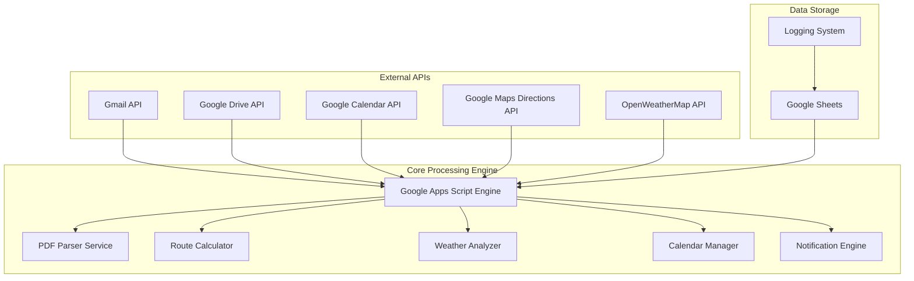
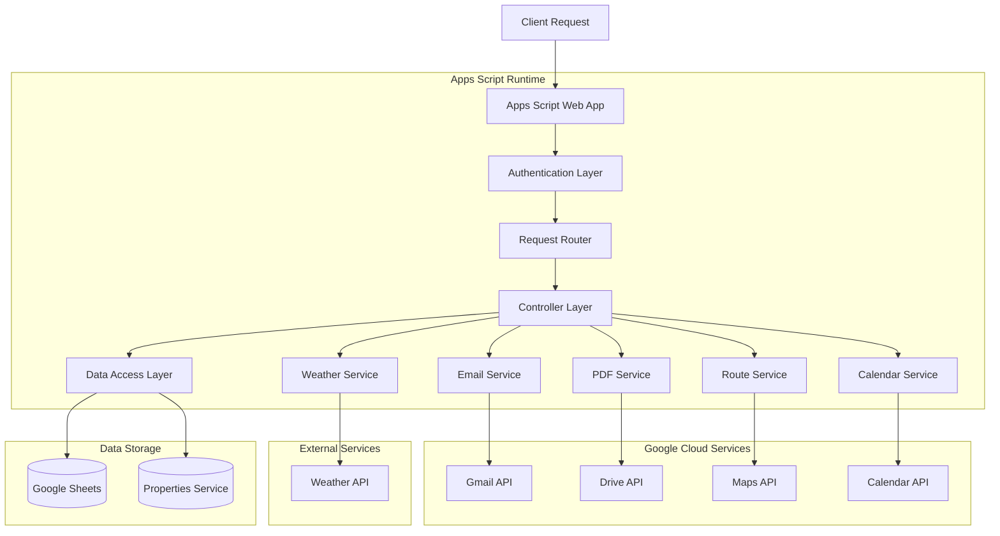
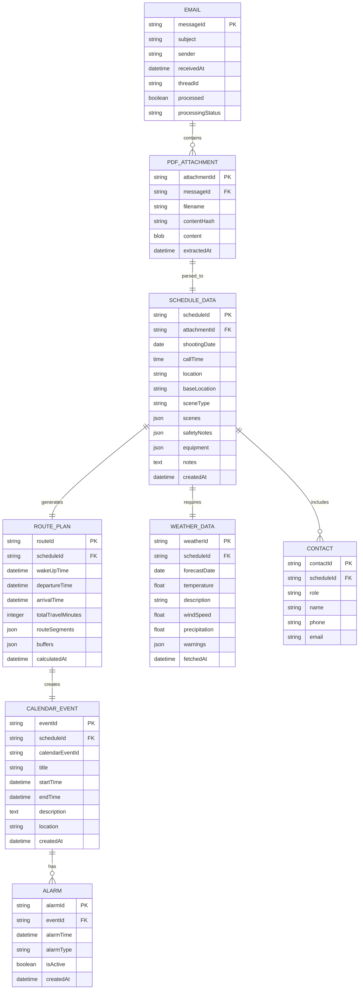

# MP2 Automation System - Technical Architecture Document

## 1. Architecture Design



## 2. Technology Description

### Frontend Stack

- **React 19**: Modern UI framework with concurrent features
- **TypeScript**: Type-safe JavaScript development
- **Vite**: Fast build tool and development server
- **Tailwind CSS**: Utility-first CSS framework
- **Zustand**: Lightweight state management
- **React Hook Form + Zod**: Form handling with validation
- **React Router**: Client-side routing
- **Recharts**: Data visualization components
- **Lucide React**: Modern icon library

### Backend Stack

- **Google Apps Script V8**: JavaScript runtime environment
- **Modular Architecture**: Component-based system design
- **MP2System Orchestrator**: Central system coordinator

### APIs & Integrations

- **Gmail API v1**: Email processing and monitoring
- **Google Drive API v3**: Temporary file storage
- **Google Calendar API v3**: Event management
- **Google Maps Directions API**: Route optimization
- **OpenWeatherMap API v2.5**: Weather forecasting
- **Google Sheets API v4**: Data persistence and logging

### Development & Deployment

- **clasp**: Google Apps Script CLI tool
- **npm scripts**: Automated build and deployment
- **Custom build system**: Frontend-to-GAS integration
- **OAuth 2.0**: Secure authentication
- **Google Cloud Platform**: Hosting and runtime
- **Model Context Protocol (MCP)**: Enhanced development capabilities
  - **mcp-everything-search**: Universal file search across the system
  - **mcp-fetch**: Internet access for external resources
  - **Disabled servers**: Various MCP servers disabled due to package availability or configuration requirements

## 3. Route Definitions

### Frontend Routes (React Router)

| Route      | Component     | Purpose                                   |
| ---------- | ------------- | ----------------------------------------- |
| /          | DashboardPage | Main system dashboard and status overview |
| /login     | LoginPage     | Google OAuth authentication               |
| /schedules | SchedulesPage | Schedule management and history           |
| /email     | EmailPage     | Email processing monitoring               |
| /weather   | WeatherPage   | Weather forecasts and route planning      |
| /analytics | AnalyticsPage | System analytics and performance metrics  |
| /team      | TeamPage      | Team management and notifications         |
| /settings  | SettingsPage  | System configuration and preferences      |

### Backend API Endpoints (Google Apps Script)

| Endpoint           | Method  | Purpose                                |
| ------------------ | ------- | -------------------------------------- |
| /api/system/status | GET     | Get comprehensive system status        |
| /api/system/health | GET     | Perform health check on all components |
| /api/email/process | POST    | Manually trigger email processing      |
| /api/schedules     | GET     | Retrieve schedule data and history     |
| /api/routes        | GET     | Calculate and retrieve route plans     |
| /api/weather       | GET     | Get weather forecasts for locations    |
| /api/config        | GET/PUT | System configuration management        |
| /api/logs          | GET     | Access system logs and diagnostics     |
| /api/test          | POST    | Run system tests and diagnostics       |

## 4. API Definitions

### 4.1 Core API Endpoints

#### Email Processing API

```
POST /api/process
```

Request:

| Param Name     | Param Type | isRequired | Description                                    |
| -------------- | ---------- | ---------- | ---------------------------------------------- |
| messageId      | string     | false      | Specific Gmail message ID to process           |
| forceReprocess | boolean    | false      | Force reprocessing of already processed emails |
| dryRun         | boolean    | false      | Process without creating calendar events       |

Response:

| Param Name     | Param Type | Description                |
| -------------- | ---------- | -------------------------- |
| success        | boolean    | Processing status          |
| processedCount | number     | Number of emails processed |
| errors         | array      | List of processing errors  |
| summary        | object     | Processing summary data    |

Example Request:

```json
{
  "messageId": "gmail_message_12345",
  "forceReprocess": false,
  "dryRun": true
}
```

Example Response:

```json
{
  "success": true,
  "processedCount": 1,
  "errors": [],
  "summary": {
    "date": "2024-03-15",
    "callTime": "07:00",
    "location": "Plac Zamkowy, Warszawa",
    "wakeUpTime": "05:15",
    "calendarEventId": "calendar_event_67890"
  }
}
```

#### Health Check API

```
GET /api/health
```

Response:

| Param Name    | Param Type | Description                                   |
| ------------- | ---------- | --------------------------------------------- |
| status        | string     | Overall system status (healthy/degraded/down) |
| services      | object     | Individual service status                     |
| lastProcessed | string     | Timestamp of last successful processing       |
| uptime        | number     | System uptime in seconds                      |

Example Response:

```json
{
  "status": "healthy",
  "services": {
    "gmail": "healthy",
    "calendar": "healthy",
    "maps": "healthy",
    "weather": "degraded"
  },
  "lastProcessed": "2024-03-15T10:30:00Z",
  "uptime": 86400
}
```

#### Configuration API

```
GET /api/config
PUT /api/config
```

Configuration Object:

| Param Name        | Param Type | Description                    |
| ----------------- | ---------- | ------------------------------ |
| homeAddress       | string     | User's home address            |
| panavisionAddress | string     | Panavision office address      |
| buffers           | object     | Time buffers configuration     |
| notifications     | object     | Notification preferences       |
| apiKeys           | object     | External API keys (write-only) |

Example Configuration:

```json
{
  "homeAddress": "ul. Stylowa 7, Warszawa",
  "panavisionAddress": "ul. Wyczółki, Warszawa",
  "buffers": {
    "carChange": 15,
    "parking": 10,
    "entry": 10,
    "traffic": 20,
    "morningRoutine": 45
  },
  "notifications": {
    "email": true,
    "sms": false,
    "push": true
  }
}
```

### 4.2 Internal Service APIs

#### PDF Parser Service

```javascript
// Internal function signature
function parsePDFContent(pdfBlob, options = {}) {
  // Returns parsed schedule data
}
```

Input:

| Param Name | Param Type | Description                           |
| ---------- | ---------- | ------------------------------------- |
| pdfBlob    | Blob       | PDF file content                      |
| options    | object     | Parsing options (OCR, language, etc.) |

Output:

| Param Name | Param Type | Description                |
| ---------- | ---------- | -------------------------- |
| date       | string     | Shooting date (YYYY-MM-DD) |
| callTime   | string     | Call time (HH:MM)          |
| location   | string     | Shooting location address  |
| type       | string     | INT/EXT scene type         |
| scenes     | array      | List of scene numbers      |
| contacts   | object     | Contact information        |
| notes      | string     | Additional notes           |

#### Route Calculator Service

```javascript
// Internal function signature
function calculateOptimalRoute(
  origin,
  destination,
  departureTime,
  options = {}
) {
  // Returns route calculation results
}
```

Input:

| Param Name    | Param Type | Description                       |
| ------------- | ---------- | --------------------------------- |
| origin        | string     | Starting address                  |
| destination   | string     | Destination address               |
| departureTime | Date       | Planned departure time            |
| options       | object     | Route options (avoid tolls, etc.) |

Output:

| Param Name   | Param Type | Description                |
| ------------ | ---------- | -------------------------- |
| duration     | number     | Travel time in minutes     |
| distance     | number     | Distance in kilometers     |
| route        | object     | Detailed route information |
| alternatives | array      | Alternative route options  |

## 5. Server Architecture Diagram



## 6. Data Model

### 6.1 Data Model Definition



### 6.2 Data Definition Language

#### Processed Emails Sheet

```sql
-- Google Sheets equivalent structure
CREATE TABLE processed_emails (
    message_id VARCHAR(255) PRIMARY KEY,
    subject TEXT NOT NULL,
    sender VARCHAR(255) NOT NULL,
    received_at TIMESTAMP NOT NULL,
    thread_id VARCHAR(255),
    processed BOOLEAN DEFAULT FALSE,
    processing_status VARCHAR(50) DEFAULT 'pending',
    pdf_hash VARCHAR(64),
    created_at TIMESTAMP DEFAULT CURRENT_TIMESTAMP,
    updated_at TIMESTAMP DEFAULT CURRENT_TIMESTAMP
);

-- Indexes
CREATE INDEX idx_processed_emails_received_at ON processed_emails(received_at DESC);
CREATE INDEX idx_processed_emails_status ON processed_emails(processing_status);
CREATE INDEX idx_processed_emails_pdf_hash ON processed_emails(pdf_hash);
```

#### Schedule Data Sheet

```sql
CREATE TABLE schedule_data (
    schedule_id VARCHAR(255) PRIMARY KEY,
    message_id VARCHAR(255) NOT NULL,
    shooting_date DATE NOT NULL,
    call_time TIME NOT NULL,
    location TEXT,
    base_location TEXT,
    scene_type VARCHAR(10) CHECK (scene_type IN ('INT', 'EXT')),
    scenes JSON,
    safety_notes TEXT,
    equipment JSON,
    contacts JSON,
    notes TEXT,
    created_at TIMESTAMP DEFAULT CURRENT_TIMESTAMP,
    FOREIGN KEY (message_id) REFERENCES processed_emails(message_id)
);

-- Indexes
CREATE INDEX idx_schedule_data_shooting_date ON schedule_data(shooting_date);
CREATE INDEX idx_schedule_data_call_time ON schedule_data(call_time);
CREATE INDEX idx_schedule_data_location ON schedule_data(location);
```

#### Route Plans Sheet

```sql
CREATE TABLE route_plans (
    route_id VARCHAR(255) PRIMARY KEY,
    schedule_id VARCHAR(255) NOT NULL,
    wake_up_time TIMESTAMP NOT NULL,
    departure_time TIMESTAMP NOT NULL,
    arrival_time TIMESTAMP NOT NULL,
    total_travel_minutes INTEGER NOT NULL,
    route_segments JSON,
    buffers JSON,
    calculated_at TIMESTAMP DEFAULT CURRENT_TIMESTAMP,
    FOREIGN KEY (schedule_id) REFERENCES schedule_data(schedule_id)
);

-- Indexes
CREATE INDEX idx_route_plans_wake_up_time ON route_plans(wake_up_time);
CREATE INDEX idx_route_plans_departure_time ON route_plans(departure_time);
```

#### Weather Data Sheet

```sql
CREATE TABLE weather_data (
    weather_id VARCHAR(255) PRIMARY KEY,
    schedule_id VARCHAR(255) NOT NULL,
    forecast_date DATE NOT NULL,
    temperature DECIMAL(5,2),
    description VARCHAR(255),
    wind_speed DECIMAL(5,2),
    precipitation DECIMAL(5,2),
    humidity INTEGER,
    warnings JSON,
    fetched_at TIMESTAMP DEFAULT CURRENT_TIMESTAMP,
    FOREIGN KEY (schedule_id) REFERENCES schedule_data(schedule_id)
);

-- Indexes
CREATE INDEX idx_weather_data_forecast_date ON weather_data(forecast_date);
CREATE INDEX idx_weather_data_temperature ON weather_data(temperature);
```

#### Calendar Events Sheet

```sql
CREATE TABLE calendar_events (
    event_id VARCHAR(255) PRIMARY KEY,
    schedule_id VARCHAR(255) NOT NULL,
    calendar_event_id VARCHAR(255) UNIQUE NOT NULL,
    title VARCHAR(255) NOT NULL,
    start_time TIMESTAMP NOT NULL,
    end_time TIMESTAMP NOT NULL,
    description TEXT,
    location TEXT,
    created_at TIMESTAMP DEFAULT CURRENT_TIMESTAMP,
    FOREIGN KEY (schedule_id) REFERENCES schedule_data(schedule_id)
);

-- Indexes
CREATE INDEX idx_calendar_events_start_time ON calendar_events(start_time);
CREATE INDEX idx_calendar_events_calendar_id ON calendar_events(calendar_event_id);
```

#### Activity Logs Sheet

```sql
CREATE TABLE activity_logs (
    log_id VARCHAR(255) PRIMARY KEY,
    timestamp TIMESTAMP DEFAULT CURRENT_TIMESTAMP,
    level VARCHAR(20) NOT NULL CHECK (level IN ('INFO', 'WARNING', 'ERROR', 'DEBUG')),
    message TEXT NOT NULL,
    data JSON,
    user_email VARCHAR(255),
    function_name VARCHAR(255),
    execution_time_ms INTEGER
);

-- Indexes
CREATE INDEX idx_activity_logs_timestamp ON activity_logs(timestamp DESC);
CREATE INDEX idx_activity_logs_level ON activity_logs(level);
CREATE INDEX idx_activity_logs_user ON activity_logs(user_email);
```

#### System Configuration Sheet

```sql
CREATE TABLE system_config (
    config_key VARCHAR(255) PRIMARY KEY,
    config_value TEXT NOT NULL,
    config_type VARCHAR(50) DEFAULT 'string',
    description TEXT,
    is_sensitive BOOLEAN DEFAULT FALSE,
    updated_at TIMESTAMP DEFAULT CURRENT_TIMESTAMP,
    updated_by VARCHAR(255)
);

-- Initial configuration data
INSERT INTO system_config (config_key, config_value, config_type, description) VALUES
('home_address', 'ul. Stylowa 7, Warszawa', 'string', 'User home address'),
('panavision_address', 'ul. Wyczółki, Warszawa', 'string', 'Panavision office address'),
('buffer_car_change', '15', 'integer', 'Car change buffer in minutes'),
('buffer_parking', '10', 'integer', 'Parking buffer in minutes'),
('buffer_entry', '10', 'integer', 'Entry/check-in buffer in minutes'),
('buffer_traffic', '20', 'integer', 'Traffic buffer in minutes'),
('buffer_morning_routine', '45', 'integer', 'Morning routine buffer in minutes'),
('default_shoot_duration', '600', 'integer', 'Default shooting duration in minutes'),
('weather_api_enabled', 'true', 'boolean', 'Enable weather API integration'),
('notification_email_enabled', 'true', 'boolean', 'Enable email notifications'),
('max_processing_retries', '3', 'integer', 'Maximum processing retry attempts');
```

### 6.3 Data Access Patterns

#### Google Apps Script Data Access Layer

```javascript
class DataAccessLayer {
  constructor() {
    this.processedEmailsSheet = SpreadsheetApp.openById(
      CONFIG.SHEETS.PROCESSED_EMAILS_ID
    );
    this.scheduleDataSheet = SpreadsheetApp.openById(
      CONFIG.SHEETS.SCHEDULE_DATA_ID
    );
    this.routePlansSheet = SpreadsheetApp.openById(
      CONFIG.SHEETS.ROUTE_PLANS_ID
    );
    this.weatherDataSheet = SpreadsheetApp.openById(
      CONFIG.SHEETS.WEATHER_DATA_ID
    );
    this.calendarEventsSheet = SpreadsheetApp.openById(
      CONFIG.SHEETS.CALENDAR_EVENTS_ID
    );
    this.activityLogsSheet = SpreadsheetApp.openById(
      CONFIG.SHEETS.ACTIVITY_LOGS_ID
    );
  }

  // Email processing methods
  isEmailProcessed(messageId) {
    const sheet = this.processedEmailsSheet.getSheetByName("ProcessedEmails");
    const data = sheet.getDataRange().getValues();
    return data.some((row) => row[0] === messageId);
  }

  markEmailAsProcessed(emailData) {
    const sheet = this.processedEmailsSheet.getSheetByName("ProcessedEmails");
    sheet.appendRow([
      emailData.messageId,
      emailData.subject,
      emailData.sender,
      emailData.receivedAt,
      emailData.threadId,
      true, // processed
      "completed",
      emailData.pdfHash,
      new Date(),
      new Date(),
    ]);
  }

  // Schedule data methods
  saveScheduleData(scheduleData) {
    const sheet = this.scheduleDataSheet.getSheetByName("ScheduleData");
    sheet.appendRow([
      scheduleData.scheduleId,
      scheduleData.messageId,
      scheduleData.shootingDate,
      scheduleData.callTime,
      scheduleData.location,
      scheduleData.baseLocation,
      scheduleData.sceneType,
      JSON.stringify(scheduleData.scenes),
      scheduleData.safetyNotes,
      JSON.stringify(scheduleData.equipment),
      JSON.stringify(scheduleData.contacts),
      scheduleData.notes,
      new Date(),
    ]);
  }

  // Route plan methods
  saveRoutePlan(routePlan) {
    const sheet = this.routePlansSheet.getSheetByName("RoutePlans");
    sheet.appendRow([
      routePlan.routeId,
      routePlan.scheduleId,
      routePlan.wakeUpTime,
      routePlan.departureTime,
      routePlan.arrivalTime,
      routePlan.totalTravelMinutes,
      JSON.stringify(routePlan.routeSegments),
      JSON.stringify(routePlan.buffers),
      new Date(),
    ]);
  }

  // Weather data methods
  saveWeatherData(weatherData) {
    const sheet = this.weatherDataSheet.getSheetByName("WeatherData");
    sheet.appendRow([
      weatherData.weatherId,
      weatherData.scheduleId,
      weatherData.forecastDate,
      weatherData.temperature,
      weatherData.description,
      weatherData.windSpeed,
      weatherData.precipitation,
      weatherData.humidity,
      JSON.stringify(weatherData.warnings),
      new Date(),
    ]);
  }

  // Calendar event methods
  saveCalendarEvent(eventData) {
    const sheet = this.calendarEventsSheet.getSheetByName("CalendarEvents");
    sheet.appendRow([
      eventData.eventId,
      eventData.scheduleId,
      eventData.calendarEventId,
      eventData.title,
      eventData.startTime,
      eventData.endTime,
      eventData.description,
      eventData.location,
      new Date(),
    ]);
  }

  // Logging methods
  logActivity(level, message, data = {}, functionName = "") {
    const sheet = this.activityLogsSheet.getSheetByName("ActivityLogs");
    sheet.appendRow([
      Utilities.getUuid(),
      new Date(),
      level,
      message,
      JSON.stringify(data),
      Session.getActiveUser().getEmail(),
      functionName,
      null, // execution time to be filled by caller
    ]);
  }

  // Configuration methods
  getConfig(key) {
    const properties = PropertiesService.getScriptProperties();
    return properties.getProperty(key);
  }

  setConfig(key, value) {
    const properties = PropertiesService.getScriptProperties();
    properties.setProperty(key, value);
  }

  // Query methods for analytics and reporting
  getProcessingStats(dateRange) {
    const sheet = this.processedEmailsSheet.getSheetByName("ProcessedEmails");
    const data = sheet.getDataRange().getValues();

    return data
      .filter((row) => {
        const processedDate = new Date(row[8]); // created_at column
        return (
          processedDate >= dateRange.start && processedDate <= dateRange.end
        );
      })
      .reduce(
        (stats, row) => {
          stats.total++;
          if (row[5]) stats.successful++; // processed column
          if (row[6] === "error") stats.errors++; // processing_status column
          return stats;
        },
        { total: 0, successful: 0, errors: 0 }
      );
  }

  getUpcomingShootingDays(daysAhead = 7) {
    const sheet = this.scheduleDataSheet.getSheetByName("ScheduleData");
    const data = sheet.getDataRange().getValues();
    const cutoffDate = new Date();
    cutoffDate.setDate(cutoffDate.getDate() + daysAhead);

    return data
      .filter((row) => {
        const shootingDate = new Date(row[2]); // shooting_date column
        return shootingDate >= new Date() && shootingDate <= cutoffDate;
      })
      .map((row) => ({
        scheduleId: row[0],
        shootingDate: row[2],
        callTime: row[3],
        location: row[4],
        sceneType: row[6],
      }));
  }
}
```

This technical architecture provides a comprehensive foundation for the MP2 automation
system.

## 10. Development Tools and Environment

### 10.1 Model Context Protocol (MCP) Integration

The MP2 system integrates with MCP servers to enhance development workflows and provide additional capabilities for system management.

#### Active MCP Servers

```json
// MCP configuration in .kiro/settings/mcp.json
{
  "mcpServers": {
    "mcp-everything-search": {
      "command": "uvx",
      "args": ["mcp-server-everything-search"],
      "disabled": false,
      "autoApprove": []
    }
  }
}
```

**Active Capabilities:**

- **Universal File Search**: Fast file discovery across the entire codebase
- **Content Search**: Intelligent search within files and documentation
- **Development Workflow Enhancement**: Improved code navigation and discovery

#### Disabled MCP Servers

Several MCP servers are currently disabled due to various technical issues:

| Server Name                 | Status      | Configuration Status                 | Capabilities                                |
| --------------------------- | ----------- | ------------------------------------ | ------------------------------------------- |
| language-server-mcp         | ✅ Active   | Locally installed and configured     | Enhanced code intelligence and diagnostics  |
| mcp-coding-assistant        | ✅ Active   | **FULLY CONFIGURED** with OpenAI API | AI-powered coding assistance and generation |
| mcp-server-neurolora-p      | ✅ Active   | Available via uvx                    | Neural network development assistance       |
| mcp-everything-search       | ✅ Active   | Available via uvx                    | Universal file and content search           |
| mcp-server-data-exploration | ❌ Disabled | MCP version incompatibility          | Update MCP version                          |
| mcp-clickhouse              | ❌ Disabled | Requires database configuration      | Set up ClickHouse if needed                 |
| mcp-server-bigquery         | ❌ Disabled | Requires Google Cloud project        | Configure GCP project for analytics         |

**Configuration Status**: ✅ All active MCP servers are fully operational with proper API keys and environment variables configured.

### 10.2 Development Workflow Integration

```javascript
// Example: Enhanced development with MCP integration
class EnhancedDevelopmentWorkflow {
  constructor() {
    this.mcpSearch = new MCPEverythingSearch();
    this.mcpFetch = new MCPFetch();
  }

  // Search for code patterns across the system
  async findCodePatterns(pattern) {
    const results = await this.mcpSearch.search({
      query: pattern,
      includePattern: "*.gs",
      caseSensitive: false,
    });

    return results.map((result) => ({
      file: result.path,
      line: result.line,
      context: result.context,
    }));
  }

  // Fetch external documentation
  async getExternalDocs(apiName) {
    const docUrls = {
      gmail: "https://developers.google.com/gmail/api",
      calendar: "https://developers.google.com/calendar/api",
      maps: "https://developers.google.com/maps/documentation",
    };

    if (docUrls[apiName]) {
      return await this.mcpFetch.fetch({
        url: docUrls[apiName],
        extractContent: true,
        maxLength: 5000,
      });
    }

    return null;
  }

  // Enhanced code analysis
  async analyzeCodeStructure() {
    const gasFiles = await this.mcpSearch.search({
      query: "function.*MP2",
      includePattern: "*.gs",
    });

    const components = await this.mcpSearch.search({
      query: "class.*Manager|class.*Service",
      includePattern: "fusion-backend/*.gs",
    });

    return {
      functions: gasFiles.length,
      components: components.length,
      files: [...new Set([...gasFiles, ...components].map((r) => r.path))],
    };
  }
}
```

### 10.3 MCP Configuration Management

```javascript
// Configuration management for MCP servers
class MCPConfigManager {
  constructor() {
    this.configPath = ".kiro/settings/mcp.json";
  }

  // Enable a disabled MCP server
  enableServer(serverName, config = {}) {
    const currentConfig = this.loadConfig();

    if (currentConfig.mcpServers[serverName]) {
      currentConfig.mcpServers[serverName].disabled = false;

      // Add any additional configuration
      Object.assign(currentConfig.mcpServers[serverName], config);

      this.saveConfig(currentConfig);
      console.log(`Enabled MCP server: ${serverName}`);
    }
  }

  // Disable an MCP server
  disableServer(serverName, reason = "") {
    const currentConfig = this.loadConfig();

    if (currentConfig.mcpServers[serverName]) {
      currentConfig.mcpServers[serverName].disabled = true;

      if (reason) {
        currentConfig.mcpServers[serverName].note = reason;
      }

      this.saveConfig(currentConfig);
      console.log(`Disabled MCP server: ${serverName} - ${reason}`);
    }
  }

  // Get status of all MCP servers
  getServerStatus() {
    const config = this.loadConfig();

    return Object.entries(config.mcpServers).map(([name, server]) => ({
      name,
      enabled: !server.disabled,
      command: server.command,
      args: server.args,
      note: server.note || "No notes",
    }));
  }
}
```

### 10.4 Future MCP Enhancements

#### Planned Integrations

1. **Custom MP2 MCP Server**

   ```javascript
   // Dedicated MCP server for MP2-specific operations
   {
     "mcp-mp2-automation": {
       "command": "uvx",
       "args": ["mcp-mp2-automation"],
       "capabilities": [
         "pdf-parsing",
         "schedule-analysis",
         "route-optimization",
         "weather-integration"
       ]
     }
   }
   ```

2. **Google Apps Script MCP**

   ```javascript
   // Enhanced GAS development tools
   {
     "mcp-gas-tools": {
       "command": "uvx",
       "args": ["mcp-gas-tools"],
       "capabilities": [
         "clasp-integration",
         "api-testing",
         "deployment-automation"
       ]
     }
   }
   ```

3. **Advanced Analytics MCP**
   ```javascript
   // Data analysis and reporting
   {
     "mcp-analytics": {
       "command": "uvx",
       "args": ["mcp-analytics"],
       "env": {
         "ANALYTICS_DB_URL": "postgresql://localhost/mp2_analytics"
       }
     }
   }
   ```

#### Development Roadmap

- **Phase 1**: Stabilize current MCP integrations
- **Phase 2**: Develop custom MP2 MCP server
- **Phase 3**: Integrate advanced analytics capabilities
- **Phase 4**: Add AI-powered development assistance

### 10.5 Best Practices for MCP Integration

#### Security Considerations

```javascript
// Secure MCP configuration
{
  "mcpServers": {
    "secure-server": {
      "command": "uvx",
      "args": ["secure-mcp-server"],
      "env": {
        "API_KEY": "${SECRET_API_KEY}",  // Use environment variables
        "DATABASE_URL": "${DATABASE_URL}"
      },
      "autoApprove": [],  // Require manual approval for sensitive operations
      "timeout": 30000    // Set appropriate timeouts
    }
  }
}
```

#### Performance Optimization

1. **Selective Enabling**: Only enable MCP servers that are actively used
2. **Resource Monitoring**: Monitor memory and CPU usage of MCP processes
3. **Timeout Configuration**: Set appropriate timeouts to prevent hanging
4. **Caching**: Implement caching for frequently accessed MCP operations

#### Maintenance Guidelines

1. **Regular Updates**: Keep MCP server packages updated
2. **Configuration Backup**: Maintain backups of MCP configurations
3. **Testing**: Test MCP integrations after system updates
4. **Documentation**: Document any custom MCP configurations

---

**MP2 Technical Architecture v3.0.0**  
_Enhanced with Model Context Protocol Integration_

**Last Updated**: August 2025  
**Architecture Version**: 3.0.0
