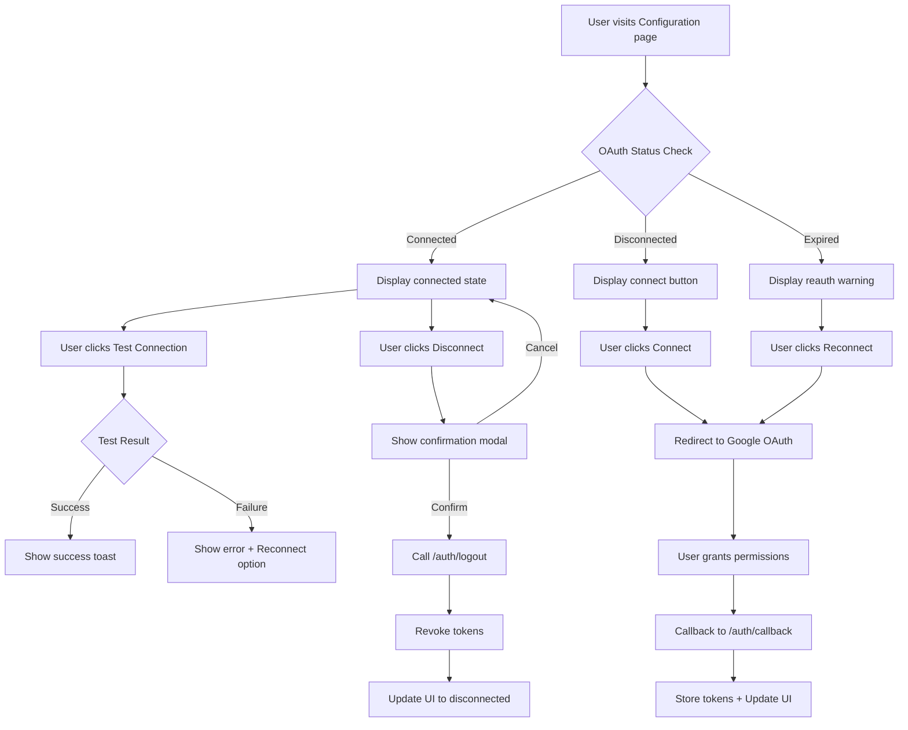
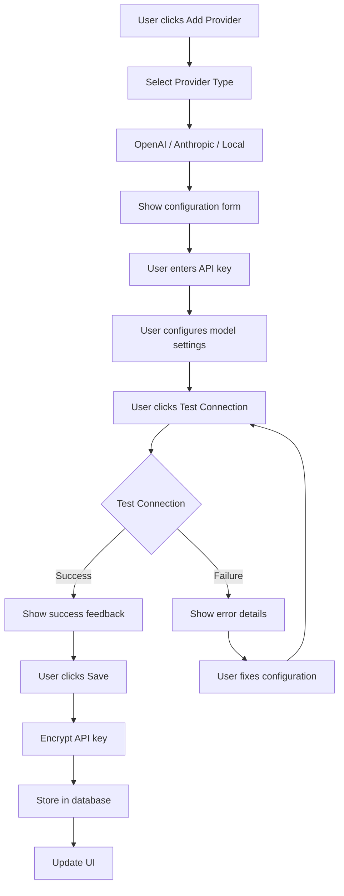
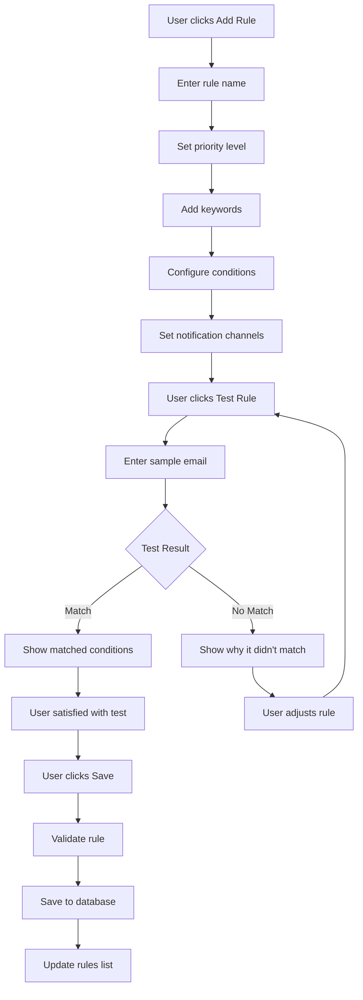

# Configuration Page UI/UX Design Document

**Project:** StillOnTime Film Schedule Automation
**Document Version:** 1.0
**Last Updated:** 2025-10-12
**Status:** Draft for Implementation

---

## Executive Summary

This document defines the comprehensive UI/UX design for the StillOnTime configuration page, managing OAuth connections, LLM provider settings, email parsing rules, and user preferences. The design prioritizes accessibility (WCAG 2.1 AA), performance, and progressive disclosure to prevent overwhelming users with complex settings.

---

## 1. Component Hierarchy

### 1.1 Page Structure

```
ConfigurationPage
├── PageHeader
│   ├── Title & Description
│   └── GlobalActions (Reset All, Export Settings)
├── NavigationTabs
│   ├── OAuth & Connections
│   ├── LLM Configuration
│   ├── Email Rules
│   └── User Preferences
└── TabContent (Dynamic)
    ├── OAuthConnectionCard
    ├── LLMProviderCard
    ├── EmailParsingRulesCard
    └── UserPreferencesCard
```

### 1.2 Component Files

```
frontend/src/pages/Configuration.tsx (Main page - already exists)
frontend/src/components/configuration/
├── OAuthConnectionCard.tsx (NEW)
├── LLMProviderCard.tsx (NEW)
├── EmailParsingRulesCard.tsx (NEW)
├── ApiConnectionCard.tsx (EXISTS - refactor)
├── NotificationConfigCard.tsx (EXISTS)
├── AddressConfigCard.tsx (EXISTS)
└── TimeBufferConfigCard.tsx (EXISTS)
```

---

## 2. State Management Strategy

### 2.1 Store Architecture

```typescript
// New stores to create
frontend/src/stores/
├── oauthStore.ts (NEW)
├── llmConfigStore.ts (NEW)
├── emailRulesStore.ts (NEW)
└── configurationStore.ts (ENHANCE EXISTING)
```

### 2.2 OAuth Store (`oauthStore.ts`)

```typescript
interface OAuthStore {
  // State
  oauthStatus: {
    connected: boolean
    accountEmail: string | null
    accountName: string | null
    scopes: string[]
    tokenExpiry: Date | null
    lastSync: Date | null
    needsReauth: boolean
    error: string | null
  } | null
  isLoading: boolean
  isRefreshing: boolean

  // Actions
  checkOAuthStatus: () => Promise<void>
  refreshToken: () => Promise<void>
  disconnectAccount: () => Promise<void>
  reconnectAccount: () => Promise<void>
  testConnection: () => Promise<boolean>
}
```

### 2.3 LLM Configuration Store (`llmConfigStore.ts`)

```typescript
interface LLMProvider {
  id: string
  name: 'openai' | 'anthropic' | 'local'
  enabled: boolean
  apiKey: string // Encrypted at rest
  model: string
  maxTokens: number
  temperature: number
  endpoint?: string // For local models
}

interface LLMConfigStore {
  // State
  providers: LLMProvider[]
  activeProvider: string | null
  testResults: Map<string, TestResult>
  isLoading: boolean
  isSaving: boolean

  // Actions
  loadProviders: () => Promise<void>
  addProvider: (provider: Omit<LLMProvider, 'id'>) => Promise<void>
  updateProvider: (id: string, updates: Partial<LLMProvider>) => Promise<void>
  deleteProvider: (id: string) => Promise<void>
  setActiveProvider: (id: string) => Promise<void>
  testProvider: (id: string) => Promise<TestResult>
  validateApiKey: (provider: string, apiKey: string) => Promise<boolean>
}
```

### 2.4 Email Rules Store (`emailRulesStore.ts`)

```typescript
interface EmailRule {
  id: string
  name: string
  enabled: boolean
  keywords: string[]
  senderDomains: string[]
  priority: 'urgent' | 'high' | 'medium' | 'low'
  actions: {
    notify: boolean
    autoProcess: boolean
    assignLabel: string | null
  }
  conditions: {
    requireAttachment: boolean
    attachmentTypes: string[]
    subjectContains: string[]
  }
}

interface EmailRulesStore {
  // State
  rules: EmailRule[]
  defaultKeywords: string[]
  trustedDomains: string[]
  isLoading: boolean
  isSaving: boolean

  // Actions
  loadRules: () => Promise<void>
  addRule: (rule: Omit<EmailRule, 'id'>) => Promise<void>
  updateRule: (id: string, updates: Partial<EmailRule>) => Promise<void>
  deleteRule: (id: string) => Promise<void>
  reorderRules: (rules: EmailRule[]) => Promise<void>
  testRule: (rule: EmailRule, testEmail: string) => Promise<boolean>
}
```

---

## 3. OAuth Connection Configuration

### 3.1 Component: OAuthConnectionCard

#### 3.1.1 Visual States

**Connected State:**
```
┌─────────────────────────────────────────────────────┐
│ OAuth Connection Status                    [Refresh]│
├─────────────────────────────────────────────────────┤
│ ✓ Connected                                         │
│                                                     │
│ [🔵] john.doe@gmail.com                            │
│      John Doe                                       │
│      Last synced: 2 minutes ago                     │
│                                                     │
│ Authorized Scopes:                                  │
│ [Gmail] [Calendar] [Drive]                         │
│                                                     │
│ Token expires in: 7 days                           │
│ [Refresh Token] [Test Connection] [Disconnect]     │
└─────────────────────────────────────────────────────┘
```

**Needs Re-authentication:**
```
┌─────────────────────────────────────────────────────┐
│ OAuth Connection Status                    [Refresh]│
├─────────────────────────────────────────────────────┤
│ ⚠️ Re-authentication Required                       │
│                                                     │
│ Your access token has expired. Please reconnect    │
│ your Google account to continue using StillOnTime.  │
│                                                     │
│ [Reconnect Google Account]                         │
└─────────────────────────────────────────────────────┘
```

**Disconnected State:**
```
┌─────────────────────────────────────────────────────┐
│ OAuth Connection Status                    [Refresh]│
├─────────────────────────────────────────────────────┤
│ ✗ Not Connected                                     │
│                                                     │
│ Connect your Google account to enable:              │
│ • Email monitoring                                  │
│ • Calendar synchronization                          │
│ • Automatic schedule processing                     │
│                                                     │
│ [Connect Google Account]                           │
└─────────────────────────────────────────────────────┘
```

#### 3.1.2 User Interactions

| Action | Trigger | Backend Endpoint | Expected Behavior |
|--------|---------|------------------|-------------------|
| **Initial Load** | Component mount | `GET /api/auth/status` | Display current OAuth status |
| **Test Connection** | Button click | `GET /api/auth/test` | Verify token validity, show result toast |
| **Refresh Token** | Button click | `POST /api/auth/refresh` | Manually refresh access token |
| **Disconnect** | Button click + confirm | `POST /api/auth/logout` | Revoke tokens, update UI |
| **Reconnect** | Button click | `GET /api/auth/login` | Redirect to OAuth flow |

#### 3.1.3 Accessibility Features

```typescript
<section aria-labelledby="oauth-section-title">
  <h2 id="oauth-section-title">OAuth Connection Status</h2>

  <div role="status" aria-live="polite" aria-atomic="true">
    {connectionStatus === 'connected' && (
      <span className="sr-only">Connected to Google account</span>
    )}
  </div>

  <button
    aria-label="Disconnect Google account"
    aria-describedby="disconnect-warning"
    onClick={handleDisconnect}
  >
    Disconnect
  </button>

  <p id="disconnect-warning" className="sr-only">
    This will stop all email monitoring and calendar syncing
  </p>
</section>
```

#### 3.1.4 Error Handling

```typescript
const errorMessages = {
  TOKEN_EXPIRED: {
    title: 'Session Expired',
    message: 'Your session has expired. Please reconnect your account.',
    action: 'Reconnect',
    actionHandler: reconnectAccount
  },
  INSUFFICIENT_PERMISSIONS: {
    title: 'Missing Permissions',
    message: 'Some required permissions are missing. Please reconnect to grant access.',
    action: 'Reconnect with Permissions',
    actionHandler: reconnectAccount
  },
  NETWORK_ERROR: {
    title: 'Connection Error',
    message: 'Unable to connect to server. Please check your internet connection.',
    action: 'Retry',
    actionHandler: checkOAuthStatus
  }
}
```

---

## 4. LLM Provider Configuration

### 4.1 Component: LLMProviderCard

#### 4.1.1 Design Layout

```
┌─────────────────────────────────────────────────────┐
│ LLM Provider Configuration                 [+ Add]  │
├─────────────────────────────────────────────────────┤
│                                                     │
│ Active Provider: [OpenAI GPT-4 ▼]                  │
│                                                     │
│ ┌─ OpenAI (Active) ─────────────────────────────┐  │
│ │ Model: gpt-4                                   │  │
│ │ API Key: ●●●●●●●●●●sk-abc123 [Show] [Edit]   │  │
│ │ Status: ✓ Connected                           │  │
│ │ Last tested: 5 minutes ago                     │  │
│ │                                                │  │
│ │ Advanced Settings ▼                            │  │
│ │ ├─ Max Tokens: [4000]                         │  │
│ │ ├─ Temperature: [0.7] ────────○────           │  │
│ │ └─ Custom Endpoint: [Optional]                │  │
│ │                                                │  │
│ │ [Test Connection] [Deactivate] [Remove]       │  │
│ └────────────────────────────────────────────────┘  │
│                                                     │
│ ┌─ Anthropic Claude ────────────────────────────┐  │
│ │ Status: ⚠️ Not Configured                     │  │
│ │ [Configure]                                    │  │
│ └────────────────────────────────────────────────┘  │
│                                                     │
│ ┌─ Local Model ─────────────────────────────────┐  │
│ │ Status: ⚠️ Not Configured                     │  │
│ │ [Configure]                                    │  │
│ └────────────────────────────────────────────────┘  │
└─────────────────────────────────────────────────────┘
```

#### 4.1.2 Provider Configuration Form

```typescript
interface ProviderFormProps {
  provider: 'openai' | 'anthropic' | 'local'
  onSave: (config: LLMProviderConfig) => Promise<void>
  onCancel: () => void
}

// OpenAI Configuration
{
  provider: 'openai',
  fields: [
    { name: 'apiKey', label: 'API Key', type: 'password', required: true },
    { name: 'model', label: 'Model', type: 'select', options: ['gpt-4', 'gpt-3.5-turbo'], default: 'gpt-4' },
    { name: 'maxTokens', label: 'Max Tokens', type: 'number', range: [100, 8000], default: 4000 },
    { name: 'temperature', label: 'Temperature', type: 'slider', range: [0, 1], step: 0.1, default: 0.7 }
  ]
}

// Anthropic Configuration
{
  provider: 'anthropic',
  fields: [
    { name: 'apiKey', label: 'API Key', type: 'password', required: true },
    { name: 'model', label: 'Model', type: 'select', options: ['claude-3-opus', 'claude-3-sonnet'], default: 'claude-3-sonnet' },
    { name: 'maxTokens', label: 'Max Tokens', type: 'number', range: [100, 4000], default: 2000 }
  ]
}

// Local Model Configuration
{
  provider: 'local',
  fields: [
    { name: 'endpoint', label: 'API Endpoint', type: 'url', placeholder: 'http://localhost:11434', required: true },
    { name: 'model', label: 'Model Name', type: 'text', placeholder: 'llama2', required: true },
    { name: 'maxTokens', label: 'Max Tokens', type: 'number', range: [100, 4000], default: 2000 }
  ]
}
```

#### 4.1.3 API Key Security

```typescript
// Frontend - Never store plain API keys
interface SecureApiKeyInput {
  provider: string
  apiKey: string // Sent only once during save

  // For display
  maskedKey: string // Show last 8 chars: "●●●●●●●●sk-abc123"
  isConfigured: boolean
}

// Backend endpoint structure
POST /api/llm/providers
{
  "provider": "openai",
  "apiKey": "sk-...", // Encrypted with AES-256-GCM before storage
  "model": "gpt-4",
  "config": { ... }
}

GET /api/llm/providers/:id
{
  "provider": "openai",
  "maskedKey": "●●●●●●●●sk-abc123", // Only return masked version
  "model": "gpt-4",
  "isActive": true,
  "lastTested": "2025-10-12T10:30:00Z"
}
```

#### 4.1.4 Connection Testing

```typescript
const testLLMConnection = async (providerId: string) => {
  try {
    setTestingProvider(providerId)

    const result = await llmConfigService.testProvider(providerId)

    if (result.success) {
      toast.success(`✓ ${result.providerName} connection successful`, {
        description: `Response time: ${result.latency}ms`
      })
      return true
    } else {
      toast.error(`✗ ${result.providerName} connection failed`, {
        description: result.error
      })
      return false
    }
  } finally {
    setTestingProvider(null)
  }
}

// Backend test endpoint
POST /api/llm/test/:providerId
Response:
{
  "success": true,
  "providerName": "OpenAI GPT-4",
  "latency": 245,
  "testMessage": "Connection test successful",
  "modelInfo": {
    "maxTokens": 8192,
    "contextWindow": 8192
  }
}
```

---

## 5. Email Parsing Rules Configuration

### 5.1 Component: EmailParsingRulesCard

#### 5.1.1 Visual Design

```
┌─────────────────────────────────────────────────────┐
│ Email Parsing Rules                       [+ Add]   │
├─────────────────────────────────────────────────────┤
│                                                     │
│ Default Keywords (StillOnTime System):              │
│ ┌───────────────────────────────────────────────┐  │
│ │ [shooting schedule] [call sheet] [schedule]   │  │
│ │ [filming] [call time] [production schedule]   │  │
│ └───────────────────────────────────────────────┘  │
│                                                     │
│ Custom Rules (Priority Order - Drag to Reorder):   │
│                                                     │
│ ┌─ 1. Urgent Schedule Changes ──────────────────┐  │
│ │ ☰ Priority: 🔴 Urgent                         │  │
│ │   Keywords: "urgent", "immediate", "asap"      │  │
│ │   Senders: *@production-company.com           │  │
│ │   Actions: ✓ Notify SMS + Email               │  │
│ │            ✓ Auto-process                      │  │
│ │   [Edit] [Test] [Disable] [Delete]            │  │
│ └────────────────────────────────────────────────┘  │
│                                                     │
│ ┌─ 2. Location Changes ─────────────────────────┐  │
│ │ ☰ Priority: 🟡 High                           │  │
│ │   Keywords: "location change", "new address"   │  │
│ │   Conditions: ✓ Requires attachment           │  │
│ │   Actions: ✓ Notify Email                     │  │
│ │   [Edit] [Test] [Disable] [Delete]            │  │
│ └────────────────────────────────────────────────┘  │
│                                                     │
│ ┌─ 3. Weather Alerts ───────────────────────────┐  │
│ │ ☰ Priority: 🟡 High                           │  │
│ │   Keywords: "weather", "storm", "rain"         │  │
│ │   Senders: *@weather-service.com              │  │
│ │   [Edit] [Test] [Disable] [Delete]            │  │
│ └────────────────────────────────────────────────┘  │
│                                                     │
│ [Test Rules Against Sample Email]                  │
└─────────────────────────────────────────────────────┘
```

#### 5.1.2 Rule Configuration Form

```typescript
interface EmailRule {
  id: string
  name: string
  enabled: boolean
  priority: 'urgent' | 'high' | 'medium' | 'low'

  // Matching Conditions
  conditions: {
    keywords: string[] // OR logic
    keywordsMatchAll: boolean // AND logic option
    senderDomains: string[] // Whitelist
    subjectContains: string[]
    requireAttachment: boolean
    attachmentTypes: string[] // ['pdf', 'xlsx', 'docx']
  }

  // Actions
  actions: {
    autoProcess: boolean
    notifyChannels: ('email' | 'sms' | 'push')[]
    assignLabel: string | null
    forwardTo: string | null
  }

  // Metadata
  createdAt: Date
  lastMatched: Date | null
  matchCount: number
}

// Add/Edit Rule Modal
<Modal title="Add Email Parsing Rule">
  <Form>
    <Input label="Rule Name" required />

    <Select label="Priority" options={['urgent', 'high', 'medium', 'low']} />

    <TagInput
      label="Keywords (match any)"
      placeholder="Enter keyword and press Enter"
      helpText="Emails matching ANY of these keywords will trigger this rule"
    />

    <TagInput
      label="Sender Domains (whitelist)"
      placeholder="e.g., production-company.com"
      helpText="Only process emails from these domains"
    />

    <Checkbox label="Require PDF attachment" />

    <CheckboxGroup label="Notification Channels">
      <Checkbox value="email" label="Email" />
      <Checkbox value="sms" label="SMS" />
      <Checkbox value="push" label="Push Notification" />
    </CheckboxGroup>

    <Checkbox label="Auto-process matching emails" />

    <Button>Test Rule</Button>
    <Button>Save Rule</Button>
  </Form>
</Modal>
```

#### 5.1.3 Rule Testing Interface

```typescript
const testEmailRule = async (rule: EmailRule, testEmail: string) => {
  const result = await emailRulesService.testRule(rule.id, {
    subject: testEmail.subject,
    body: testEmail.body,
    sender: testEmail.sender,
    hasAttachment: testEmail.hasAttachment
  })

  return {
    matched: result.matched,
    matchedConditions: result.matchedConditions,
    score: result.score,
    explanation: result.explanation
  }
}

// Test Result Display
<TestResultPanel>
  {result.matched ? (
    <Alert variant="success">
      <CheckCircle /> Rule matched successfully
      <ul>
        <li>Keywords matched: {result.matchedConditions.keywords.join(', ')}</li>
        <li>Sender domain: {result.matchedConditions.senderDomain}</li>
        <li>Match score: {result.score}/100</li>
      </ul>
    </Alert>
  ) : (
    <Alert variant="warning">
      <XCircle /> Rule did not match
      <p>{result.explanation}</p>
    </Alert>
  )}
</TestResultPanel>
```

#### 5.1.4 Drag-and-Drop Reordering

```typescript
import { DndContext, closestCenter } from '@dnd-kit/core'
import { SortableContext, verticalListSortingStrategy } from '@dnd-kit/sortable'

<DndContext onDragEnd={handleDragEnd}>
  <SortableContext items={rules} strategy={verticalListSortingStrategy}>
    {rules.map(rule => (
      <SortableRule key={rule.id} rule={rule} />
    ))}
  </SortableContext>
</DndContext>

const handleDragEnd = async (event) => {
  const { active, over } = event
  if (active.id !== over.id) {
    const reorderedRules = reorderArray(rules, active.id, over.id)
    await emailRulesStore.reorderRules(reorderedRules)
    toast.success('Rule priority order updated')
  }
}
```

---

## 6. User Preferences Configuration

### 6.1 Component: UserPreferencesCard (Enhancement)

#### 6.1.1 Additional Sections

```
┌─────────────────────────────────────────────────────┐
│ User Preferences                                    │
├─────────────────────────────────────────────────────┤
│                                                     │
│ Time Zone & Locale:                                 │
│ ┌───────────────────────────────────────────────┐  │
│ │ Time Zone: [Europe/Warsaw (GMT+1) ▼]         │  │
│ │ Date Format: [DD/MM/YYYY ▼]                  │  │
│ │ Time Format: [24-hour ▼]                     │  │
│ └───────────────────────────────────────────────┘  │
│                                                     │
│ Default Settings:                                   │
│ ┌───────────────────────────────────────────────┐  │
│ │ Preferred LLM Provider: [OpenAI GPT-4 ▼]     │  │
│ │ Auto-process schedules: [✓ Enabled]          │  │
│ │ Require confirmation: [✓ For urgent only]    │  │
│ └───────────────────────────────────────────────┘  │
│                                                     │
│ Processing Options:                                 │
│ ┌───────────────────────────────────────────────┐  │
│ │ Schedule validation: [✓ Check for conflicts] │  │
│ │ Location geocoding: [✓ Validate addresses]   │  │
│ │ Weather integration: [✓ Fetch forecasts]     │  │
│ │ Route optimization: [✓ Find fastest route]   │  │
│ └───────────────────────────────────────────────┘  │
│                                                     │
│ Notification Preferences:                           │
│ ┌───────────────────────────────────────────────┐  │
│ │ Daily Summary: [✓ 08:00] [Edit Schedule]     │  │
│ │ Weekly Report: [✓ Monday 09:00]              │  │
│ │ Processing Alerts: [✓ Real-time]             │  │
│ │ Error Notifications: [✓ Immediate]           │  │
│ └───────────────────────────────────────────────┘  │
│                                                     │
│ [Save Preferences]                                  │
└─────────────────────────────────────────────────────┘
```

---

## 7. Responsive Design Specifications

### 7.1 Breakpoint Strategy

```typescript
const breakpoints = {
  mobile: '0-639px',    // Single column, stacked layout
  tablet: '640-1023px', // 2-column grid for some cards
  desktop: '1024px+'    // Full multi-column layout
}

// Mobile (< 640px)
- Vertical navigation tabs
- Full-width cards
- Collapsible sections
- Touch-friendly buttons (min 44x44px)
- Single column layout

// Tablet (640-1023px)
- Horizontal navigation tabs
- 2-column grid for smaller cards
- Side-by-side form fields
- Moderate spacing

// Desktop (1024px+)
- Horizontal navigation tabs
- Multi-column grid
- Inline form editing
- Maximum content width: 1400px
```

### 7.2 Mobile-First CSS Example

```css
/* Mobile First (default) */
.config-grid {
  display: grid;
  grid-template-columns: 1fr;
  gap: 1rem;
}

.oauth-card {
  padding: 1rem;
}

/* Tablet */
@media (min-width: 640px) {
  .config-grid {
    grid-template-columns: repeat(2, 1fr);
    gap: 1.5rem;
  }

  .oauth-card {
    padding: 1.5rem;
  }
}

/* Desktop */
@media (min-width: 1024px) {
  .config-grid {
    grid-template-columns: repeat(12, 1fr);
    gap: 2rem;
  }

  .oauth-card {
    grid-column: span 6;
  }

  .llm-card {
    grid-column: span 6;
  }

  .email-rules-card {
    grid-column: span 12;
  }
}
```

---

## 8. Accessibility Implementation (WCAG 2.1 AA)

### 8.1 Keyboard Navigation

```typescript
// Focus management
const ConfigurationPage = () => {
  const [activeTab, setActiveTab] = useState(0)
  const tabRefs = useRef<HTMLButtonElement[]>([])

  const handleKeyDown = (e: KeyboardEvent, index: number) => {
    switch (e.key) {
      case 'ArrowLeft':
        e.preventDefault()
        const prevIndex = index === 0 ? tabs.length - 1 : index - 1
        tabRefs.current[prevIndex]?.focus()
        setActiveTab(prevIndex)
        break

      case 'ArrowRight':
        e.preventDefault()
        const nextIndex = (index + 1) % tabs.length
        tabRefs.current[nextIndex]?.focus()
        setActiveTab(nextIndex)
        break

      case 'Home':
        e.preventDefault()
        tabRefs.current[0]?.focus()
        setActiveTab(0)
        break

      case 'End':
        e.preventDefault()
        const lastIndex = tabs.length - 1
        tabRefs.current[lastIndex]?.focus()
        setActiveTab(lastIndex)
        break
    }
  }

  return (
    <div role="tablist" aria-label="Configuration sections">
      {tabs.map((tab, index) => (
        <button
          key={tab.id}
          ref={el => tabRefs.current[index] = el!}
          role="tab"
          aria-selected={activeTab === index}
          aria-controls={`panel-${tab.id}`}
          tabIndex={activeTab === index ? 0 : -1}
          onKeyDown={(e) => handleKeyDown(e, index)}
        >
          {tab.label}
        </button>
      ))}
    </div>
  )
}
```

### 8.2 Screen Reader Support

```typescript
// Live region announcements
const [announcement, setAnnouncement] = useState('')

const handleSave = async () => {
  setAnnouncement('Saving configuration...')
  await saveConfig()
  setAnnouncement('Configuration saved successfully')
}

<div
  role="status"
  aria-live="polite"
  aria-atomic="true"
  className="sr-only"
>
  {announcement}
</div>

// Form field descriptions
<div>
  <label htmlFor="api-key">
    API Key
    <span className="required" aria-label="required">*</span>
  </label>
  <input
    id="api-key"
    type="password"
    aria-describedby="api-key-help api-key-error"
    aria-invalid={hasError}
    aria-required="true"
  />
  <p id="api-key-help" className="text-sm text-gray-600">
    Your API key will be encrypted before storage
  </p>
  {hasError && (
    <p id="api-key-error" role="alert" className="text-red-600">
      {errorMessage}
    </p>
  )}
</div>
```

### 8.3 Color Contrast Requirements

```typescript
// WCAG 2.1 AA Compliant Colors
const colors = {
  // Text on white background (minimum 4.5:1)
  textPrimary: '#1f2937',      // 15.96:1 ✓
  textSecondary: '#4b5563',    // 9.73:1 ✓
  textTertiary: '#6b7280',     // 5.74:1 ✓

  // Status colors
  success: {
    bg: '#ecfdf5',
    text: '#047857',   // 5.02:1 on white ✓
    border: '#10b981'
  },
  warning: {
    bg: '#fef3c7',
    text: '#92400e',   // 7.92:1 on white ✓
    border: '#f59e0b'
  },
  error: {
    bg: '#fef2f2',
    text: '#991b1b',   // 7.88:1 on white ✓
    border: '#ef4444'
  },

  // Interactive elements
  primary: {
    bg: '#2563eb',     // 4.79:1 on white ✓
    hover: '#1d4ed8',
    text: '#ffffff'
  }
}
```

### 8.4 Focus Indicators

```css
/* High-visibility focus styles */
*:focus-visible {
  outline: 3px solid #2563eb;
  outline-offset: 2px;
  border-radius: 4px;
}

button:focus-visible,
input:focus-visible,
select:focus-visible,
textarea:focus-visible {
  box-shadow: 0 0 0 3px rgba(37, 99, 235, 0.3);
}

/* Skip to main content link */
.skip-link {
  position: absolute;
  top: -40px;
  left: 0;
  background: #2563eb;
  color: white;
  padding: 8px;
  text-decoration: none;
  z-index: 100;
}

.skip-link:focus {
  top: 0;
}
```

---

## 9. User Flow Diagrams

### 9.1 OAuth Connection Flow



### 9.2 LLM Provider Setup Flow



### 9.3 Email Rule Creation Flow



---

## 10. Service Layer Architecture

### 10.1 Frontend Services

```typescript
// frontend/src/services/oauth.ts
class OAuthService {
  async getStatus(): Promise<OAuthStatus> {
    const response = await apiService.get('/api/auth/status')
    return response.data
  }

  async refreshToken(): Promise<void> {
    await apiService.post('/api/auth/refresh')
  }

  async disconnect(): Promise<void> {
    await apiService.post('/api/auth/logout')
  }

  async testConnection(): Promise<boolean> {
    const response = await apiService.get('/api/auth/test')
    return response.success
  }
}

// frontend/src/services/llmConfig.ts
class LLMConfigService {
  async getProviders(): Promise<LLMProvider[]> {
    const response = await apiService.get('/api/llm/providers')
    return response.data
  }

  async addProvider(provider: CreateLLMProviderInput): Promise<LLMProvider> {
    const response = await apiService.post('/api/llm/providers', provider)
    return response.data
  }

  async testProvider(id: string): Promise<TestResult> {
    const response = await apiService.post(`/api/llm/test/${id}`)
    return response.data
  }

  async validateApiKey(provider: string, apiKey: string): Promise<boolean> {
    const response = await apiService.post('/api/llm/validate-key', {
      provider,
      apiKey
    })
    return response.valid
  }
}

// frontend/src/services/emailRules.ts
class EmailRulesService {
  async getRules(): Promise<EmailRule[]> {
    const response = await apiService.get('/api/email/rules')
    return response.data
  }

  async addRule(rule: CreateEmailRuleInput): Promise<EmailRule> {
    const response = await apiService.post('/api/email/rules', rule)
    return response.data
  }

  async testRule(ruleId: string, testEmail: TestEmailInput): Promise<TestResult> {
    const response = await apiService.post(`/api/email/rules/${ruleId}/test`, testEmail)
    return response.data
  }
}
```

### 10.2 Backend API Endpoints

```typescript
// backend/src/routes/llm.routes.ts
router.get('/api/llm/providers', authenticate, llmController.getProviders)
router.post('/api/llm/providers', authenticate, llmController.addProvider)
router.put('/api/llm/providers/:id', authenticate, llmController.updateProvider)
router.delete('/api/llm/providers/:id', authenticate, llmController.deleteProvider)
router.post('/api/llm/test/:id', authenticate, llmController.testProvider)
router.post('/api/llm/validate-key', authenticate, llmController.validateApiKey)

// backend/src/routes/email-rules.routes.ts
router.get('/api/email/rules', authenticate, emailRulesController.getRules)
router.post('/api/email/rules', authenticate, emailRulesController.addRule)
router.put('/api/email/rules/:id', authenticate, emailRulesController.updateRule)
router.delete('/api/email/rules/:id', authenticate, emailRulesController.deleteRule)
router.post('/api/email/rules/:id/test', authenticate, emailRulesController.testRule)
router.put('/api/email/rules/reorder', authenticate, emailRulesController.reorderRules)
```

---

## 11. Performance Optimization

### 11.1 Loading Strategy

```typescript
// Code splitting for configuration components
const OAuthConnectionCard = lazy(() =>
  import('@/components/configuration/OAuthConnectionCard')
)
const LLMProviderCard = lazy(() =>
  import('@/components/configuration/LLMProviderCard')
)
const EmailParsingRulesCard = lazy(() =>
  import('@/components/configuration/EmailParsingRulesCard')
)

// Lazy load only active tab content
<Suspense fallback={<LoadingSpinner />}>
  {activeTab === 'oauth' && <OAuthConnectionCard />}
  {activeTab === 'llm' && <LLMProviderCard />}
  {activeTab === 'rules' && <EmailParsingRulesCard />}
</Suspense>
```

### 11.2 Data Fetching

```typescript
// Parallel data loading on page mount
useEffect(() => {
  const loadConfigurationData = async () => {
    const [oauthStatus, llmProviders, emailRules, userConfig] =
      await Promise.all([
        oauthStore.checkOAuthStatus(),
        llmConfigStore.loadProviders(),
        emailRulesStore.loadRules(),
        configurationStore.getUserConfig()
      ])

    setIsLoading(false)
  }

  loadConfigurationData()
}, [])

// Debounced auto-save for user input
const debouncedSave = useDebouncedCallback(
  async (field: string, value: any) => {
    await configurationStore.updateField(field, value)
  },
  1000
)
```

### 11.3 Caching Strategy

```typescript
// Service worker caching for static assets
// Cache configuration data for 5 minutes
const CACHE_DURATION = 5 * 60 * 1000

const cachedFetch = async (url: string) => {
  const cached = localStorage.getItem(`cache_${url}`)
  if (cached) {
    const { data, timestamp } = JSON.parse(cached)
    if (Date.now() - timestamp < CACHE_DURATION) {
      return data
    }
  }

  const response = await fetch(url)
  const data = await response.json()

  localStorage.setItem(`cache_${url}`, JSON.stringify({
    data,
    timestamp: Date.now()
  }))

  return data
}
```

---

## 12. Security Considerations

### 12.1 API Key Storage

```typescript
// Backend encryption service
class EncryptionService {
  private algorithm = 'aes-256-gcm'

  encryptApiKey(apiKey: string): string {
    const salt = crypto.randomBytes(16)
    const key = crypto.scryptSync(config.encryptionSecret, salt, 32)
    const iv = crypto.randomBytes(16)

    const cipher = crypto.createCipheriv(this.algorithm, key, iv)
    let encrypted = cipher.update(apiKey, 'utf8', 'hex')
    encrypted += cipher.final('hex')

    const authTag = cipher.getAuthTag()

    return `${salt.toString('hex')}:${iv.toString('hex')}:${authTag.toString('hex')}:${encrypted}`
  }

  decryptApiKey(encryptedKey: string): string {
    const [saltHex, ivHex, authTagHex, encrypted] = encryptedKey.split(':')

    const salt = Buffer.from(saltHex, 'hex')
    const iv = Buffer.from(ivHex, 'hex')
    const authTag = Buffer.from(authTagHex, 'hex')
    const key = crypto.scryptSync(config.encryptionSecret, salt, 32)

    const decipher = crypto.createDecipheriv(this.algorithm, key, iv)
    decipher.setAuthTag(authTag)

    let decrypted = decipher.update(encrypted, 'hex', 'utf8')
    decrypted += decipher.final('utf8')

    return decrypted
  }
}

// Database schema
CREATE TABLE llm_providers (
  id UUID PRIMARY KEY,
  user_id UUID NOT NULL REFERENCES users(id),
  provider_name VARCHAR(50) NOT NULL,
  encrypted_api_key TEXT NOT NULL, -- Never store plaintext
  model VARCHAR(100) NOT NULL,
  is_active BOOLEAN DEFAULT false,
  created_at TIMESTAMP DEFAULT NOW(),
  updated_at TIMESTAMP DEFAULT NOW()
);

CREATE INDEX idx_llm_providers_user_id ON llm_providers(user_id);
```

### 12.2 Input Validation

```typescript
// Zod schemas for validation
const LLMProviderSchema = z.object({
  provider: z.enum(['openai', 'anthropic', 'local']),
  apiKey: z.string().min(20).max(200), // Reasonable API key length
  model: z.string().min(1).max(100),
  maxTokens: z.number().int().min(100).max(8000),
  temperature: z.number().min(0).max(1),
  endpoint: z.string().url().optional()
})

const EmailRuleSchema = z.object({
  name: z.string().min(1).max(100),
  keywords: z.array(z.string().min(1).max(50)).min(1).max(20),
  senderDomains: z.array(z.string().email().or(z.string().regex(/^\*@[\w\-\.]+$/))),
  priority: z.enum(['urgent', 'high', 'medium', 'low'])
})

// Frontend validation
const { register, handleSubmit, formState: { errors } } = useForm({
  resolver: zodResolver(LLMProviderSchema)
})
```

### 12.3 Rate Limiting

```typescript
// Backend rate limiter
import rateLimit from 'express-rate-limit'

const apiKeyValidationLimiter = rateLimit({
  windowMs: 15 * 60 * 1000, // 15 minutes
  max: 10, // 10 validation attempts per 15 minutes
  message: 'Too many API key validation attempts. Please try again later.'
})

router.post('/api/llm/validate-key',
  authenticate,
  apiKeyValidationLimiter,
  llmController.validateApiKey
)
```

---

## 13. Testing Strategy

### 13.1 Unit Tests

```typescript
// OAuth Store Tests
describe('OAuthStore', () => {
  it('should fetch OAuth status on mount', async () => {
    const { result } = renderHook(() => useOAuthStore())

    await waitFor(() => {
      expect(result.current.oauthStatus).toBeDefined()
    })
  })

  it('should refresh token successfully', async () => {
    const { result } = renderHook(() => useOAuthStore())

    await act(async () => {
      await result.current.refreshToken()
    })

    expect(result.current.oauthStatus?.tokenExpiry).toBeGreaterThan(Date.now())
  })

  it('should handle token refresh failure', async () => {
    mockApiService.post.mockRejectedValue(new Error('Token expired'))

    const { result } = renderHook(() => useOAuthStore())

    await act(async () => {
      await expect(result.current.refreshToken()).rejects.toThrow()
    })

    expect(result.current.oauthStatus?.needsReauth).toBe(true)
  })
})

// LLM Config Service Tests
describe('LLMConfigService', () => {
  it('should validate OpenAI API key', async () => {
    const result = await llmConfigService.validateApiKey('openai', 'sk-test123')
    expect(result).toBe(true)
  })

  it('should reject invalid API key', async () => {
    const result = await llmConfigService.validateApiKey('openai', 'invalid')
    expect(result).toBe(false)
  })

  it('should test provider connection', async () => {
    const result = await llmConfigService.testProvider('provider-id-123')
    expect(result.success).toBe(true)
    expect(result.latency).toBeLessThan(1000)
  })
})
```

### 13.2 Integration Tests

```typescript
// Configuration Page E2E Flow
describe('Configuration Page Integration', () => {
  it('should complete OAuth connection flow', async () => {
    render(<Configuration />)

    // Initial state - disconnected
    expect(screen.getByText('Not Connected')).toBeInTheDocument()

    // Click connect button
    fireEvent.click(screen.getByText('Connect Google Account'))

    // Simulate OAuth callback
    mockOAuthCallback({ code: 'test-code', state: 'test-state' })

    // Wait for connection
    await waitFor(() => {
      expect(screen.getByText('Connected')).toBeInTheDocument()
    })
  })

  it('should save LLM provider configuration', async () => {
    render(<Configuration />)

    // Navigate to LLM tab
    fireEvent.click(screen.getByText('LLM Configuration'))

    // Add provider
    fireEvent.click(screen.getByText('Add Provider'))

    // Fill form
    fireEvent.change(screen.getByLabelText('API Key'), {
      target: { value: 'sk-test123' }
    })

    fireEvent.change(screen.getByLabelText('Model'), {
      target: { value: 'gpt-4' }
    })

    // Test connection
    fireEvent.click(screen.getByText('Test Connection'))

    await waitFor(() => {
      expect(screen.getByText(/connection successful/i)).toBeInTheDocument()
    })

    // Save
    fireEvent.click(screen.getByText('Save'))

    await waitFor(() => {
      expect(mockApiService.post).toHaveBeenCalledWith('/api/llm/providers', expect.any(Object))
    })
  })
})
```

### 13.3 Accessibility Tests

```typescript
// Accessibility compliance tests
import { axe, toHaveNoViolations } from 'jest-axe'

expect.extend(toHaveNoViolations)

describe('Configuration Page Accessibility', () => {
  it('should have no accessibility violations', async () => {
    const { container } = render(<Configuration />)
    const results = await axe(container)
    expect(results).toHaveNoViolations()
  })

  it('should support keyboard navigation', async () => {
    render(<Configuration />)

    // Tab through all interactive elements
    const interactiveElements = screen.getAllByRole('button')

    interactiveElements[0].focus()
    expect(document.activeElement).toBe(interactiveElements[0])

    userEvent.tab()
    expect(document.activeElement).toBe(interactiveElements[1])
  })

  it('should announce status changes to screen readers', async () => {
    render(<Configuration />)

    const liveRegion = screen.getByRole('status')

    // Trigger save action
    fireEvent.click(screen.getByText('Save'))

    await waitFor(() => {
      expect(liveRegion).toHaveTextContent('Configuration saved successfully')
    })
  })
})
```

---

## 14. Implementation Roadmap

### 14.1 Phase 1: OAuth Enhancement (Week 1)

- [ ] Create `OAuthConnectionCard.tsx` component
- [ ] Implement `oauthStore.ts` with Zustand
- [ ] Add OAuth service methods (`oauth.ts`)
- [ ] Create backend endpoint `/api/auth/test`
- [ ] Implement token refresh UI flow
- [ ] Add disconnect confirmation modal
- [ ] Write unit tests for OAuth store
- [ ] Integration tests for OAuth flows

### 14.2 Phase 2: LLM Provider Configuration (Week 2)

- [ ] Create `LLMProviderCard.tsx` component
- [ ] Implement `llmConfigStore.ts`
- [ ] Design LLM provider configuration form
- [ ] Backend API key encryption service
- [ ] Database migrations for `llm_providers` table
- [ ] Implement `/api/llm/*` endpoints
- [ ] Provider connection testing logic
- [ ] API key validation service
- [ ] Unit tests for LLM configuration
- [ ] Integration tests for provider management

### 14.3 Phase 3: Email Parsing Rules (Week 3)

- [ ] Create `EmailParsingRulesCard.tsx`
- [ ] Implement `emailRulesStore.ts`
- [ ] Build rule configuration form
- [ ] Implement drag-and-drop reordering
- [ ] Backend email rule matching engine
- [ ] Database migrations for `email_rules` table
- [ ] Implement `/api/email/rules/*` endpoints
- [ ] Rule testing interface
- [ ] Sample email tester
- [ ] Unit tests for email rules
- [ ] Integration tests for rule matching

### 14.4 Phase 4: User Preferences Enhancement (Week 4)

- [ ] Enhance existing preference components
- [ ] Add timezone and locale settings
- [ ] Processing options configuration
- [ ] Notification scheduling
- [ ] Backend preference storage
- [ ] Accessibility audit and fixes
- [ ] Performance optimization
- [ ] E2E testing suite
- [ ] Documentation updates
- [ ] User acceptance testing

---

## 15. Deployment Checklist

### 15.1 Pre-Deployment

- [ ] All unit tests passing (target: >90% coverage)
- [ ] Integration tests passing
- [ ] E2E tests passing
- [ ] Accessibility audit with no violations
- [ ] Performance audit (Lighthouse score >90)
- [ ] Security audit (no critical vulnerabilities)
- [ ] Code review completed
- [ ] Documentation updated

### 15.2 Database Migrations

```sql
-- Migration: Add LLM providers table
CREATE TABLE llm_providers (
  id UUID PRIMARY KEY DEFAULT gen_random_uuid(),
  user_id UUID NOT NULL REFERENCES users(id) ON DELETE CASCADE,
  provider_name VARCHAR(50) NOT NULL,
  encrypted_api_key TEXT NOT NULL,
  model VARCHAR(100) NOT NULL,
  max_tokens INTEGER DEFAULT 4000,
  temperature DECIMAL(3,2) DEFAULT 0.7,
  endpoint TEXT,
  is_active BOOLEAN DEFAULT false,
  last_tested TIMESTAMP,
  test_status VARCHAR(20),
  created_at TIMESTAMP DEFAULT NOW(),
  updated_at TIMESTAMP DEFAULT NOW()
);

CREATE INDEX idx_llm_providers_user_id ON llm_providers(user_id);
CREATE INDEX idx_llm_providers_active ON llm_providers(user_id, is_active);

-- Migration: Add email parsing rules table
CREATE TABLE email_parsing_rules (
  id UUID PRIMARY KEY DEFAULT gen_random_uuid(),
  user_id UUID NOT NULL REFERENCES users(id) ON DELETE CASCADE,
  name VARCHAR(100) NOT NULL,
  enabled BOOLEAN DEFAULT true,
  priority VARCHAR(20) NOT NULL,
  priority_order INTEGER NOT NULL,
  keywords TEXT[] NOT NULL,
  sender_domains TEXT[],
  subject_contains TEXT[],
  require_attachment BOOLEAN DEFAULT false,
  attachment_types TEXT[],
  auto_process BOOLEAN DEFAULT false,
  notify_channels TEXT[] NOT NULL,
  assign_label VARCHAR(100),
  match_count INTEGER DEFAULT 0,
  last_matched TIMESTAMP,
  created_at TIMESTAMP DEFAULT NOW(),
  updated_at TIMESTAMP DEFAULT NOW()
);

CREATE INDEX idx_email_rules_user_id ON email_parsing_rules(user_id);
CREATE INDEX idx_email_rules_enabled ON email_parsing_rules(user_id, enabled);
CREATE INDEX idx_email_rules_priority ON email_parsing_rules(user_id, priority_order);
```

### 15.3 Environment Variables

```bash
# LLM Configuration
ENCRYPTION_SECRET=<32-byte-random-string> # For API key encryption
LLM_REQUEST_TIMEOUT=30000 # 30 seconds
LLM_MAX_RETRIES=3

# Rate Limiting
API_KEY_VALIDATION_RATE_LIMIT=10 # Per 15 minutes
RULE_TEST_RATE_LIMIT=50 # Per hour
```

---

## 16. Maintenance & Monitoring

### 16.1 Metrics to Track

```typescript
// Analytics events
const trackConfigurationEvent = (event: string, data: any) => {
  analytics.track('Configuration', {
    event,
    ...data,
    timestamp: new Date().toISOString()
  })
}

// Key metrics
- OAuth connection success rate
- OAuth token refresh success rate
- LLM provider test success rate
- Average LLM response time
- Email rule match accuracy
- Configuration save success rate
- User preference update frequency
```

### 16.2 Error Monitoring

```typescript
// Sentry error tracking
Sentry.captureException(error, {
  tags: {
    component: 'Configuration',
    action: 'oauth-refresh'
  },
  extra: {
    userId: user.id,
    oauthStatus: oauthStore.oauthStatus
  }
})

// Alert conditions
- OAuth connection failure rate > 5%
- LLM provider test failure rate > 10%
- API key decryption failure
- Email rule matching errors
```

---

## Appendix A: Color Palette

```typescript
const configurationTheme = {
  // Primary colors
  primary: {
    50: '#eff6ff',
    100: '#dbeafe',
    500: '#3b82f6',
    600: '#2563eb',
    700: '#1d4ed8'
  },

  // Status colors
  success: {
    50: '#ecfdf5',
    500: '#10b981',
    600: '#059669',
    text: '#047857'
  },
  warning: {
    50: '#fef3c7',
    500: '#f59e0b',
    600: '#d97706',
    text: '#92400e'
  },
  error: {
    50: '#fef2f2',
    500: '#ef4444',
    600: '#dc2626',
    text: '#991b1b'
  },

  // Neutral grays
  gray: {
    50: '#f9fafb',
    100: '#f3f4f6',
    200: '#e5e7eb',
    300: '#d1d5db',
    600: '#4b5563',
    900: '#111827'
  }
}
```

---

## Appendix B: Component Props Reference

```typescript
// OAuthConnectionCard Props
interface OAuthConnectionCardProps {
  className?: string
  onConnectionChange?: (connected: boolean) => void
}

// LLMProviderCard Props
interface LLMProviderCardProps {
  className?: string
  onProviderChange?: (providerId: string) => void
}

// EmailParsingRulesCard Props
interface EmailParsingRulesCardProps {
  className?: string
  onRuleUpdate?: (rules: EmailRule[]) => void
}

// UserPreferencesCard Props (Enhanced)
interface UserPreferencesCardProps {
  preferences: UserPreferences
  onUpdate: (preferences: Partial<UserPreferences>) => Promise<void>
  isSaving: boolean
}
```

---

**Document End**

For implementation questions or clarifications, refer to:
- Technical Lead: Backend Architecture
- Frontend Architect: UI/UX Implementation
- Security Engineer: API Key Storage & Encryption
